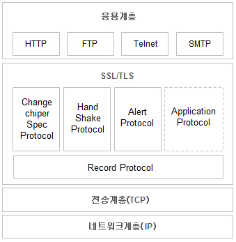

# SSL(secure socket layer)

네트워크에서 메시지 전송시 보안을 위해 개발된 표준 프로토콜. 즉, HTTP만을 위한 프로토콜이 아닌 응용계층의 여러 프로토콜의 보안을 위해 발명됐다. (TCP 보호)

클라이언트 또는 서버에서 메시지를 만들어 상대에게 전달할때, 응용계층에서 만들어진 메시지가 전송계층으로 가기전 SSL을 통해 데이터가 암호화. 그 후 전송계층을 통해 네트워크로 데이터가 상대에게 전달.

  

---

  

## 장점

- 기밀성(암호화)
- 데이터 무결성
- 서버인증

  

---

  

## 없을 시 문제점

- 기밀성(암호화): 기밀성이 제공되지 않는다면, A의 카드번호가 유출되어, 타인이 A의 카드로 결제를 진행할 수 있습니다.

- 데이터 무결성: 데이터 무결성이 제공되지 않는다면, 침입자가 A의 거래정보를 수정하여 옷의 수량을 변경하여 원치않는 양의 옷을 받게 될 수 있습니다.

- 서버인증: 서버인증을 제공하지 않는다면, 가짜 사이트에 결제를하게되어 A의 돈만을 받고 물건을 배송하지 않을 수 있습니다.

  

---

  

## http && https

HTTP - HyperText 문서를 클라이언트와 서버간 송수신 하기위한 프로토콜.
HTTPS - HTTP + SSL(Secure Socket Layer)을 합친말로, 보다 보안이 강화된 HTTP 프로토콜이라는 의미.

HTTP의 경우 보안적인 측면을 고려하고 만들어진 프로토콜이 아니기 때문에, 오가는 패킷을 중간에서 가로채어 확인하는 것이 매우 쉽다. 따라서 SSL은 이를 보완하기위해 등장.

- SSL과 TLS는 같은 의미

  

---

  

## SSL 인증서

- 클라이언트가 접속한 서버가 의도한 서버임을 보장.
- 클라이언트와 서버가 통신할때 암호화 할수 있도록 서버의 공개키를 제공.

- CA: SSL 인증서를 발급하는 기관으로, 신뢰할 수 있는 기관들을 의미.
