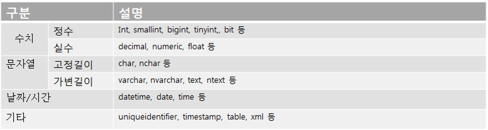
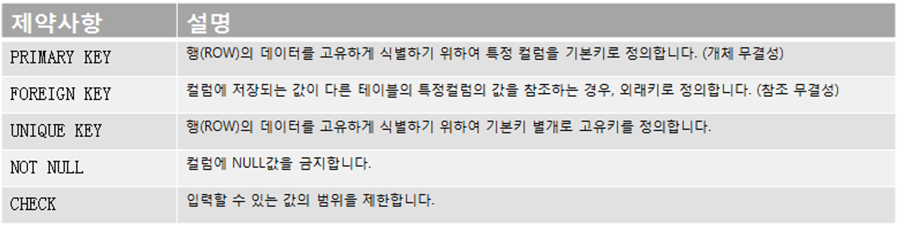
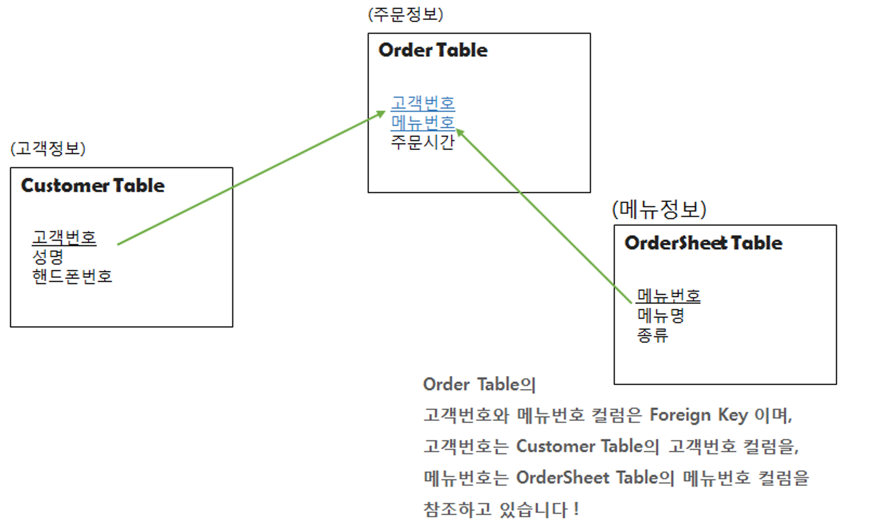

# CREATE

## DB/Table을 생성하는 쿼리문

### DB

CREATE DATABASE DB명칭;

### Table

CREATE TABLE 테이블명칭

(

컬럼명칭 자료형 제약사항,

컬럼명칭 자료형 제약사항,

컬럼명칭 자료형 제약사항,

...

)

-  DB명칭/테이블명칭 : 생성할 DB/테이블 명칭을 표기합니다.

-  컬럼명칭                  : 생성할 컬럼명칭을 표기합니다.

-  자료형                      : 생성하는 컬럼의 자료형을 표기합니다.

-  제약사항                   : 생성하는 컬럼의 제약사항이 존재할 경우, 제약사항을 표기합니다.

※ 자료형이란

☞ 컬럼에 저장되는 데이터의 유형을 뜻합니다.

ex. 문자열을 저장하기 위한 컬럼은 varchar, char 등의 자료형을 표기해야 합니다.

정수(소수점없는)를 저장하기 위한 컬럼은 int, smallint, tinyint 등이 자료형을 표기해야 합니다.

실수(소수점있는)를 저장하기 위한 컬럼은 decimal, float, numeric 등이 자료형을 표기해야 합니다.

날짜를 저장하기 위한 컬럼은 datetime 등의 자료형을 표기해야 합니다.

  

## 자료형의 종류

 

 

※ 제약사항이란

☞ 컬럼에 저장되는 데이터의 무결성을 위해서, 물리적으로 옵션을 주어,

데이터를 제한하는 방식을 뜻합니다.

 

 

## 부가설명

PRIMARY KEY : 테이블 당 하나의 기본키만 정의할 수 있습니다.

기본키로 정의된 컬럼이 클러스터 인덱스로 생성됩니다.

NULL 값을 허용하지 않기 때문에, 컬럼이 NOT NULL 이어야 합니다.

UNIQUE KEY   : 테이블 당 여러개의 고유키를 정의할 수 있습니다.

넌클러스터 인덱스가 고유키로 정의된 컬럼으로 생성됩니다.

NULL 값을 허용합니다. 단, 고유키이기 때문에 NULL값도 한 행만 허용합니다.

FOREIGN KEY :

