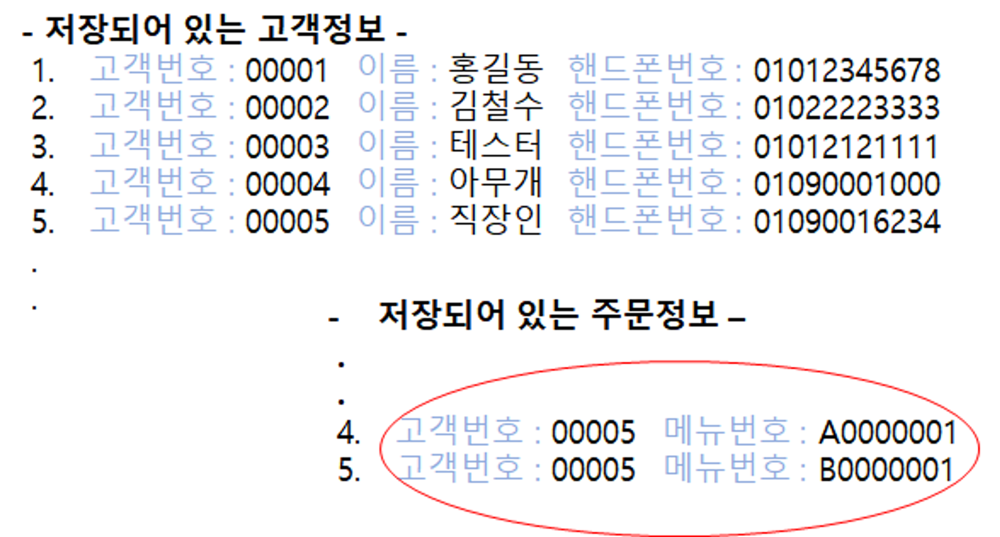

# delete

기존 DATA를 삭제하는 쿼리문

## **문법**

DELETE FROM 삭제하는 테이블

WHERE 삭제할 조건

-  삭제하는 테이블     :  DATA를 삭제할 테이블을 명시합니다.

필수로 명시해야 하는 부분입니다.

-  삭제할 조건             :  해당 테이블에서 삭제되야 할 대상의 조건을 명시합니다.

조건이 필요하지 않은 경우에는 생략 가능한 구절입니다만,

DATA의 삭제가 일어나는 만큼 신중해야 할 구문입니다.

## 문법예시



그림과 같이 주문번호 테이블에서 직장인의 주문정보를 삭제하려고 합니다.

```sql
DELETE FROM Order
WHERE EMPNO = '00005';
```

☞ 주문정보 테이블(Order)에서 고객번호(EMPNO)가 직장인 고객번호(00005)인

ROW를 삭제하는 쿼리입니다.
