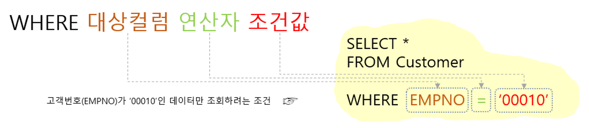
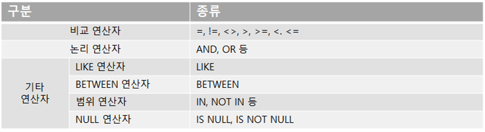
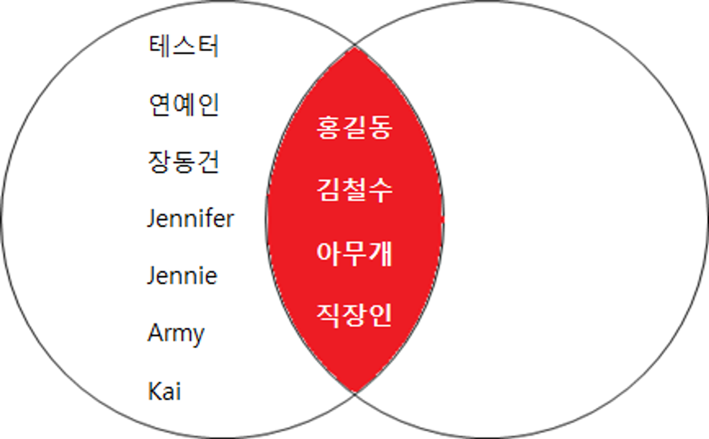
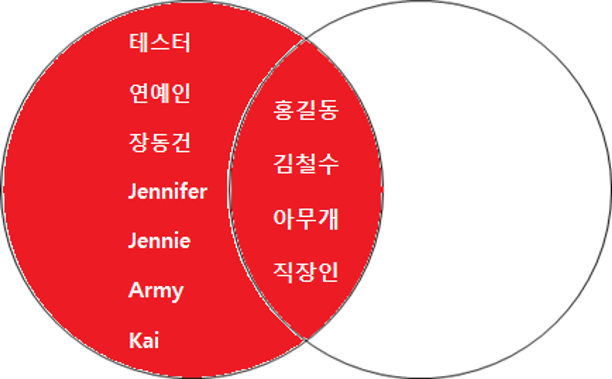
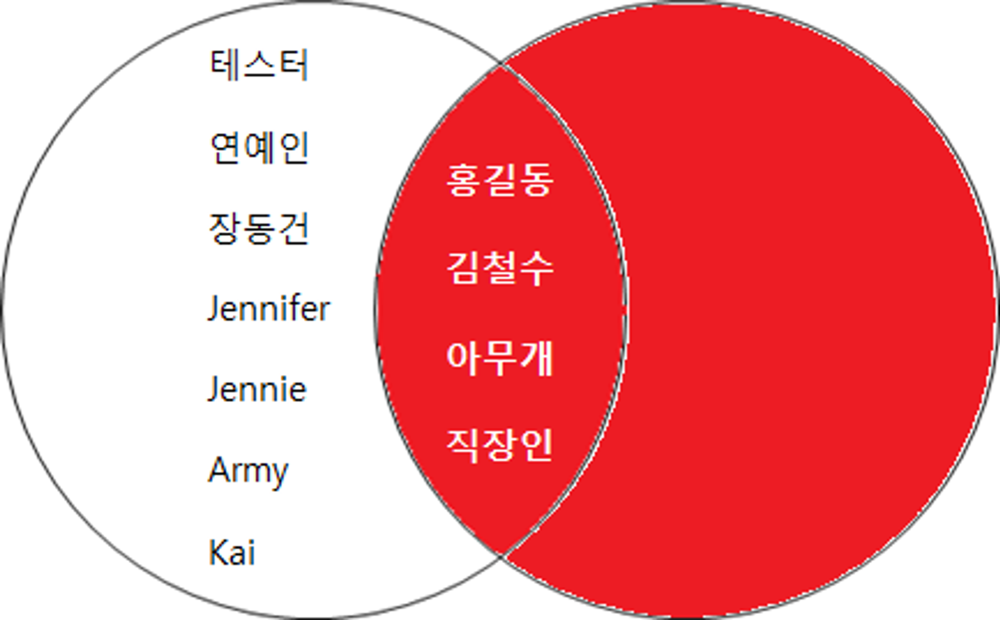

# select

Table을 조회하는 쿼리문

## 문법

```sql
SELECT 조회할 컬럼
FROM  조회할 테이블
WHERE 조회할 조건
```

<br />

- 조회할 컬럼     : 조회하고자 하는 테이블의 컬럼들을 나열하며,

  테이블의 전체 컬럼들을 조회할 시에는 \*를 표기 합니다.

  필수로 명시해야 하는 부분입니다.

<br />

- 조회할 테이블 :  조회하고자 하는 대상 테이블을 명시합니다.

  필수로 명시해야 하는 부분입니다.

<br />

- 조회할 조건     : 특정 조건에 해당되는 데이터만 조회할 시, 조건을 명시합니다.

  조건을 명시하는 구문은 아래와 같습니다.

  조건이 필요하지 않은 경우에는 생략 가능한 구절입니다.

<br />



<br /><br />

---

<br /><br />

## 조건으로 쓰이는 연산자 종류



### 1. 비교연산자 : 값을 비교하고자 할 때, 사용하는 연산자

    = :  같음을 비교 합니다.

    !=, <> :  같지 않음을 비교 합니다.

    \> :  대상컬럼 값이 조건값보다 큰지를 비교합니다.

    \>= :  대상컬럼 값이 조건값보다 크거나 같은지를 비교합니다.

    < :  대상컬럼 값이 조건값보다 작은지를 비교합니다.

    <= :  대상컬럼 값이 조건값보다 작거나 같은지를 비교합니다.

<br />

### 2. 논리연산자 : 여러개의 조건을 연결할 때 사용하는 연산자

    AND:  연결 된 조건이 모두 만족해야 성립합니다.

    OR:  연결 된 조건 중 하나만 만족해도 성립합니다.

<br />

### 3. LIKE 연산자 : 문자열의 일부를 비교할 때 사용하는 연산자

<br />

### 4. BETWEEN 연산자 : 특정 범위를 값들을 지정하기 위해 사용하는 연산자

<br />

### 5. 범위 연산자 : 특정 값들을 명시적으로 나열하여 범위를 지정하기 위해 사용하는 연산자

    IN :  명시한 특정 값들에 해당되는 값들을 포함합니다.

    NOT IN :  명시한 특정 값들에 해당되지 않는 값들을 포함합니다.

<br />

### 6. NULL 연산자 : NULL에 대한 값을 비교하기 위한 연산자

    빈 값이 아닙니다. 값이 없음도 아닙니다. 값을 알 수 없는 상태입니다.

    ex) 가나다 순으로 직원들의 핸드폰 번호를 조사중인 상황입니다,

    현재 순서상 '이' 씨의 성을 가진 직원들을 조사하고 있습니다.

    이 때, '홍길동'의 핸드폰 번호는 빈 값이 아닙니다. 값이 없음도 아닙니다.

    아직 조사하지 않았으니, 핸드폰 번호가 있는지 없는지, 어떤건지 알 수 없는 상태입니다.

    홍길동의 핸드폰 번호는 NULL인 상황입니다.

<br /><br />

---

<br /><br />

# join

```sql
SELECT
FROM 테이블1 JOIN 테이블2
ON 테이블1.JOIN컬럼 = 테이블2.JOIN컬럼;
```

## INNER JOIN

테이블의 교집합 JOIN입니다.



예시) '홍길동' 고객의 주문내역을 조회하세요.

```sql
SELECT B.*
FROM Customer A INNER JOIN Order B
ON A.EMPNO = B.EMPNO
WHERE A.NAME = '홍길동';
```

<br />

## OUTER JOIN

테이블의 차집합 JOIN입니다.

차집합의 대상에 따라 LEFT OUTER JOIN / RIGHT OUTER JOIN 이 있습니다.

### LEFT OUTER JOIN



<br />

###  RIGHT OUTER JOIN



예시) 고객정보를 모두 조회하며,  주문 내역이 있을 경우 같이 조회합니다.

```sql
SELECT A.*
FROM Customer A LEFT OUTER JOIN
Order B
WHERE A.EMPNO = B.EMPNO;
```

<br /><br />

---

<br /><br />

## 서브쿼리

    쿼리문 내에 괄호로 구분되어 또다른 쿼리가 있는 것
    SELECT문, JOIN문, 조건값 등 여러 경우에 활용

<br /><br />

## UNION / UNION ALL

    각 쿼리의 결과를 병합하여 하나의 결과로 보여주는 문법

<br /><br />

## 집계

    - GROUP BY : 데이터의 평균, 합계, 최대값, 최소값 등의 결과를 조회하고자 할 때 집계쿼리를 작성
    - HAVING: GROUP BY 에 대한 조건을 작성할 경우 HAVING문을 통하여 작성

<br /><br />

## 정렬

    각 쿼리의 결과를 정렬하여 보여주는 문법
    ORDER BY 구문을 사용하며, 구문은 쿼리구문의 끝에 위치

<br /><br />

## WITH(NOLOCK)

    MSSQL 은 기본적으로 SELECT 시 공유잠금(S Lock) 이 걸린다.

    이는 MSSQL 의 기본 격리수준(Isolation Level) 이 Read Committed 이기 때문이다.

    즉, DML(INSERT, UPDATE, DELETE) 작업중인 ROW 또는 TABLE 에 SELECT 할 경우,

    해당 작업이 끝나야 SELECT 할 수 있다는 의미이다.

    만일 이렇게 수행된다면 DB의 성능은 떨어지고, 데드락(Deadlock) 이 발생될 수 있다.

    이를 방지하기 위해 WITH(NOLOCK) 을 사용할 수 있다.

    WITH(NOLOCK) 의 격리수준(Isolation Level)은 Read Uncommitted 와 같다고 보면 된다.
