# Cursor

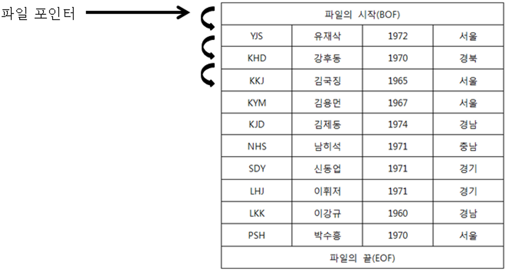

일반적으로 프로그래밍에서 Whlie문을 생각하면 됩니다.

파일을 열어서 첫번째 부터 쭉쭉 읽어 나가는 방식입니다.

실제로 그렇다면 커서가 어떻게 실행되는지 간단한 예제와 그림을 함께 보면 다음과 같습니다.

(예제는 뇌를 자극하는 MS SQL Server 2008 6장을 참조하였습니다.)

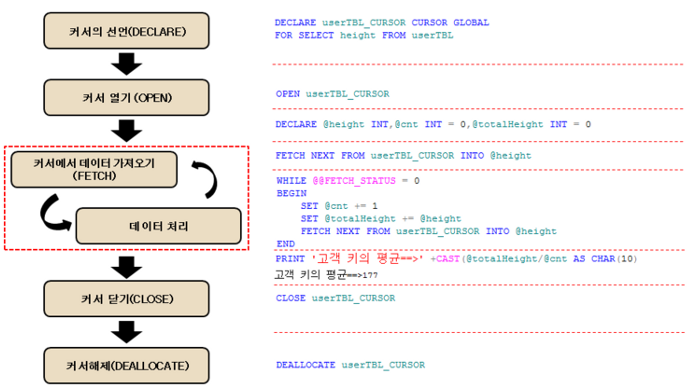

위의 커서를 실행하면 다음과 같은 결과값이 나옵니다.

이제 어떻게 처리되는지 봤으니 하나하나 살펴보겠습니다.

순차적으로 살펴보면 다음과 같은 의미를 가집니다.

  

---

  

## 1. DECLARE 생성

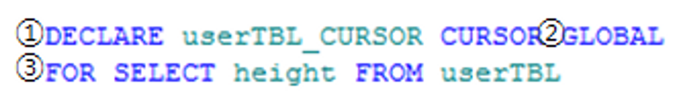

① 가장 위쪽에 위치한 구문으로 DECLARE 구문입니다. 우선 커서를 만들겠다고 선언하는 부분입니다.

변수를 지정할때 DECLARE 를 입력하듯이 커서도 같은 방법으로 생성합니다.

② GLOBAL은 커서의 범위를 나타냅니다. GLOBAL / LOCAL의 2가지 옵션이 있습니다.

-   GLOBAL(전역커서) : 모든 저장 프로시저나 일괄 처리에서 커서이름 참조가능
-   LOCAL(지역커서) : 지정된 범위에서만 유효,해당 범위를 벗어나면 자동소멸 (ex:프로시저)

③ 마지막으로 어떠한 테이블을 불러들일 것인지 명시합니다. userTBL의 height 즉, 키 컬럼을 불러오겠다고 선언했습니다.

  

## 2. OPEN 활성화

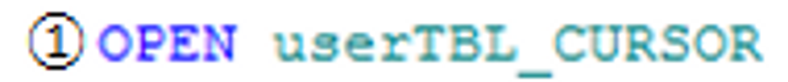

① 커서를 여는 부분입니다. 앞서 정의를 하였던 커서에 정의된 구문에 따라서 결과집합을 반환하고 Cache 상에 결과집합을 저장합니다.

  

## 3. 변수 선언

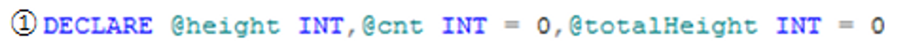

① 커서에서 사용할 변수를 선언합니다. 우선 키를 넣을 변수, 고객의 인원수를 셀 변수 , 마지막으로 키의 합계를 넣을 변수를 선언 합니다.

  

## 4. FETCH 반환

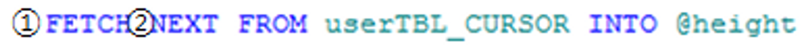

① Cache 상에 저장된 결과집합에서 Data를 하나씩 반환하는 구문입니다.

② 커서가 움직일 방향을 나타냅니다. 이 옵션의 경우 NEXT / PRIOT / FIRST / LAST 등의 옵션이 있습니다.

이 옵션을 사용하여 userTBL_CURSOR에서 반환하는 값을 @height 변수에 넣습니다. 아까 위에서 봤듯이 현재 커서는 userTBL의

heigth 컬럼을 하나씩 반환하고 있습니다. 그 값을 @height 변수에 넣는다고 생각하면 됩니다.

  

## 5. WHILE 루프

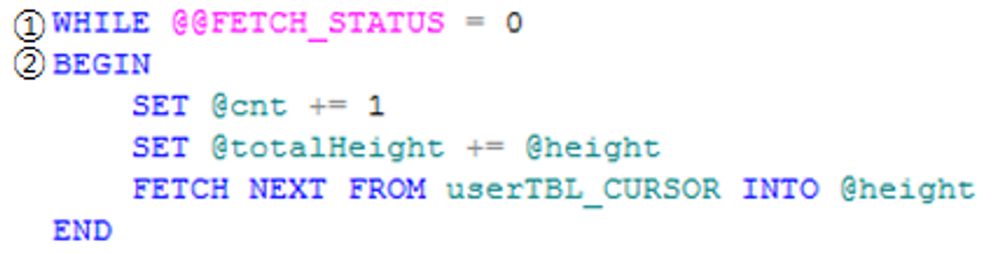

① WHILE 문을 통해서 ② 구문을 계속 반복 실행합니다.

WHILE 옆에 @@FETCH_STATUS 옵션이 있는데 이것의 상태값은 다음과 같습니다.

0 : 구문성공

1 : 구문이 실패했거나 더 이상 반환 결과가 없음

2 : 반환 ROW가 더 이상 없음

② @cnt 변수에 1씩 증가시키고 (1줄 읽었으므로 전체인원 1명씩 증가) , @totalHeight 변수에 반환하는 키를 누적시킵니다.

그 후에 ' FETCH NEXT FROM userTBL_CURSOR INTO @height ' 를 통해서 다음 Row를 읽습니다.

  

## 6. PRINT 출력

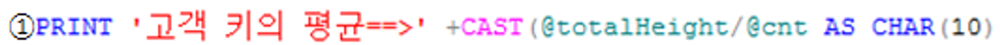

① PRINT 문을 통해서 고객의 평균 키를 계산합니다.

  

## 7. CLOSE (커서닫기) / DEALLOCATE (커서해제)

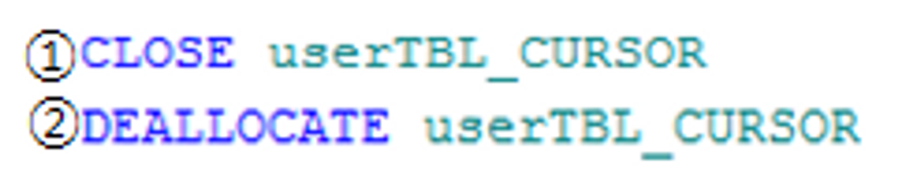

① 커서의 가장 처음에 봤었던 OPEN의 반대 개념입니다. 지금 할당되어 있는 커서를 닫습니다. 커서를 닫을 경우

커서를 사용 할 수 없습니다. 하지만 OPEN을 이용하면 다시 사용이 가능합니다.

② 커서를 완전히 해제합니다. 커서를 해제 할 경우 커서를 다시 선언 해야합니다.

위의 동작 원리 이외에 옵션에 대해서 설명하면 다음과 같습니다.

커서에 옵션중에 다음과 같은 옵션이 있습니다.

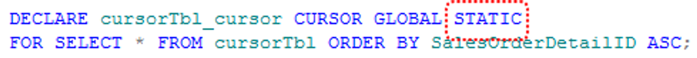

커서의 옵션에서 제가 생각(필자생각)으로 가장 중요한 부분이라고 생각합니다.

이 부분을 어떻게 하냐에 따라서 커서의 내부적 옵션이 전혀 달라질수가 있습니다.

이 옵션에는 STATIC / KEYSET / DANAMIC의 옵션이 존재합니다. 3가지마다 특성이 있으며 방식 또한 모두 다릅니다.

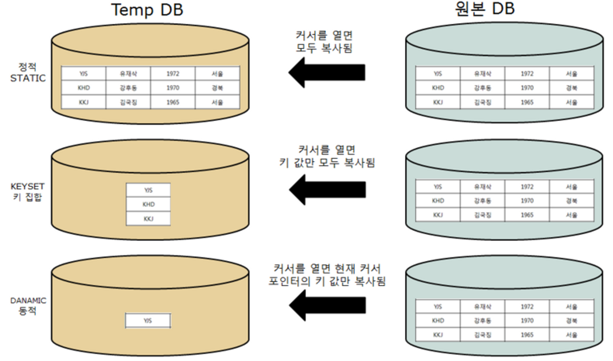

그림으로 한번에 보면 이해가 잘 안가실 것 같아서 한개씩 설명하면 다음과 같습니다.

  

## ① STATIC(정적)

정적옵션은 위의 그림에서 보시는 바와 같이 TempDB에 모든 테이블을 복사합니다. 원본에서 유저가 선언한 해당 커서의 테이블 자체를 복사한다고 생각하면 됩니다. 하지만 여기서 중요한것은 이것은 앞서 말한 바와 같이 복사합니다. 복사는 한번 하면 그 다음에 원본에서 업데이트가 되거나 삭제가 되어도 전혀 TempDB에 있는 테이블에는 영향이 없습니다. 다음 간단한 테스트를 통해서 알아보겠습니다.

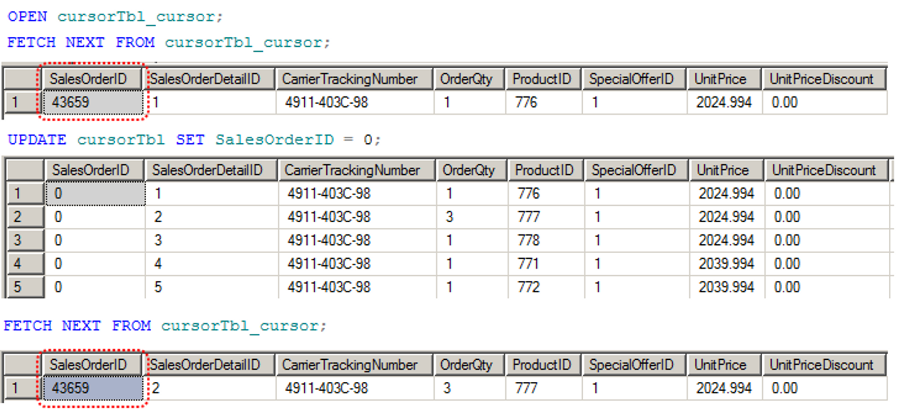

-   STATIC(정적)옵션을 이용하여 커서를 선언하고 한번 FETCH NEXT를 실행했습니다. 물론 잘 됩니다. 그 후에 원본 테이블의 모든 salesOrderID를 0으로 만들었습니다. 그후에 다시 FETCH NEXT를 실행했는데 전혀 변화가 없습니다.
-   즉, STATIC로 선언하면 원본에서 무슨일이 일어나든 무조건 복사한 시점 (커서를 선언한 시점)의 테이블을 이용합니다.

  

## ② KEYSET(키집합)

-   KEY집합은 원본DB에서 커서를 선언하는 순간 그 테이블의 KEY값만 복사합니다. 그렇게해서 KEY값을 가져와서 이것을 FETCH NEXT구문을 할때마다 해당 열을 KEY을 이용하여 원본테이블에서 불러옵니다. 다음의 테스트를 보면 좀 더 이해가 갈 겁니다.

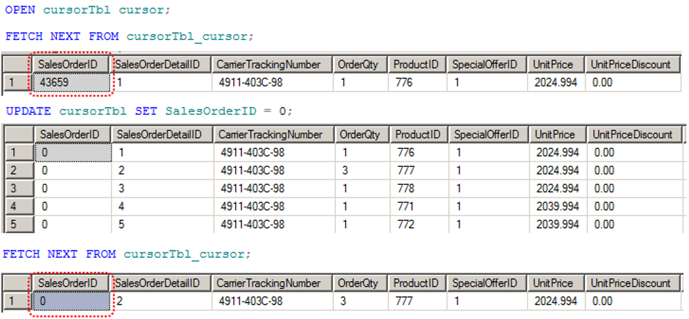

-   KEY집합은 위의 정적옵션과 다르게 UPDATE를 한 이후부터의 값이 바뀌었습니다. 하지만 여기서 중요한 사실이 있습니다. 이 KEY집한은 커서가 선언된 시점부터 해당 테이블에 LOCK을 겁니다.
-   그 이유는 해당 테이블의 KEY를 복사했는데 새로운 KEY(PK)가 들어오면 그 KEY를 다시 재복사 해야하기 때문입니다. 물론 DELTE도 않됩니다. 왜냐면 마찬가지로 빠져버리는 것이니까요.

  

## ③ DYNAMIC (동적)

-   동적옵션은 KEY집합에서 더욱 진화한 것입니다. 이 옵션은 INSERT,DELETE,UPDATE가 모두 됩니다. 하지만 여기서 KEY집합과 다른점은 해당 행만 잠급니다. 왜? 당연히 지금 해당 열의 포인터를 TempDB로 복사했기 떄문입니다. 그렇기 때문에 해당 열에만 LOCK이 발생합니다.
