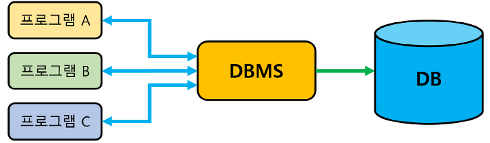

# Database

**데이터베이스([영어](https://ko.wikipedia.org/wiki/%EC%98%81%EC%96%B4): database, DB)는 체계화된 [데이터](https://ko.wikipedia.org/wiki/%EB%8D%B0%EC%9D%B4%ED%84%B0)의 모임이다. 작성된 목록으로써 여러 응용 시스템들의 통합된 정보들을 저장하여 운영할 수 있는 공용 데이터들의 묶음이다.**

**즉, 여러 사람이 공유하여 사용할 목적으로 통합, 관리하는 데이터의 [집합](https://ko.wikipedia.org/wiki/%EC%A7%91%ED%95%A9)이다.**

  

---

  

## 파일 시스템의 한계

프로그램은 기본적으로 **RAM**으로부터 특정 메모리 영역을 할당받아 프로세스가 실행되는 것이기에, 지나치게 많은 데이터를 RAM에 올려둘 수도 없을 뿐더러, 프로세스가 종료되거나 컴퓨터가 종료되면 해당 데이터는 모두 사라지게 된다.

따라서 우리는 프로세스가 종료되더라도 데이터를 보존하기 위해, 파일 시스템을 사용해 **SSD**나 **HDD**에 파일 형식으로 데이터를 저장해왔다.

하지만 여전히 파일 시스템을 사용해 데이터를 관리하면, 중복 데이터가 발생하고, 중복 데이터 간 불일치가 발생하는 등 데이터 무결성 문제가 발생할 수 있다. 또한 파일구조는 변경도 쉽지 않아, 결과적으로 프로그램이 파일 구조에 영향을 받는 형태가 되어 유지보수가 어렵다. 이러한 문제를 해결하기 위해 데이터베이스가 탄생했다.

  

---

  

## DB 시스템 구조

  

---

  

## DATABASE(DB) 특징

-   실시간 접근성: 쿼리에 대해 즉시 처리해 응답함

-   계속적인 진화: 삽입, 삭제, 갱신을 통해 항상 최신 데이터를 유지함

-   동시 공유: 여러 사용자가 동시에 같은 내용의 데이터를 사용 가능함

-   내용에 의한 참조: 값에 따라 데이터를 참조함

-   데이터의 독립성: 응용 프로그램과 DB, 기억장치를 서로 분리해, 구조 변경 시에도 서로 영향을 끼치지 않음

  

---

  

## DATABASE(DB) 장단점

### 데이터베이스 장점

1. 데이터 중복 최소화
2. 데이터 공유
3. 일관성, 무결성, 보안성 유지
4. 최신의 데이터 유지
5. 데이터의 표준화 가능
6. 데이터의 논리적, 물리적 독립성
7. 용이한 데이터 접근
8. 데이터 저장 공간 절약

 

### 데이터베이스 단점

1. 데이터베이스 전문가 필요
2. 많은 비용 부담
3. 데이터 백업과 복구가 어려움
4. 시스템의 복잡함
5. 대용량 디스크로 엑세스가 집중되면 과부하 발생
