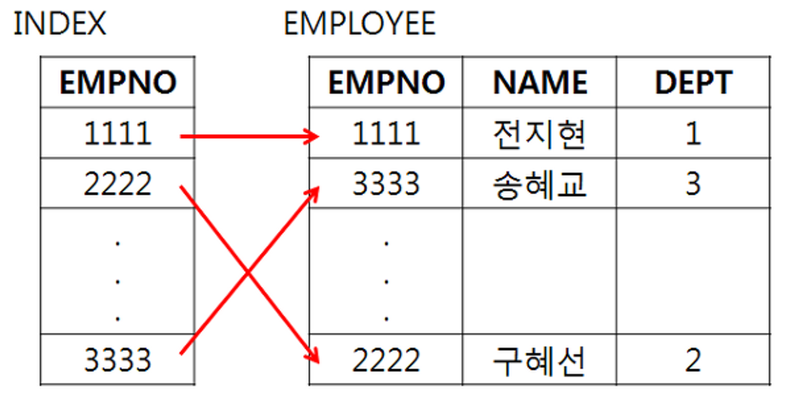
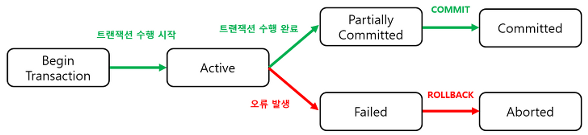

# Database 용어 정리

-   **SQL**

    관계형 DB 언어로, 관계대수와 관계해석을 통해 데이터를 정의, 조작, 제어함, 용도에 따라 DDL, DML, DCL로 구분함.

-   **DDL**

    데이터 정의어의 약자로, 테이블이나 뷰와 같은 DB 객체 생성, 변경, 삭제하는데 사용됨

-   **DML**

    데이터 조작어의 약자로, 테이블 내에서 데이터 조회 및 삽입, 수정 등을 하는데 사용됨

-   **COMMIT**

    트랜잭션이 성공 종료되고, 해당 변경 내용을 DB에 반영하는 연산

-   **ROLLBACK**

    트랜잭션이 비정상 종료되고, 해당 변경된 내용을 취소하고, 이전 상태로 돌아가는 연산

-   **GRANT**

    사용자에게 권한을 부여함

-   **메타데이터**

    데이터를 관리하는데 사용되는 데이터

-   **View**

    기본 테이블로부터 생성한 가상 테이블, 필요한 데이터만 사용하기 위해 생성함.

-   **서브쿼리**

    조건절에 사용되는 쿼리문.

-   **트리거**

    DB에서 이벤트가 발생할 때 자동으로 수행되는 사용자 정의 프로시저, 제약조건을 통해 명시할 수 없는 사항을 구현할 때 사용.

-   **Join**

    2개의 테이블에서 연관된 튜플을 결합해 1개의 새로운 릴레이션을 반환하는 것

-   **Inner Join**

    **동등 조인**: '=' 비교에 의해 같은 값을 가지는 행을 결합하는 Join

    **비동등 조인**: '=' 가 아닌 나머지 비교 연산자에 의해 행을 결합하는 Join

-   **ER 다이어그램**

    개체, 속성, 관계 등을 도형으로 표현한 것

-   **Index**

    Row(레코드)에 빠르게 접근하기 위해 (키 값, 포인터) 쌍으로 구성되는 데이터 구조

    SELECT 시엔 속도가 빠르지만, 그 외 DML(INSERT, UPDATE, DELETE)에서는 속도가 느려짐

 

 

-   **트랜잭션**

    DB에서 하나의 논리 기능을 수행하기 위한 연산 집합, 즉 작업의 단위.

-   **트랜잭션의 특성**

    데이터의 무결성을 보장하기 위한 특성.

-   **원자성**

    트랜잭션 내 모든 연산이 성공적으로 수행되어야 하며, 1개라도 실패 시 모든 연산을 취소해야 함.

-   **일관성**

    트랜잭션 수행 후에도 데이터의 상태는 일관되야 함.

-   **독립성**

    각 트랜잭션은 서로 간섭없이 독립적으로 수행되야 함.

-   **영속성**

    트랜잭션이 정상 수행된 결과는 DB에 영구적으로 반영되야 함.

-   **트랜잭션의 상태**

 

-   **병행성**

    여러 트랙잭션들이 번갈아가며 조금씩 자신의 연산을 수행하는 것

-   **Lock**

    병행 제어를 위해 한 트랜잭션이 사용하는 데이터를 다른 트랜잭션이 접근 못하게 막는 것.

-   **Dead Lock**

    특정 트랜잭션이 사용하는 데이터가 잠겨, 전체 트랜잭션의 진행이 불가능한 상황

    교착상태를 해결하려면 트랜잭션 간 실행 순서를 미리 결정하거나, 트랜잭션 커밋의 빈도를 높여야 함

-   **ORM**

    Object-Relational Mapping의 약자

    프로그램에서 가상 객체 DB를 생성해, 객체와 관계를 연결해주는 것

    프로그램이 RDB의 제약을 최대한 덜 받게하기 위해 사용됨.

-   **SQL Injection**

    프로그램의 보안 상 취약점을 파악해, 악의적인 SQL문을 실행시켜 DB를 조작하는 것
