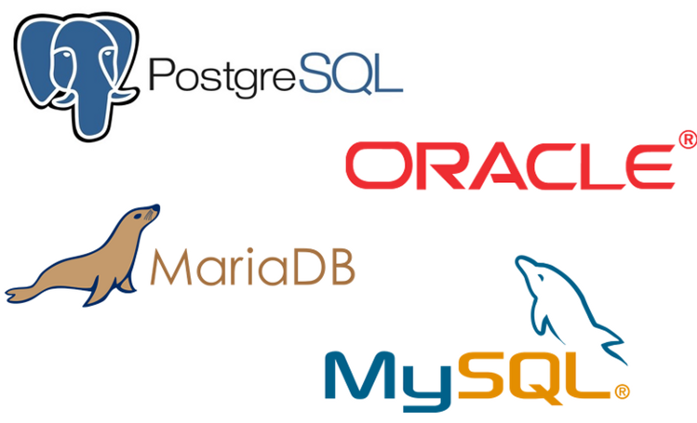

# 데이터베이스 종류

  

## RDB(관계형 데이터베이스)

 

 

 

-   **[MySQL](https://mirror.enha.kr/wiki/MySQL)**
    알다시피 가장 많이 사용하는 무료 DBMS다. 분류는 RDB.
    커뮤니티 버전은 오픈소스. SUN에 10억 달러에 인수된 후 오라클이 썬을 72억 달러에 인수하면서 결국 오라클이 MySQL을 소유하게 되었다. 오라클이 오픈소스에 호의적이지 않기 때문에 MySQL 사용자들 사이에서 불안감이 커졌고 그로 인해 대체재로 등장한 것이 바로 MariaDB다.
-   **MariaDB**
    [MySQL 클론의 역습 – 1 (MariaDB 편)](http://embian.wordpress.com/2013/06/26/mysql-%ED%81%B4%EB%A1%A0%EC%9D%98-%EC%97%AD%EC%8A%B5-1-mariadb-%ED%8E%B8/)
    MySQL이 Sun Microsystems로 넘어가면서 당시 MySQL  출신들이 따로 나와서 MySQL을 기반으로 한 오픈 소스 DBMS를 만들었다. 그게 바로 MariaDB. MySQL을 기반으로 만들었기 때문에 거의 완벽하게 호환이 된다.
-   **[Oracle](https://mirror.enha.kr/wiki/%EC%98%A4%EB%9D%BC%ED%81%B4#s-7)**
    가장 유명한 유료 DBMS. 미국의 대표적인 RDBMS 회사인 오라클 사 및 그 회사에서 만드는 데이터베이스 관리 시스템. 엔터프라이즈 DB 시장의 절반 이상을 항상 차지하고 있다.
-   **PostgreSQL**
    ORDBMS. 다양한 기능을 제공하는 오픈소스 DBMS. 엔터프라이즈급이나 차세대 DBMS에서 제공하는 기능들을 많이 제공한다.
    [한눈에 살펴보는 PostgreSQL](http://helloworld.naver.com/helloworld/227936)
-   **MS-SQL**
    Microsoft 제공하는 유료 RDBMS.
-   **아파치 더비(Apache Derby)**
    IBM에서 기증한 cloudscape 소스 기반으로 아파치 소프트웨어 재단에서 개발 진행하고 있는 자바 기술로 구현된 관계형 데이터베이스 소프트웨어이다.

  

---

  

## NoSQL

 

 

 

-   **MongoDB와 CouchBase**
    둘 다 Document DB이며 메모리DB와 결합되어 있다.
    [MongoDB vs Couchbase](http://kangiljun1102.wordpress.com/2014/03/16/mongodb-vs-couchbase/)
    -   MongoDB
        단연 가장 많이 쓰이는 NoSQL. 다양한 인덱싱을 지원하기 때문에 RDB에 익숙한 사람이 다루기 편하다.
        [MongoDB의 Physical 데이타 저장 구조](http://bcho.tistory.com/746)
        [MongoDB를 쓰면서 알게 된 것들](http://bigmatch.i-um.net/2013/12/mongodb%EB%A5%BC-%EC%93%B0%EB%A9%B4%EC%84%9C-%EC%95%8C%EA%B2%8C-%EB%90%9C-%EA%B2%83%EB%93%A4/)
    -   Couchbase
        memcached + CouchDB. 정확히는 membase + CouchDB. 단순히 In-memory DB인 memcached에 persistence를 붙여 DB로 만든것이 membase이고 여기에 CouchDB를 결합하여 persistence layer를 CouchDB로 대체시킨 것이 Couchbase.
        맵&리듀스 방식을 사용한다.
        [CouchDB Overview](http://bcho.tistory.com/867)
        [Why CouchDB](http://www.joinc.co.kr/modules/moniwiki/wiki.php/Site/cloud/BigData/CouchDB/WhyCouchDB)
-   **Cassandra와 HBase**
    빅데이터 처리에 적합하다는 듯. 둘다 별로 많이 쓰이지 않는다. 참고로 HBase는 HDFS(HaDoop File System)을 기반으로 만들어짐.
    [아파치 분산 데이타 베이스 Cassandra 소개](http://bcho.tistory.com/440)
    분산데이타 베이스 Cassandra vs HBase 에 대한 짧은 의견
-   **[주요 NoSQL에 대한 초간단 정리](http://kimws.wordpress.com/2012/08/07/%EC%A3%BC%EC%9A%94-nosql%EB%93%A4%EC%97%90-%EB%8C%80%ED%95%9C-%EC%B4%88%EA%B0%84%EB%8B%A8-%EC%A0%95%EB%A6%AC/)**

  

---

  

## In-memory DB

 

 

 

-   **memcached**
    memcached는 레디스와 다르게 순수한 메모리 DB다.
    [Memcached의 확장성 개선](http://helloworld.naver.com/helloworld/151047)
-   **Redis**
    REmote DIctionary System. NoSQL로도 분류된다. 레디스는 memcached와 다르게 데이터를 디스크에 저장할 수 있다.
    memcached와는 다르게 데이터 스트럭처를 제공한다; String, Set, Sorted Set, Hashs, List.
    [In memory dictionary Redis 소개](http://bcho.tistory.com/654)
    [redis vs memcached](http://charsyam.wordpress.com/2013/02/05/%EC%9E%85-%EA%B0%9C%EB%B0%9C-memcached-%EB%8A%94-predictable-%ED%95%98%EA%B3%A0-redis%EB%8A%94-unpredictable-%ED%95%98%EB%8B%A4/) : 생산성으로는 Redis! 성능으로는 케이스 바이 케이스.

  

---

  

## SQLite

 

 

-   **sqlite**
    지금까지 살펴본 DBMS들은 서버-클라이언트 구조에서 대규모 데이터베이스 관리를 위한 시스템이다. 그러나 sqlite는 이와 달리 로컬에서 사용하는 경량 데이터베이스. 원격 Connection이 발생하지 않기 때문에 데이터로의 접근이 매우 빠름. 아이폰이나 안드로이드 등의 모바일에서 많이 활용된다. 오픈소스.
    [SQLite 1탄](http://gywn.net/2013/08/let-me-intorduce-sqlite/)
