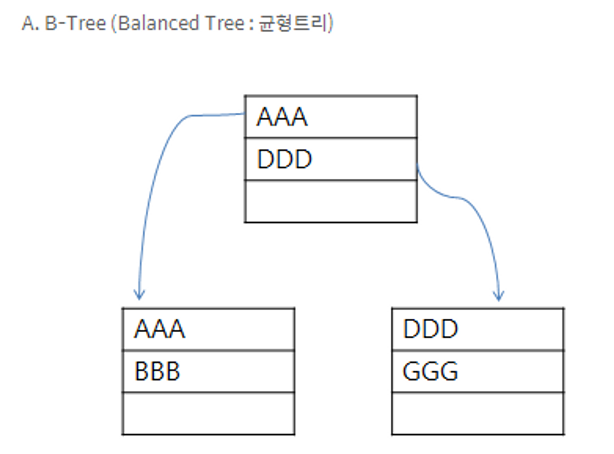
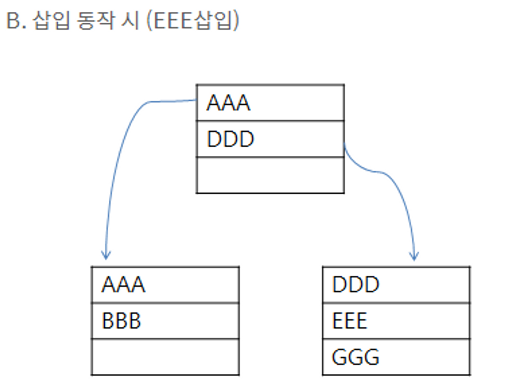
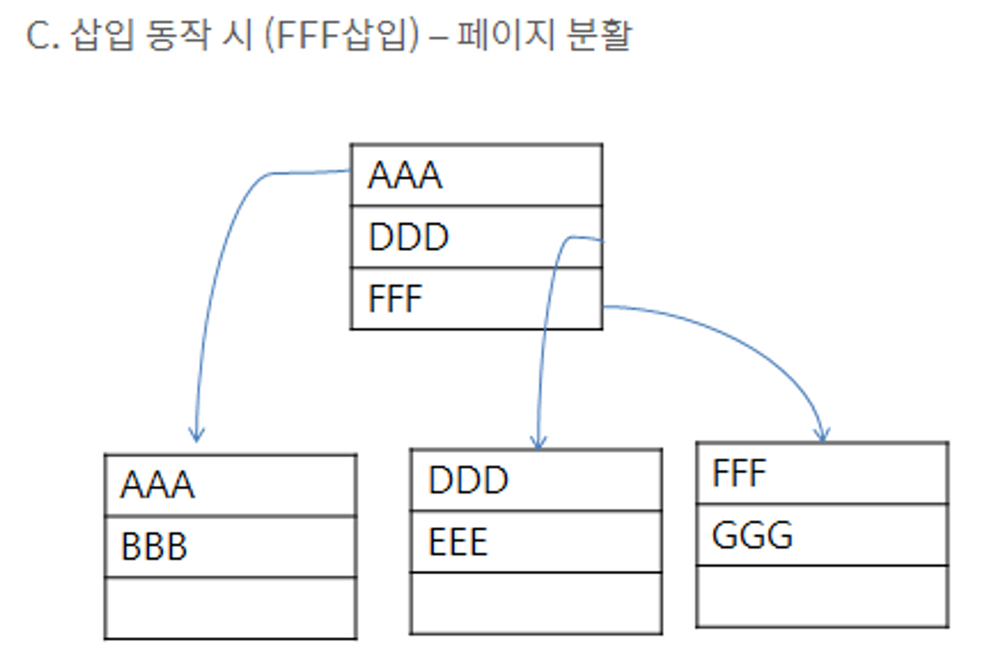
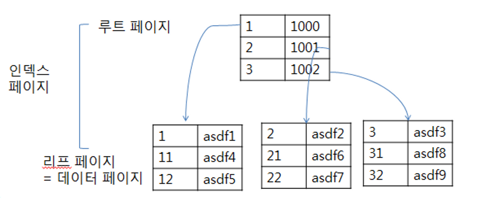
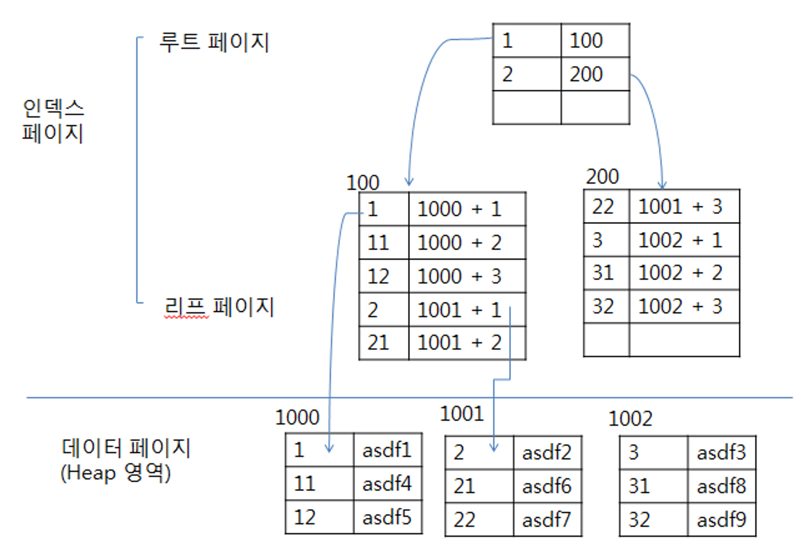

# PK, INDEX

인덱스의 개념을 설명할 때 가장 쉬운예가 바로 사전이다. 사전 같은경우 A,B,C,D~Z 이런식으로 책을 찾기 쉽게 인덱스가 되어있다. A,B,C,D~Z 을 인덱스라고 생각하면 된다.인덱스를 색인이라고도 한다. 만약에 인덱스가 없는 책이라면 일일이 한장한장 넘겨가면서 찾아야할 지도 모른다. 테이블이 간단할때는 사전이 3~4장 밖에 안되서 찾기가 쉬웠지만 테이블이 거대해지면 인덱스를 쓰는게 효율적이고 원하는 것을 빨리 찾을 수 있을 것이다.

### 장점

1.검색속도가 대체적으로 빨라진다.

2.시스템에 걸리는 부하가 줄어들어서 성능이 향상된다.

### 단점

1.인덱스가 들어갈 추가적인 공간이 필요하다.

2.인덱스를 생성하는데 시간이 소요된다.

3.데이터의 변경작업이 자주 일어나면 성능이 나빠진다.

  

---

  

## 종류

### 클러스터형 인덱스

1.사전과 같이 책의 내용 자체가 순서대로 정렬이 되어있다.

2.테이블당 한개만 생성가능하다.

3.행 데이터를 인덱스로 지정한 열에 맞춰 자동정렬을 한다.

### 비클러스터형 인덱스

1.책 뒤쪽에 찾아보기가 있는 일반 책이라 생각하면 되고 인덱스가 별도로 있고 인덱스를 찾은 후에 표시된 해당 페이지로 가야만 실제 내용을 접할 수 있다.

2.테이블당 여러개가 생성가능하다.

### 내부 작동

1.B-Tree(Balanced Tree, 균형 트리)

자료구조에 나오는 잘 사용되는 데이터의 구조이다. 이 구조는 주로 인덱스를 표현할 때 많이 사용되며 균형이 잡힌 트리이다. 이 구조는 SELECT 구문을 사용할 때 뛰어난 성능을 발휘한다.

노드: 데이터가 존재하는 공간  -> AAA를 담고 있는 직사각형

루트 노드(페이지):가장 상위 노드  -> AAA,DDD,FFF 데이터를 담고 있음.

리프 노드(페이지) : 제일 마지막 노드  ->AAA,BBB와 DDD,EEE와 FFF,GGG 데이터를 담고 있음. 

 

 

 

  

---

  

## 클러스터형 인덱스

1.인덱스의 생성 시에는 데이터 페이지 전체를 다시 정렬.

2.이미 대용량의 데이터가 입력된 상태라면 시스템에 큰 부하를 줄 수 있기 때문에 클러스터형 인덱스를 생성하는 것을 신중하게 검토해야한다.

3.인덱스 자체의 리프 페이지가 곧 데이터이다. 그러므로 인덱스 자체에 데이터가 포함되어 있다.

4.비클러스터형보다 검색속도는 빠르지만 입력/수정/삭제는 느리다.

5.성능은 좋지 테이블에 한개만 생성가능하고 어느 열에 클러스터형 인덱스를 생성하느냐에 따라서 시스템의 성능이 달라진다.

 

 

## 비클러스터형 인덱스

1.인덱스의 생성시에는 별도의 페이지에 인덱스를 구성한다.

2.인덱스 자체의 리프 페이지는 데이터가 아니라 데이터가 위치하는 포인터이다.검색속도는 느리지만 데이터의 입력/수정/삭제는 빠르다.

3.비클러스터형 인덱스는 여러 개 생성할 수가 있고 함부로 남용할 경우에는 오히려 시스템의 성능을 떨어뜨릴 수 있다.

 

  

---

  

## 생성 예제

간단하게 아래는 사용방법 및 생성 방법입니다.

1. 단일 컬럼 인덱스

오직 하나의 컬럼만 인덱스로 가짐

CREATE INDEX 인덱스이름

ON 테이블이름 (컬럼이름);

CREATE INDEX IX_INFO_HYUKRAE_NAME ON INFO_HYUKRAE(NAME);

2. Unique 인덱스

지정된 컬럼(필드)의 값 고유함

CREATE UNIQUE INDEX 인덱스이름

ON 테이블이름 (컬럼이름);

CREATE UNIQUE INDEX IX_INFO_HYUKRAE_ID ON INFO_HYUKRAE(ID);

3. 조합 인덱스

조합 인덱스는 두 개 또는 그 이상의 컬럼을 테이블에 가짐

CREATE INDEX 인덱스이름

on 테이블이름 (컬럼이름1, 컬럼이름2, ...);

CREATE INDEX IX_INFO_HYUKRAE_OLD ON INFO_HYUKRAE(FATHERNAME,MOTHERNAME);

4. 인덱스 삭제

존재하는 인덱스를 삭제할 경우 DROP 키워드를 사용하여 삭제가 가능합니다. 인덱스 테이블의 삭제는 성능과 밀접한 관계를 가지므로 삭제할 경우 항상 주의를 해야합니다.

!! 참고로 인덱스 테이블은 한번 설정하면 수정할 수가 없습니다. 그렇기 때문에 수정을 원하는 경우 삭제 후 재생성하는 방법을 사용하여야합니다. 이때는 DROP 그리고 INDEX 키워드를 함께 사용하여 삭제합니다.

DROP INDEX 삭제할 인덱스명 ON 테이블명;

DROP INDEX IX_INFO_HYUKRAE_OLD ON INFO_HYUKRAE ;

DROP  INDEX IX_INFO_HYUKRAE_ID ON INFO_HYUKRAE ;

DROP  INDEX IX_INFO_HYUKRAE_NAME ON INFO_HYUKRAE ;
