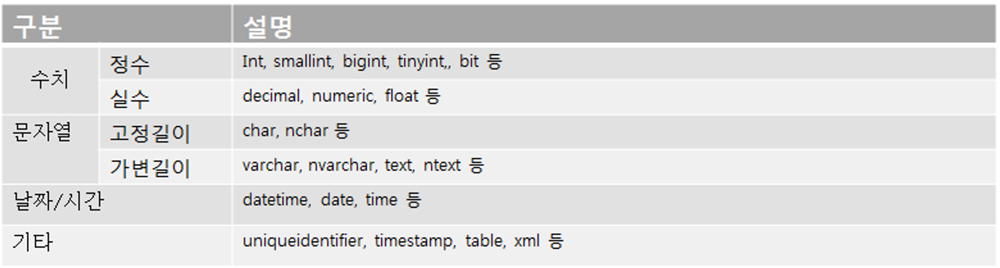
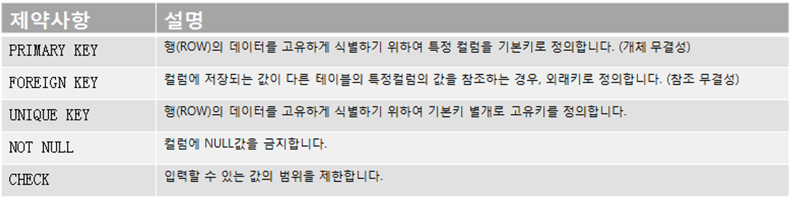
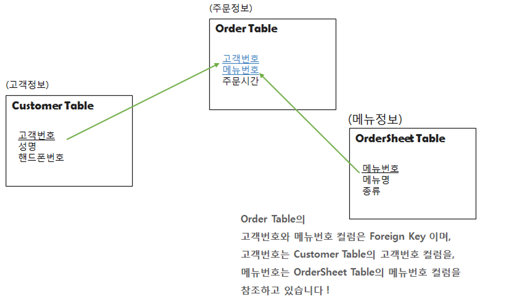

# table, type, view

 

## TABLE

 

### TABLE 정의

 

-   테이블은 데이타베이스의 기본적인 데이타 저장 단위 이다.
-   데이타베이스 테이블은 사용자가 접근 가능한 모든 데이타를 보유하며 레코드와 컬럼으로 구성 된다.
-   관계형 데이타베이스가 아닌 예전의 데이타 베이스 용어에서는 파일과 테이블이, 필드와 컬럼이, 그리고 레코드와 행이 동일시 되었다.
-   테이블은 시스템내에서 독립적으로 사용되길 원하는 엔티티를 표현할수 있다. 예를 들면, 회사에서의 고용자나 제품에 대한 주문은 테이블로 표현 가능하다.
-   테이블은 두 엔티티간의 관계를 표현할 수 있다. 즉 테이블은 고용자와 그들의 작업 숙련도 혹은 제품과 주문과의 관계를 표현하는데 사용될 수 있다.
-   테이블내에 있는 외래 키 (ForeIgn Key)는 두 엔티티 사이의 관계를 표현하는데 사용 된다.
-   컬럼 : 테이블의 각 컬럼은 엔티티의 한 속성을 표현 한다.
-   행(ROW, 레코드) : 테이블의 데이타는 행에 저장 된다.

  

### TABLE 생성

 

-   **테이블 생성 시에 주의해야 할 규칙**

1. 객체를 의미할 수 있는 적절한 이름을 사용.

2. 다른 테이블의 이름과 중복되지 않도록 지정.

3. 한 테이블 내에서는 컬럼명이 중복되게 지정할 수 없음.

4. 테이블 이름을 지정하고 각 컬럼들은 괄호로 묶어서 지정.

5. 각 컬럼들은 , 로 구분되고, 테이블 생성문의 끝은 ; 기호로 맺음.

6. 컬럼뒤에 데이터 유형은 꼭 지정되어야 함.

7. 테이블 명과 컬럼 명은 반드시 문자로 시작.

8. 벤더사마다 사전에 정의한 예약어는 사용 불가.

-   **컬럼에 대한 규칙**

1. DATETIME 유형에는 별도로 크기를 지정하지 않음.

2. 문자 데이터 유형은 반드시 가질 수 있는 최대 길이를 표시.

3. 컬럼의 구분은 , 로 하되 마지막 컬럼은 콤마를 찍지 않음.

4. 컬럼에 대해서 CONSTRAINT 를 이용하여 제약조건을 추가 가능.

  

---

  

## TYPE

 

### Type 개념

 

※ 자료형이란

☞ 컬럼에 저장되는 데이터의 유형을 뜻합니다.

ex. 문자열을 저장하기 위한 컬럼은 varchar, char 등의 자료형을 표기해야 합니다.

정수(소수점없는)를 저장하기 위한 컬럼은 int, smallint, tinyint 등이 자료형을 표기해야 합니다.

실수(소수점있는)를 저장하기 위한 컬럼은 decimal, float, numeric 등이 자료형을 표기해야 합니다.

날짜를 저장하기 위한 컬럼은 datetime 등의 자료형을 표기해야 합니다.

자료형의 종류

※ 제약사항이란

☞ 컬럼에 저장되는 데이터의 무결성을 위해서, 물리적으로 옵션을 주어,

데이터를 제한하는 방식을 뜻합니다.

부가설명

PRIMARY KEY : 테이블 당 하나의 기본키만 정의할 수 있습니다.

클러스터 인덱스가 기본키로 정의된 컬럼으로 생성됩니다.

NULL 값을 허용하지 않기 때문에, 컬럼이 NOT NULL 이어야 합니다.

UNIQUE KEY   : 테이블 당 여러개의 고유키를 정의할 수 있습니다.

넌클러스터 인덱스가 고유키로 정의된 컬럼으로 생성됩니다.

NULL 값을 허용합니다. 단, 고유키이기 때문에 NULL값도 한 행만 허용합니다.

FOREIGN KEY :

  

---

  

## TABLE 생성 정의

 

테이블의 칼럼이 가지고 있는 대표적인 4가지 데이터 유형은 다음과 같습니다.

1. CHARACTER : 고정 길이 문자열 정보

2. VARCHAR : 가변길이 문자열 정보

3. NUMERIC : 정수, 실수 등 숫자 정보

4. DATE : 날짜와 시각 정보

테이블에 대한 생성 예제

테이블 명 :  INFO*HYUKRAE -> INFO*이름

컬럼 명 : ID (아이디) 문자 자릿수 7자리

NAME (이름) 문자 자릿수 20자리

UNAME( 영어 이름) 문자 자릿수20자리

EMAIL(EMAIL )문자 자릿수  20 자리

FATHERNAME (아버지 이름) 문자 자릿수 10 자리

MOTHERNAME( 어머니 이름) 문자 자릿수 10 자리

BROTHERCNT( 형제몇명인지 ) 숫자

AGE (나이) 숫자

제약조건 : 기본키(PRIMARY KEY) -> ID

값이 반드시 존재 (NOT NULL) -> NAME

CREATE TABLE INFO_HYUKRAE(

ID VARCHAR(7),

NAME VARCHAR(20) NOT NULL,

UNAME VARCHAR(20),

EMAIL VARCHAR(20),

FATHERNAME VARCHAR(10),

MOTHERNAME VARCHAR(10),

BROTHERCNT INT,

AGE INT,

CONSTRAINT INFO_HYUKRAE_PK PRIMARY KEY (ID ASC));

  

### ALTER TABLE

 

처음의 테이블 구조를 그대로 유지하는 것이 최선이지만, 변경해야 할 일들이 발생할 수도 있습니다.

주로 칼럼을 추가/삭제하거나 제약조건을 추가/삭제하는 작업을 진행합니다.

  

### 컬럼 추가

 

새롭게 추가된 컬럼은 테이블의 마지막 컬럼이 되며 위치를 지정할 순 없습니다.

ALTER TABLE <TABLE_NAME> ADD (<COLUMN_NAME> <COLUMN_TYPE>) ; -- ORACLE

ALTER TABLE <TABLE_NAME> ADD <COLUMN_NAME> <COLUMN_TYPE> ; -- MS-SQL

ALTER TABLE INFO_HYUKRAE ADD CELLPHONE VARCHAR(20)

  

### 컬럼 제거

 

데이터가 있거나 없거나 삭제가 가능합니다.

한 번에 하나의 컬럼만 삭제가 가능하며, 컬럼 삭제 후 최소 하나 이상의 컬럼이 테이블에 존재해야 합니다.

한 번 삭제한 컬럼은 복구가 불가능 하므로 주의해야 합니다.

ALTER TABLE <TABLE_NAME> DROP COLUMN <COLUMN_NAME>; -- ORACLE, MS-SQL

ALTER TABLE INFO_HYUKRAE DROP COLUMN CELLPHONE

  

### 컬럼 수정

 

컬럼의 데이터 유형, 디폴트, NOT NULL 제약조건 등에 대한 변경을 할 수 있습니다.

컬럼을 변경할 때는 다음을 고려해야 합니다.

1. 컬럼의 크기를 늘릴 수는 있지만 줄이지는 못한다.

2. 해당 컬럼이 NULL 값만 가지고 있거나 테이블에 아무 행도 없으면 컬럼의 폭을 줄일 수 있다.

3. 해당 컬럼이 NULL 값만 가지고 있으면 데이터 유형을 변경할 수 있다.

4. 해당 컬럼의 DEFAULT 값을 바꾸면 변경 작업 이후 발생하는 행 삽입에만 영향을 미치게 된다.

5. 해당 컬럼에 NULL 값이 없을 경우에만 NOT NULL 제약조건을 추가할 수 있다.

ALTER TABLE <TABLE_NAME> MODIFY (<COLUMN_NAME> <COLUMN_TYPE> [DEFAULT] [NOT NULL] [, .. ]); -- ORACLE

ALTER TABLE <TABLE_NAME> ALTER COLUMN (<COLUMN_NAME> <COLUMN_TYPE> [DEFAULT] [NOT NULL] [, .. ]); -- MS-SQL

ALTER TABLE INFO_HYUKRAE ALTER  COLUMN ID VARCHAR(10) NOT NULL;

  

### 컬럼 명 변경

 

ALTER TABLE <TABLE_NAME> RENAME COLUMN <COLUMN_NAME> TO <NEW_COLUMN_NAME>; -- ORACLE

sp_rename <COLUMN_NAME>, <NEW_COLUMN_NAME>, 'COLUMN'; --MS-SQL

sp_rename 'INFO_HYUKRAE.[CELLPHONE]', 'CELLPHONE_XXXX', 'COLUMN'

  

### 제약조건 삭제

 

ALTER TABLE <TABLE_NAME> DROP CONSTRAINT <CONSTRAINT_NAME>; -- ORACLE, MS-SQL

ALTER TABLE INFO_HYUKRAE DROP CONSTRAINT INFO_HYUKRAE_PK;

  

### 제약조건 추가

 

ALTER TABLE <TABLE_NAME> ADD CONSTRAINT <CONSTRAINT_NAME> <CONSTRAINT_TYPE> (<COLUMN_NAME>); -- ORACLE, MS-SQL

ALTER TABLE INFO_HYUKRAE ADD CONSTRAINT INFO_HYUKRAE_PK1 PRIMARY KEY (ID ASC)

  

### RENAME TABLE

 

테이블 명을 변경합니다.

RENAME <TABLE_NAME> TO <NEW_TABLE_NAME>; -- ORACLE

sp_rename <TABLE_NAME>, <NEW_TABLE_NAME>; -- MS-SQL

sp_rename INFO_HYUKRAE, INFO_HYUKRAE_test

  

### DROP TABLE

 

테이블을 잘못 만들었거나 테이블이 더 이상 필요 없을 경우 해당 테이블을 삭제합니다.

DROP TABLE <TABLE_NAME>; -- ORACLE, MS-SQL

DROP TABLE INFO_HYUKRAE

  

### TRUNCATE TABLE

 

테이블 자체가 삭제되는 것이 아니고, 해당 테이블에 들어있단 모든 행들이 제거됩니다.

또한 저장 공간을 재사용 가능하도록 해제합니다.

테이블의 데이터를 일괄 삭제하는 명령어로 DML 로 분류할 수도 있지만 내부 처리 방식이나 Auto Commit 특성으로 인해 DDL 로 분류됩니다.

TRUNCATE TABLE <TABLE_NAME>: -- ORACLE, MS-SQL

TRUNCATE TABLE INFO_HYUKRAE

  

---

  

## VIEW 정의

 

허용된 데이터를 제한적으로 보여주기 위해서 하나 이상의 테이블에서부터 유도된 가상 테이블 입니다.

### 특징

1. 뷰가 정의된 기본테이블이 변경 되면, 뷰도 자동적으로 변경 됩니다.

2. 외부 스키마는 뷰와 기본 테이블 정의로 구성됩니다.

3. 뷰에 대한 검색은 기본테이블과 거의 동일하지만 삽입, 삭제, 갱신은 제약을 받게 됩니다.

4. DBA 는 보안측면에서 뷰를 활용할수 있습니다.

5. 뷰는 CREATE문에 의해 정의 되며 SYSVIEW에 저장됩니다.

6. 한번 정의된 뷰는 변경할수 없으며, 삭제한 후에 다시 생성해야 합니다.

7. 뷰의 정의는 ALTER 문을 이용하여 변경할수 없습니다.

8. 뷰를 제거 할때에는 DROP 문을 사용합니다.

### 장점

1. 논리적 독립성을 제공합니다.

2. 데이터 접근 제어로 보안 가능합니다.

-   뷰를 통해 접근하기 때문에 뷰에 나타나지 않는 데이터를 보호 할수 있습니다.

3. 사용자의 데이터 관리를 간단하게 합니다.

4. 하나의 테이블로 여러개의 상이한 뷰를 정의할수 있습니다.

### 단점

1. 독자적인 인덱스를 가질수 없습니다.

2. 정의를 변경할수 없습니다.

3. 삽입, 삭제, 갱신 연산에 많은 제약이 따릅니다.

  

### VIEW  CREATE

 

허용된 데이터를 제한적으로 보여주기 위해서 하나 이상의 테이블에서부터 유도된 가상 테이블 입니다.

CREATE VIEW <VIEW NAME>

AS

SELECT <select_list1>

FROM <TABLE_NAME>

UNION ALL

SELECT <select_list2>

FROM <TABLE_NAME>

UNION ALL

...

SELECT <select_listn>

FROM <TABLE_NAME>;

CREATE VIEW INFO_VIEW_HYUKRAE

AS

SELECT \*

FROM INFO_HYUKRAE

UNION ALL

SELECT \*

FROM INFO_ECOUNT;

실행 확인:

SELECT \*

FROM INFO_VIEW_HYUKRAE;

  

### VIEW  ALTER

 

ALTER VIEW <VIEW NAME>

AS

SELECT <select_list1>

FROM <TABLE_NAME>

UNION ALL

SELECT <select_list2>

FROM <TABLE_NAME>

UNION ALL

...

SELECT <select_listn>

FROM <TABLE_NAME>;

ALTER VIEW INFO_VIEW_HYUKRAE

AS

SELECT ID,NAME

FROM INFO_HYUKRAE

UNION ALL

SELECT ID,NAME

FROM INFO_ECOUNT;

실행 확인1:

SELECT \*

FROM INFO_VIEW_HYUKRAE;

실행 확인2:

SELECT ID,

NAME

FROM INFO_VIEW_HYUKRAE;

  

### VIEW DROP

 

DROP VIEW <VIEW NAME>;

DROP VIEW INFO_VIEW_HYUKRAE;

실행 확인:

SELECT \*

FROM INFO_VIEW_HYUKRAE;

TRUNCATE TABLE INFO_HYUKRAE_TEST;

DELETE FROM INFO_HYUKRAE_TEST1;

SELECT \* INTO INFO_KEUNHA_test FROM INFO_HYUKRAE_SAMPLE;

SELECT \* INTO INFO_SBKIM_test FROM INFO_HYUKRAE_SAMPLE;

SELECT \* INTO INFO_SUNMO_test FROM INFO_HYUKRAE_SAMPLE;

SELECT \* INTO INFO_HYESEOK_test FROM INFO_HYUKRAE_SAMPLE;

SELECT \* INTO INFO_KSG_test  FROM INFO_HYUKRAE_SAMPLE;

SELECT \* INTO INFO_DAEYEOB_test FROM INFO_HYUKRAE_SAMPLE;

SELECT \* INTO INFO_JAEBIN_test FROM INFO_HYUKRAE_SAMPLE;

SELECT TOP 10000 \* INTO INFO_KEUNHA_test1 FROM INFO_HYUKRAE_SAMPLE;

SELECT TOP 10000 \* INTO INFO_SBKIM_test1 FROM INFO_HYUKRAE_SAMPLE;

SELECT TOP 10000 \* INTO INFO_SUNMO_test1 FROM INFO_HYUKRAE_SAMPLE;

SELECT TOP 10000 \* INTO INFO_HYESEOK_test1 FROM INFO_HYUKRAE_SAMPLE;

SELECT TOP 10000 \* INTO INFO_KSG_test1  FROM INFO_HYUKRAE_SAMPLE;

SELECT TOP 10000 \* INTO INFO_DAEYEOB_test1 FROM INFO_HYUKRAE_SAMPLE;

SELECT TOP 10000 \* INTO INFO_JAEBIN_test1 FROM INFO_HYUKRAE_SAMPLE;
