# Trigger

 

## MS-SQL Trigger

Trigger는 Trigger가 정의된 Table(또는 View)에서 어떠한 작업(Insert, Update, Delete 등)이 이루어 지면 자동으로 실행되는 일련의 작업단위입니다. 또한 Trigger는 자동으로 실행된다는 개념의 Procedure이므로 수동적으로 호출하여 실행하는 것은 불가능합니다.

  

### 1. Trigger 생성

Trigger는 다음과 같은 방법으로 생성할 수 있습니다.

Create trigger 이름

On table 또는 view명

Event

As

Query

<이름>부분에는 정의할 Trigger이름을 지정하고 Trigger가 작동하도록 정의할 Table이나 View를 On 구문 다음에 입력합니다. 그리고 <Event>부분에 Trigger를 실행시킬 작업을 정의하면 됩니다.

실제 Trigger가 어떤 작업을 할지는 As 다음의 <Query>부분에 입력하면 되는데 실제 구현부분은 다음 예제를 참고해 주십시오.

Create trigger In_Department

On HumanResources.Department

After Insert

As

Select getdate();

In_Department라는 이름의 Trigger는 HumanResources.Department Table에 Insert작업이 실행된 후 현재 시간을 Select하도록 정의하였습니다.

Trigger의 작동을 확인하기 위해 HumanResources.Department Table에 Data를 추가하여 보겠습니다.

Insert Into HumanResources.Department

Values('Administrator', 'Administrator Group', getdate());

Trigger가 정의된 Table에 Data를 추가합니다.

 

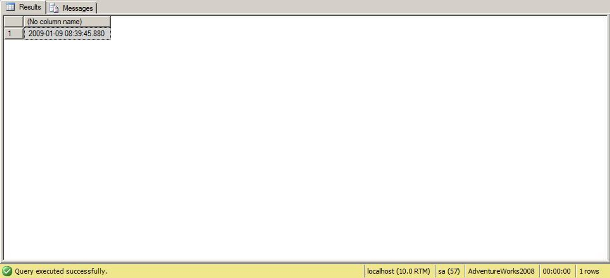

 

Insert 작업이 완료되자 마자 Trigger정의로 인해 현재 시간이 출력되고 있습니다.

Trigger작동이후 Insert 작업이 올바르게 실행되었는지 확인해 보도록 하겠습니다.

Select \* From HumanResources.Department;

 

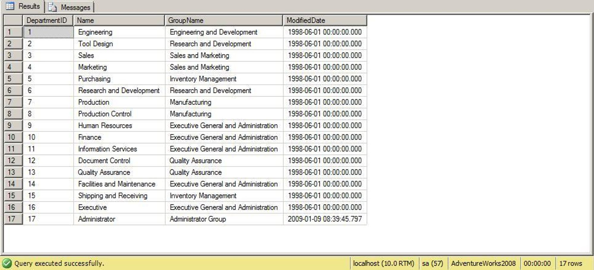

 

마지막에 'Administrator'이름으로 Data가 추가되었습니다.

Trigger정의시 After Insert는 해당 Table에 Insert작업이 먼저 실행된 후 정의된 작업을 수행하도록 하는 것입니다.(After는 View에는 할 수 없고 Table에서만 가능합니다.) 이때 Trigger를 발생시키는 작업의 정의는 ,(comma)구분을 통해서 하나이상 정의하는 것 또한 가능합니다.

Alter trigger [HumanResources].[In_Department]

On HumanResources.Department

After Insert, Delete

As

Select \*

From HumanResources.Department;

Insert 혹은 Delete작업이 발생하면 Trigger가 발생하도록 하고 있으며 실제 Trigger의 작동내용도 HumanResources.Department Table의 내용이 보여지도록 변경하였습니다.(Trigger의 변경은 Alter구문을 이용합니다.)

Trigger의 작동을 확인해 보기 위해 이전에 추가하였던 Data를 삭제해 보겠습니다.

Delete From HumanResources.Department

Where DepartmentID = 17;

 

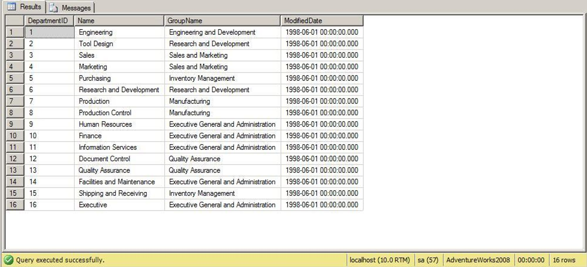

 

Administrator이라는 이름으로 등록된 Data를 삭제 후 HumanResources.Department Table의 내용이 나타나고 있습니다.

Trigger생성시 After대신에 Instead of를 사용하여 해당 Table에 정의된 작업이 시도되면 그 작업은 무시되고 Trigger에 정의된 작업이 실행되도록 할 수 있습니다. 즉, After는 Table작업 시도 후 Trigger가 실행되지만 Instead of는 작업 시도전 Trigger를 실행시키게 되는 것입니다.(Instead of는 Table뿐만 아니라 View에도 정의할 수 있습니다.)

주의:

Instead of로 인해 Trigger가 작동된 후에는 이전에 Table에 시도한 작업은 실행되지 않습니다.

Alter trigger [HumanResources].[In_Department]

On HumanResources.Department

Instead of Delete

As

Insert Into HumanResources.Department

Values('Administrator', 'Administrator Group', getdate());

Select \*

From HumanResources.Department;

HumanResources.Department Table에 Delete작업이 발생하면 해당 Delete작업은 무시되고 Trigger정의된 Insert작업이 실행된 후 Table의 내용이 보여지도록 하였습니다.

그럼 HumanResources.Department Table에 삭제 작업을 시도하여 Trigger작동을 확인해 보도록 하겠습니다.

Delete From HumanResources.Department

Where DepartmentID = 16;

 

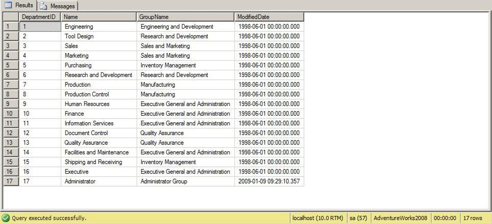

 

삭제하려고 시도 했던 작업은 무시되어 Data가 그대로 남아 있으며 Trigger에 의해 새로운 Data가 추가되었습니다.

  

### 2. Trigger의 추가생성과 실행주기

Trigger는 하나의 Table나 View에 2개이상을 정의할 수 있습니다.

Create trigger [HumanResources].[Up_Department]

On HumanResources.Department

After Update

As

Raiserror('Update 되었음', 16, 1);

Create trigger [HumanResources].[In_Department]

On HumanResources.Department

After Insert

As

Raiserror('Insert 되었음', 16, 1);

Create trigger [HumanResources].[In2_Department]

On HumanResources.Department

After Insert

As

Raiserror('Insert 되었음2', 16, 1);

Create trigger [HumanResources].[Del_Department]

On HumanResources.Department

After Insert

As

Raiserror('Delete 되었음', 16, 1);

HumanResources.Department Table에 Update, Insert, Delete관련 Trigger와 Insert에 대한 Trigger를 하나 더 생성하였습니다.(위 Trigger문은 한꺼번에 실행되지 않으므로 하나씩 생성해야 합니다.)

이렇게 Trigger를 생성해둔 상태에서 Insert작업을 시도한다면 관련 Trigger는 정의된 순서대로 모두 실행될 것입니다.

Insert Into HumanResources.Department

Values('Administrator', 'Administrator Group', getdate());

 

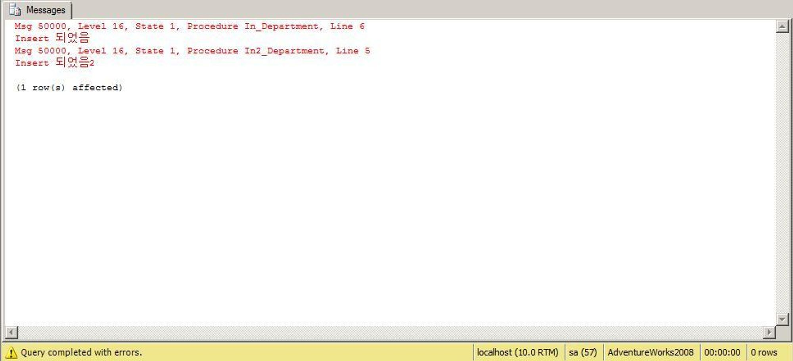

 

이때 만일 두번째로 정의한 Insert Trigger를 먼저 실행시키고자 한다면 Sp_settriggerorder로 그 순서를 지정해 주면 됩니다.

sp_settriggerorder '[HumanResources].[In2_Department]', 'First', 'INSERT'

Insert작업에 대해 In2_Department Trigger를 먼저 실행시키고

sp_settriggerorder '[HumanResources].[In_Department]', 'Last', 'INSERT'

In_Department Trigger를 나중에 실행시킵니다.

위와 같이 설정 후 다시 Insert작업을 시도하면

Insert Into HumanResources.Department

Values('Administrator', 'Administrator Group', getdate());

 

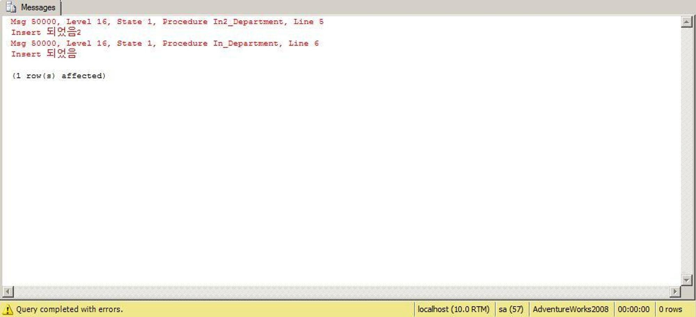

 

실행 순서가 바뀌어 있음을 확인할 수 있습니다.

  

### 3. trigger 내부 제어

Trigger가 작동할때 Table이나 View자체가 아닌 특정 Column을 확인하여 Trigger를 작동시킬 수도 있습니다.

Alter trigger [HumanResources].[In_Department]

On HumanResources.Department

After Update

As

If Update(GroupName)

Begin

Raiserror('GroupName 열에 Update가 발생하였습니다.', 16, 1);

End

HumanResources.Department Table에 Update작업이 발생했을 때 Column을 확인하여 GroupName열이 변경되었으면 Message를 보여주도록 합니다.

실제 HumanResources.Department Table에 Update를 시도하여 Trigger의 작동을 확인해 보면

Update HumanResources.Department

Set GroupName = 'Executive General'

Where DepartmentID = 16;

 

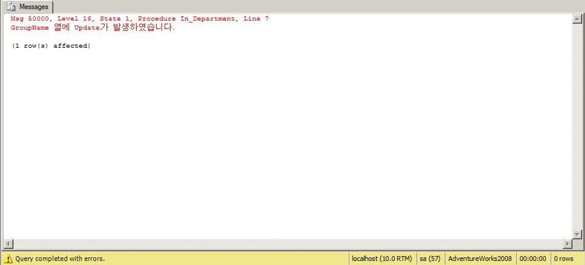

 

Trigger에서 정의해둔 Message가 나타남을 확인 할 수 있습니다.

Select \*

From HumanResources.Department;

HumanResources.Department Table에 Update가 제대로 이루어 졌는지 확인합니다.

 

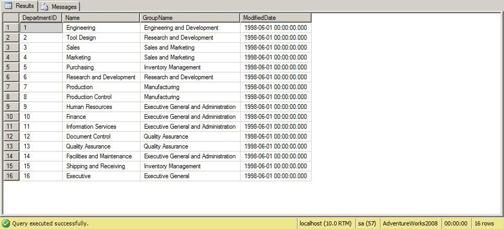

 

만일 HumanResources.Department Table의 다른 Column에 Update를 시도한다면

Update HumanResources.Department

Set Name = 'Exec'

Where DepartmentID = 16;

 

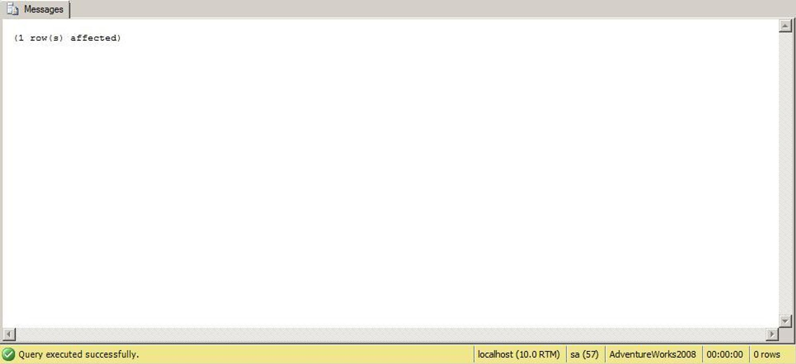

 

If와 Update(GroupName)로 Trigger가 작동할 수 있는 조건이 지정되어 있으므로 Trigger는 실행되지 않을 것입니다.

또한 Update()를 통해 특정 열의 Update여부를 확인하는 대신 Columns_Update() 함수를 이용할 수도 있습니다. 이 함수는bColumn에 대한 변경 여부를 판단한다는 의미에서 Update()함수와 동일하지만 대신 Binary값을 통해 확인한다는 차이가 있습니다.

Columns_Update()는 Update작업이 아루어 지는 Table의 Column을 Bit값을 통해 나타내는데 쉽게 얘기하면 Table의 열을 첨부터 끝까지 1, 2, 4, 6, 8....(2의 승수) 순으로 보고 Update되는 해당 Column만 값을 더하여 산출합니다. 이 결과를 보게 되면 변경되는 Column을 확인할 수 있게 되는 것입니다.

예를 들어 HumanResources.Department Table에는 DepartmentID, Name, GroupName, ModifiedDate 4개의 Column이 존재하는데 이들 각각의 열을 1, 2, 4, 8 값으로 보겠습니다. 그러면 Name과 GroupName만 Update되었을때 Columns_Update() 함수는 2+4 인 6의 값을 반환할 것입니다.

  

### 4. Trigger의 중첩실행방지

만일 어떤 하나의 Table에 Trigger가 설정되어 있을때 그 Table에 특정 작업을 시도하면 정해진 Trigger가 실행될것입니다. 그런데 이 Trigger가 작동하면서 다른 Table의 Data를 변경할때 그 Table에도 Trigger가 설정되어 있다면 해당 Table의 Trigger도 작동할 것입니다.

이런식으로 어느 하나의 Table에서 부터 시작하여 점차적으로 다른 Table에 영향을 미치게 되어 Trigger가 연속적으로 실행되는 경우를 Trigger의 중첩실행이라고 합니다. 만일 이 중첩실행을 방지하고자 한다면 sp_configure를 통해 Server설정을 변경해야 합니다.

sp_configure 'nested trigger', 0

Trigger가 중첩 실행될 수 있는 횟수는 32회 까지로 이 횟수를 넘어서면 Trigger는 종료됩니다. 그럼 이전까지 실행된 Trigger는 어떻게 될까? 라는 의문을 가질 수 있지만 Trigger는 내부에는 Transaction을 구현하지 않아도 자동적으로 Transaction을 동반하므로 모두 Rollback처리 됩니다.

  

### 5. 재귀 Trigger

Trigger가 실행되어 다른 Table에 Data변경 작업이 발생할때 그 Table의 Trigger가 또 작동되는 경우는 위에서 말씀드린 중첩실행에 해당합니다. 그런데 Trigger가 실행될때 Trigger안에서 자신을 호출한 Table의 Data를 변경한다면 또 다시 자기자신에 해당하는 Trigger가 실행될 수 있습니다.

자기자신을 호출한다는 의미로 이런 경우를 재귀호출이라 할 수 있는데 자신을 호출한 Table이 아닌 다른 Table의 Data변경으로 인해 그 Table의 Trigger가 호출되면서 다시 원래 Table의 Data변경 작업을 시도하여 본래 실행되었던 Trigger를 다시 호출하는 경우도 재귀 Trigger라 할 수 있습니다.

이런 재귀 Trigger는 다음과 같은 방법으로 방지할 수 있습니다.

Sp_dboption database, 'recursive trigger', true

  

### 6. DDL Tirgger

Trigger가 작동하는 대상을 Table이나 View가 아닌 SQL Server자체나 특정 Database전체를 대상으로 할 수도 있습니다. 즉, Server나 Database에 Trigger를 생성해 놓으면 해당 작업이 발생할때 Trigger가 실행되도록 할 수 있는 것입니다.

DDL Trigger를 생성하기 위한 구문은 다음과 같습니다.

Create trigger 이름

On All server 혹은 Database

Event

As

Query

On다음에는 해당 Trigger가 Server를 대상으로 하는지 Database를 대상으로 하는지를 지정해 줘야하며 <Event>에는 On에서 설정한 Server혹은 Database에 Trigger가 실행될 특정 작업(Event)을 지정해 줍니다.

Trigger가 Table이나 View를 대상하는 하는 경우에는 Insert, Update, Delete등의 구문이 들어갔지만 Server나 Database가 Trigger의 대상이 되는 경우 SQL Server에서 별도로 제공해 주는 Event를 따로 써야합니다.

다음은 Server와 Database에서 DDL Trigger를 생성한 예제입니다.

Create trigger User_add

On All Server

After Create_login

As

Raiserror('사용자를 생성할 수 없습니다.', 16, 1)

Rollback Tran;

All Server로 인해 해당 Trigger가 Server 내에서 작동하도록 하였으며 Create_Login Event를 지정하여 Server의 사용자가 추가될때 Trigger가 작동하도록 합니다.

위와 같이 설정 후 실제 Server에 사용자를 추가하려고 하면 아래와 같은 오류가 발생할 것입니다.

 

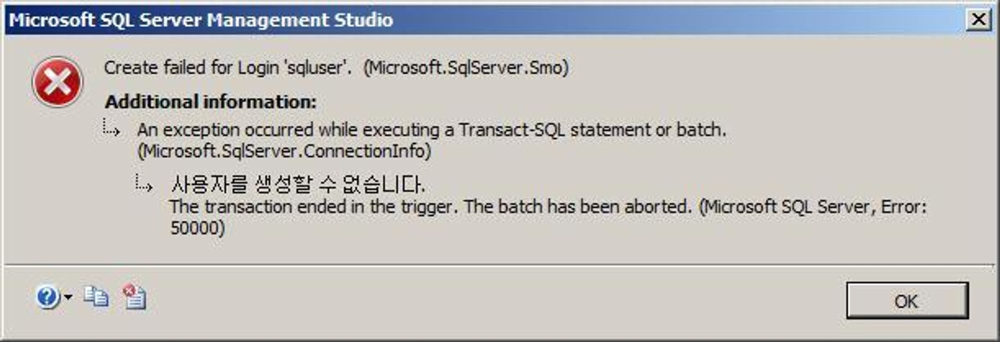

 

위 Trigger생성시 Raiserror로 인해 오류 Message를 반환하도록 한 후 실제 사용자 추가가 취소되도록 Rollback Tran하였습니다. DDL Trigger는 오로지 After Option만 사용할 수 있기 때문에 작업이 일어나기 전에는 Trigger가 작동하지 않게 되기 때문입니다. 따라서 일단 사용자가 추가되면 오류를 일으킴과 동시에 Rollback되도록 하여 사용자 추가가 불가능하도록 만들어 둔 것입니다.

이번에는 Database를 대상으로 하여 DDL Trigger를 생성해 보도록 하겠습니다.

Create trigger Add_table

On Database

After DDL_Table_Events

As

Raiserror('해당 Database 내에서는 Table을 추가/삭제/변경할 수 없습니다.', 16, 1)

Rollback Tran;

On 다음에 Database를 지정해 해당 Database내에서 Table을 추가하거나 삭제/변경할때 Trigger가 발생하도록 하였습니다.

Create Table tmp_table(

Col1 Int,

Col2 Int

)

Trigger를 생성 후 Table만들기를 시도합니다.

 

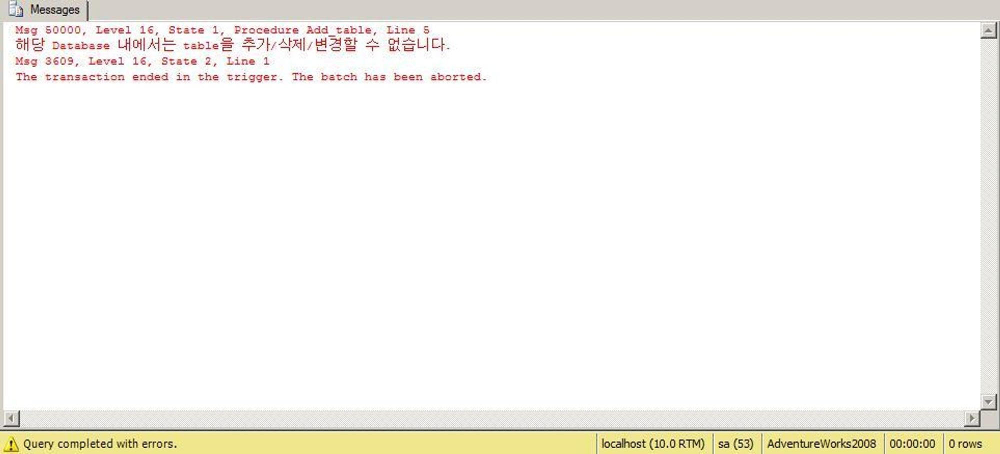

 

위에서 Trigger를 설정할때 지정한 DDL_Table_Events는 하나의 작업에 대한 Event가 아닌 여러 Event를 묶어 Group화된 Event를 지정한 것입니다. 이때 Group화된 DDL_Table_Events는 다음과 같은 3개의 Event를 포함하고 있습니다.

(1) Create_Table

Table을 만들때 발생하는 Event입니다.

(2) Alter_Table

Table을 변경할때 발생하는 Event입니다.

(3) Drop_Table

Table을 삭제할때 발생하는 Event입니다.

이상입니다. 따라서 DDL_Table_Events 를 지정하면 Database에서 위 세가지 Event가 발생할때 Trigger가 작동하게 되는 것입니다.

이처럼 DDL Trigger생성시에는 특정 Event 뿐만 아니라 여러 Event를 묶은 그룹화된 Event도 설정이 가능다는 것을 알아두기시 바랍니다.(각각의 Event와 Group화된 Event가 어떤 종류가 있는지에 대해서는 SQL 도움말을 참고하십시오.)

  

### 7. Trigger의 암호화

Trigger는 생성시에 암호화 하여 다른 사람이 내용을 볼 수 없도록 할 수 있습니다.

Create trigger [HumanResources].[In_Department]

On HumanResources.Department

With Encryption

Instead of Delete

As

Insert Into HumanResources.Department

Values('Administrator', 'Administrator Group', getdate());

Select \* From HumanResources.Department;
