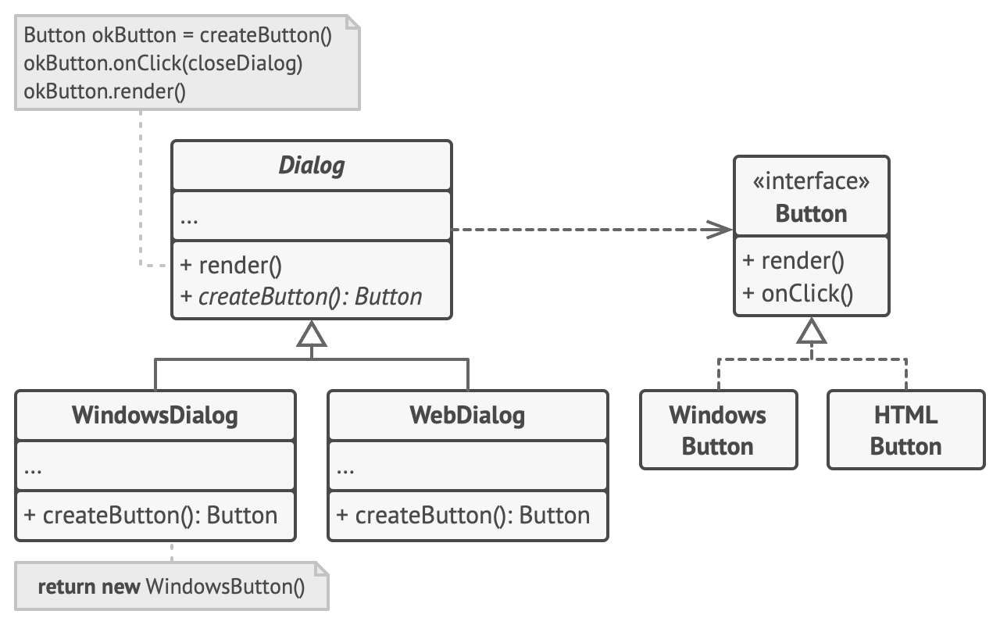

# Factory Method

팩토리 메서드는 부모 클래스에서 객체들을 생성할 수 있는 인터페이스를 제공하지만, 자식 클래스들이 생성될 객체들의 유형을 변경할 수 있도록 하는 생성 패턴입니다.



어떻게 팩토리 메서드가 클라이언트 코드를 구상 UI 클래스들과 결합하지 않고도 크로스 플랫폼 UI 요소들을 생성할 수 있는지를 보여줍니다.

기초 Dialog​(대화 상자) 클래스는 여러 UI 요소들을 사용하여 대화 상자를 렌더링합니다. 다양한 운영 체제에서 이러한 요소들은 약간씩 다르게 보일 수 있지만 여전히 일관되게 작동해야 합니다. 예를 들어 윈도우에서의 버튼은 리눅스에서도 여전히 버튼이어야 합니다.

팩토리 메서드가 적용되면, 당신은 대화 상자 로직을 각 운영 체제를 위하여 반복해서 재작성할 필요가 없습니다. 기초 Dialog 클래스 내에서 버튼을 생성하는 팩토리 메서드를 선언하면 나중에 팩토리 메서드에서 윈도우 유형의 버튼들을 반환하는 Dialog 자식 클래스를 생성할 수 있습니다. 그 후 이 자식 클래스는 기초 클래스로부터 Dialog의 코드 대부분을 상속받으나, 팩토리 메서드 덕분에 윈도우 유형의 버튼들도 렌더링할 수 있습니다.

이 패턴이 작동하려면 기초 Dialog 클래스가 추상 버튼들과 함께 작동해야 합니다. (참고로 추상 버튼은 모든 구상 버튼들이 따르는 인터페이스 또는 기초 클래스입니다). 이렇게 해야 다이얼로그 코드가 버튼 유형에 관계없이 작동합니다.

물론, 위 접근 방식을 다른 UI 요소들에도 적용할 수 있으나, 대화 상자에 새로운 팩토리 메서드를 추가할 때마다 이 프로그램은 추상 팩토리 패턴에 더 가까워집니다.

```java
// 크리에이터 클래스는 제품 클래스의 객체를 반환해야 하는 팩토리 메서드를
// 선언합니다. 크리에이터의 자식 클래스들은 일반적으로 이 메서드의 구현을
// 제공합니다.
class Dialog is
    // 크리에이터는 팩토리 메서드의 일부 디폴트 구현을 제공할 수도 있습니다.
    abstract method createButton():Button

    // 크리에이터의 주 업무는 제품을 생성하는 것이 아닙니다. 크리에이터는
    // 일반적으로 팩토리 메서드에서 반환된 제품 객체에 의존하는 어떤 핵심
    // 비즈니스 로직을 포함합니다. 자식 클래스들은 팩토리 메서드를 오버라이드 한
    // 후 해당 메서드에서 다른 유형의 제품을 반환하여 해당 비즈니스 로직을
    // 간접적으로 변경할 수 있습니다.
    method render() is
        // 팩토리 메서드를 호출하여 제품 객체를 생성하세요.
        Button okButton = createButton()
        // 이제 제품을 사용하세요.
        okButton.onClick(closeDialog)
        okButton.render()


// 구상 크리에이터들은 결과 제품들의 유형을 변경하기 위해 팩토리 메서드를
// 오버라이드합니다.
class WindowsDialog extends Dialog is
    method createButton():Button is
        return new WindowsButton()

class WebDialog extends Dialog is
    method createButton():Button is
        return new HTMLButton()


// 제품 인터페이스는 모든 구상 제품들이 구현해야 하는 작업들을 선언합니다.
interface Button is
    method render()
    method onClick(f)

// 구상 제품들은 제품 인터페이스의 다양한 구현을 제공합니다.
class WindowsButton implements Button is
    method render(a, b) is
        // 버튼을 윈도우 스타일로 렌더링하세요.
    method onClick(f) is
        // 네이티브 운영체제 클릭 이벤트를 바인딩하세요.

class HTMLButton implements Button is
    method render(a, b) is
        // 버튼의 HTML 표현을 반환하세요.
    method onClick(f) is
        // 웹 브라우저 클릭 이벤트를 바인딩하세요.


class Application is
    field dialog: Dialog

    // 앱은 현재 설정 또는 환경 설정에 따라 크리에이터의 유형을 선택합니다.
    method initialize() is
        config = readApplicationConfigFile()

        if (config.OS == "Windows") then
            dialog = new WindowsDialog()
        else if (config.OS == "Web") then
            dialog = new WebDialog()
        else
            throw new Exception("Error! Unknown operating system.")

    // 클라이언트 코드는 비록 구상 크리에이터의 기초 인터페이스를 통하는 것이긴
    // 하지만 구상 크리에이터의 인스턴스와 함께 작동합니다. 클라이언트가
    // 크리에이터의 기초 인터페이스를 통해 크리에이터와 계속 작업하는 한 모든
    // 크리에이터의 자식 클래스를 클라이언트에 전달할 수 있습니다.
    method main() is
        this.initialize()
        dialog.render()
```

<br /><br />

---

<br /><br />

## 사용 유형

-   코드가 함께 작동해야 하는 객체들의 정확한 유형들과 의존관계들을 미리 모르는 경우
-   라이브러리 또는 프레임워크의 사용자들에게 내부 컴포넌트들을 확장하는 방법을 제공하고 싶을 때
-   기존 객체들을 매번 재구축하는 대신 이들을 재사용하여 시스템 리소스를 절약하고 싶을 때

<br /><br />

---

<br /><br />

## 구현방법

모든 제품이 같은 인터페이스를 따르도록 하세요. 이 인터페이스는 모든 제품에서 의미가 있는 메서드들을 선언해야 합니다.

크리에이터 클래스 내부에 빈 팩토리 메서드를 추가하세요. 이 메서드의 반환 유형은 공통 제품 인터페이스와 일치해야 합니다.

크리에이터의 코드에서 제품 생성자들에 대한 모든 참조를 찾으세요. 이 참조들을 하나씩 팩토리 메소드에 대한 호출로 교체하면서 제품 생성 코드를 팩토리 메서드로 추출하세요.

반환된 제품의 유형을 제어하기 위해 팩토리 메서드에 임시 매개변수를 추가해야 할 수도 있습니다.

이 시점에서 팩토리 메서드의 코드는 꽤 복잡할 수 있습니다. 예를 들어 인스턴트화할 제품 클래스를 선택하는 큰 switch 문장이 있을 수 있습니다. 하지만 걱정하지 마세요, 곧 이 문제를 해결할 테니까요.

이제 팩토리 메서드에 나열된 각 제품 유형에 대한 크리에이터 자식 클래스들의 집합을 생성한 후, 자식 클래스들에서 팩토리 메서드를 오버라이딩하고 기초 메서드에서 생성자 코드의 적절한 부분들을 추출하세요.

제품 유형이 너무 많아 모든 제품에 대하여 자식 클래스들을 만드는 것이 합리적이지 않을 경우, 자식 클래스들의 기초 클래스의 제어 매개변수를 재사용할 수 있습니다.

예를 들어, 다음과 같은 클래스 계층구조가 있다고 상상해 보세요. Mail​(우편) 기초 클래스의 자식 클래스들은 Air­Mail​(항공우편)​과 Ground­Mail​(지상우편)​이며, Transport​(운송수단) 클래스의 자식 클래스들은 Plane​(비행기), Truck​(트럭), 그리고 Train​(기차)​입니다. Air­Mail​(항공우편) 클래스는 Plane​(비행기) 객체만 사용하지만, Ground­Mail​(지상우편)​은 Truck 과 Train 객체들 모두 사용할 수 있습니다. 이 두 가지 경우를 모두 처리하기 위해 새 자식 클래스​(예: Train­Mail​(기차우편))​를 만들 수도 있으나, 다른 방법도 있습니다. 클라이언트 코드가 받으려는 제품을 제어하기 위해 Ground­Mail 클래스의 팩토리 메서드에 전달인자​(argument)​를 전달하는 방법입니다.

추출이 모두 끝난 후 기초 팩토리 메서드가 비어 있으면, 해당 팩토리 메서드를 추상화할 수 있습니다. 팩토리 메서드가 비어 있지 않으면, 나머지를 그 메서드의 디폴트 행동으로 만들 수 있습니다.

<br /><br />

---

<br /><br />

## 장단점

### 장점

-   크리에이터와 구상 제품들이 단단하게 결합되지 않도록 할 수 있습니다.
-   단일 책임 원칙. 제품 생성 코드를 프로그램의 한 위치로 이동하여 코드를 더 쉽게 유지관리할 수 있습니다.
-   개방/폐쇄 원칙. 당신은 기존 클라이언트 코드를 훼손하지 않고 새로운 유형의 제품들을 프로그램에 도입할 수 있습니다.

<br />

### 단점

-   패턴을 구현하기 위해 많은 새로운 자식 클래스들을 도입해야 하므로 코드가 더 복잡해질 수 있습니다. 가장 좋은 방법은 크리에이터 클래스들의 기존 계층구조에 패턴을 도입하는 것입니다.
