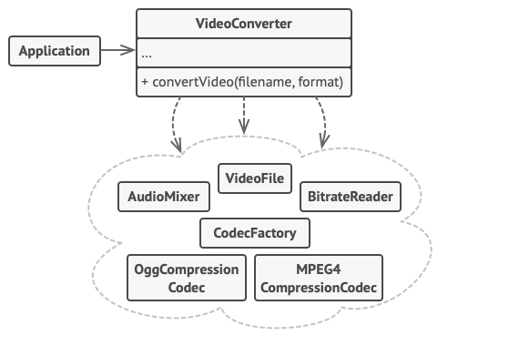

# 퍼사드 패턴

- [참고 자료(Refactoring.Guru)](https://refactoring.guru/ko/design-patterns/facade)

퍼사드 패턴은 라이브러리에 대한, 프레임워크에 대한 또는 다른 클래스들의 복잡한 집합에 대한 단순화된 인터페이스를 제공하는 구조적 디자인 패턴입니다.



당신의 코드가 수십 개의 프레임워크 클래스들과 직접 작업하도록 하는 대신, 해당 기능들을 캡슐화하여 코드의 나머지 부분으로부터 숨기는 퍼사드 클래스를 만듭니다. 이러한 구조를 이용하면 나중에 프레임워크를 업그레이드하거나 다른 프레임워크로 교체할 때 들어갈 노력을 최소한으로 줄일 수 있습니다. 앱에서 바꾸어야 할 부분이 퍼사드의 메서드들의 구현뿐일 것이기 때문입니다.

```java
// 이것들은 복잡한 타사 비디오 변환 프레임워크 클래스의 일부입니다. 해당 프레임워크
// 코드는 우리가 제어할 수 없기 때문에 단순화할 수 없습니다.

class VideoFile
// …

class OggCompressionCodec
// …

class MPEG4CompressionCodec
// …

class CodecFactory
// …

class BitrateReader
// …

class AudioMixer
// …


// 퍼사드 클래스를 만들어 프레임워크의 복잡성을 간단한 인터페이스 뒤에 숨길 수
// 있습니다. 기능성과 단순함을 상호보완하는 것이죠.
class VideoConverter is
    method convert(filename, format):File is
        file = new VideoFile(filename)
        sourceCodec = (new CodecFactory).extract(file)
        if (format == "mp4")
            destinationCodec = new MPEG4CompressionCodec()
        else
            destinationCodec = new OggCompressionCodec()
        buffer = BitrateReader.read(filename, sourceCodec)
        result = BitrateReader.convert(buffer, destinationCodec)
        result = (new AudioMixer()).fix(result)
        return new File(result)

// 애플리케이션 클래스들은 복잡한 프레임워크에서 제공하는 수많은 클래스에 의존하지
// 않습니다. 또한 프레임워크의 전환을 결정한 경우에는 퍼사드 클래스만 다시 작성하면
// 됩니다.
class Application is
    method main() is
        convertor = new VideoConverter()
        mp4 = convertor.convert("funny-cats-video.ogg", "mp4")
        mp4.save()
```

<br /><br />

---

<br /><br />

## 사용 유형

- 복잡한 하위 시스템에 대한 제한적이지만 간단한 인터페이스가 필요할 때
- 하위 시스템을 계층들로 구성하려는 경우

<br /><br />

---

<br /><br />

## 구현방법

- 기존 하위시스템이 이미 제공하고 있는 것보다 더 간단한 인터페이스를 제공하는 것이 가능한지 확인
- 새 퍼사드 패턴 클래스에서 이 인터페이스를 선언하고 구현
- 패턴을 최대한 활용하려면 모든 클라이언트 코드가 퍼사드 패턴을 통해서만 하위시스템과 통신하도록 구현
- 퍼사드가 너무 커지면 행동들 일부를 새롭고 정제된 퍼사드 클래스로 추출

<br /><br />

---

<br /><br />

## 장단점

### 장점

- 복잡한 하위 시스템에서 코드를 별도로 분리할 수 있습니다.

<br />

### 단점

- 퍼사드는 앱의 모든 클래스에 결합된 전지전능한 객체가 될 수 있습니다.
