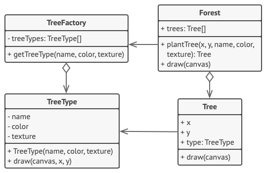

# 플라이웨이트 패턴

- [참고 자료(Refactoring.Guru)](https://refactoring.guru/ko/design-patterns/flyweight)

플라이웨이트는 각 객체에 모든 데이터를 유지하는 대신 여러 객체들 간에 상태의 공통 부분들을 공유하여 사용할 수 있는 RAM에 더 많은 객체들을 포함할 수 있도록 하는 구조 디자인 패턴입니다.



```java
// 플라이웨이트 클래스는 트리의 상태 일부를 포함합니다. 이러한 필드는 각 특정
// 트리에 대해 고유한 값들을 저장합니다. 예를 들어 여기에서는 트리 좌표들을 찾을
// 수 없을 것입니다. 그러나 많은 트리들이 공유하는 질감들과 색상들은 찾을 수 있을
// 것입니다. 이 데이터는 일반적으로 크기 때문에 각 트리 개체에 보관하면 많은
// 메모리를 낭비하게 됩니다. 대신 질감, 색상 및 기타 반복되는 데이터를 많은 개별
// 트리 객체들이 참조할 수 있는 별도의 객체로 추출할 수 있습니다.
class TreeType is
    field name
    field color
    field texture
    constructor TreeType(name, color, texture) { ... }
    method draw(canvas, x, y) is
        // 1. 주어진 유형, 색상 및 질감의 비트맵을 만드세요.
        // 2. 비트맵을 캔버스의 X 및 Y 좌표에 그리세요.

// 플라이웨이트 팩토리는 기존 플라이웨이트를 재사용할지 아니면 새로운 객체를
// 생성할지를 결정합니다.
class TreeFactory is
    static field treeTypes: collection of tree types
    static method getTreeType(name, color, texture) is
        type = treeTypes.find(name, color, texture)
        if (type == null)
            type = new TreeType(name, color, texture)
            treeTypes.add(type)
        return type

// 콘텍스트 객체는 트리 상태의 공유된 부분을 포함합니다. 이러한 부분들은 두 개의
// 정수로 된 좌표와 하나의 참조 필드만 참조하여 크기가 작기 때문에 하나의 앱이
// 이런 부분을 수십억 개씩 만들 수 있습니다.
class Tree is
    field x,y
    field type: TreeType
    constructor Tree(x, y, type) { ... }
    method draw(canvas) is
        type.draw(canvas, this.x, this.y)

// Tree 및 Forest 클래스들은 플라이웨이트의 클라이언트들이며 Tree 클래스를 더
// 이상 개발할 계획이 없으면 이 둘을 병합할 수 있습니다.
class Forest is
    field trees: collection of Trees

    method plantTree(x, y, name, color, texture) is
        type = TreeFactory.getTreeType(name, color, texture)
        tree = new Tree(x, y, type)
        trees.add(tree)

    method draw(canvas) is
        foreach (tree in trees) do
            tree.draw(canvas)
```

<br /><br />

---

<br /><br />

## 사용 유형

- 프로그램이 많은 수의 객체들을 지원해야 해서 사용할 수 있는 RAM을 거의 다 사용했을 때

<br /><br />

---

<br /><br />

## 구현방법

- 플라이웨이트가 될 클래스의 필드들을 두 부분으로 나누기
- 클래스의 고유한 상태를 나타내는 필드들은 그대로 두되 변경될 수 없도록
- 메서드에 사용된 각 필드에 대해 새 매개변수를 도입하고 필드 대신 사용
- 옵션으로, 플라이웨이트들의 풀을 관리하기 위한 팩토리 클래스를 생성
- 클라이언트는 플라이웨이트 객체들의 메서드들을 호출할 수 있도록 공유한 상태의 값들​(콘텍스트)​을 저장하거나 계산

<br /><br />

---

<br /><br />

## 장단점

### 장점

- 당신의 프로그램에 유사한 객체들이 많다고 가정하면 많은 RAM을 절약할 수 있습니다.

<br />

### 단점

- 누군가가 플라이웨이트 메서드를 호출할 때마다 콘텍스트 데이터의 일부를 다시 계산해야 한다면 당신은 CPU 주기 대신 RAM을 절약하고 있는 것일지도 모릅니다.
- 코드가 복잡해지므로 새로운 팀원들은 왜 개체​(entity)​의 상태가 그런 식으로 분리되었는지 항상 궁금해할 것입니다.
