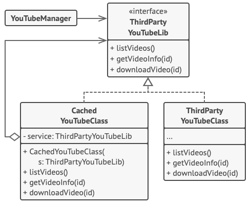

# 프록시 패턴

- [참고 자료(Refactoring.Guru)](https://refactoring.guru/ko/design-patterns/proxy)

프록시는 다른 객체에 대한 대체 또는 자리표시자를 제공할 수 있는 구조 디자인 패턴입니다. 프록시는 원래 객체에 대한 접근을 제어하므로, 당신의 요청이 원래 객체에 전달되기 전 또는 후에 무언가를 수행할 수 있도록 합니다.



이 라이브러리는 비디오 다운로드 클래스를 제공하나 매우 비효율적입니다. 왜냐하면 클라이언트 앱이 같은 비디오를 여러 번 요청하면 라이브러리는 처음 다운로드한 파일을 캐싱하고 재사용하는 대신 계속해서 같은 비디오를 다운로드하기 때문입니다.

프록시 클래스는 원래 다운로더와 같은 인터페이스를 구현하고 이 다운로더에 모든 작업을 위임하나, 앱이 같은 비디오를 두 번 이상 요청하면 이미 다운로드한 파일을 추적한 후 캐시 된 결과를 반환합니다.

```java
// 원격 서비스의 인터페이스.
interface ThirdPartyYouTubeLib is
    method listVideos()
    method getVideoInfo(id)
    method downloadVideo(id)

// 서비스 연결자의 구상 구현. 이 클래스의 메서드들은 유튜브에서 정보를 요청할 수
// 있습니다. 해당 요청의 속도는 사용자와 유튜브의 인터넷 연결 속도에 따라 다를
// 것입니다. 앱이 많은 요청을 동시에 처리하면 속도가 느려질 것입니다. 이는
// 요청들이 모두 같은 정보를 요청하더라도 마찬가지입니다.
class ThirdPartyYouTubeClass implements ThirdPartyYouTubeLib is
    method listVideos() is
        // 유튜브에 API 요청을 보냅니다.

    method getVideoInfo(id) is
        // 어떤 비디오에 대한 메타데이터를 가져옵니다.

    method downloadVideo(id) is
        // 유튜브에서 동영상 파일을 다운로드합니다.

// 일부 대역폭을 절약하기 위해 요청 결과를 캐시하고 일정 기간 보관할 수 있습니다.
// 그러나 이러한 코드를 서비스 클래스에 직접 넣는 것은 불가능할 수 있습니다. 예를
// 들어, 타사 라이브러리의 일부로 제공되었거나 `final`로 정의된 경우에는 말이죠.
// 서비스 클래스와 같은 인터페이스를 구현하는 새 프록시 클래스에 캐싱 코드를 넣는
// 이유가 바로 그 때문입니다. 이 클래스는 실제 요청을 보내야 하는 경우에만 서비스
// 객체에 위임합니다.
class CachedYouTubeClass implements ThirdPartyYouTubeLib is
    private field service: ThirdPartyYouTubeLib
    private field listCache, videoCache
    field needReset

    constructor CachedYouTubeClass(service: ThirdPartyYouTubeLib) is
        this.service = service

    method listVideos() is
        if (listCache == null || needReset)
            listCache = service.listVideos()
        return listCache

    method getVideoInfo(id) is
        if (videoCache == null || needReset)
            videoCache = service.getVideoInfo(id)
        return videoCache

    method downloadVideo(id) is
        if (!downloadExists(id) || needReset)
            service.downloadVideo(id)

// 서비스 객체와 직접 작업하던 그래픽 사용자 인터페이스 클래스는 서비스 객체와
// 인터페이스를 통해 작업하는 한 변경되지 않습니다. 둘 다 같은 인터페이스를
// 구현하므로 실제 서비스 객체 대신 프록시 객체를 안전하게 전달할 수 있습니다.
class YouTubeManager is
    protected field service: ThirdPartyYouTubeLib

    constructor YouTubeManager(service: ThirdPartyYouTubeLib) is
        this.service = service

    method renderVideoPage(id) is
        info = service.getVideoInfo(id)
        // 비디오 페이지를 렌더링하세요.

    method renderListPanel() is
        list = service.listVideos()
        // 비디오 섬네일 리스트를 렌더링하세요.

    method reactOnUserInput() is
        renderVideoPage()
        renderListPanel()

// 앱은 언제든지 프록시를 설정할 수 있습니다.
class Application is
    method init() is
        aYouTubeService = new ThirdPartyYouTubeClass()
        aYouTubeProxy = new CachedYouTubeClass(aYouTubeService)
        manager = new YouTubeManager(aYouTubeProxy)
        manager.reactOnUserInput()
```

<br /><br />

---

<br /><br />

## 사용 유형

- 지연된 초기화​(가상 프록시). 이것은 어쩌다 필요한 무거운 서비스 객체가 항상 가동되어 있어 시스템 자원들을 낭비하는 경우
- 접근 제어 (보호 프록시). 당신이 특정 클라이언트들만 서비스 객체를 사용할 수 있도록 하려는 경우
- 원격 서비스의 로컬 실행 (원격 프록시). 서비스 객체가 원격 서버에 있는 경우
- 요청들의 로깅​(로깅 프록시). 서비스 객체에 대한 요청들의 기록을 유지하려는 경우
- 요청 결과들의 캐싱​(캐싱 프록시). 이것은 클라이언트 요청들의 결과들을 캐시하고 이 캐시들의 수명 주기를 관리해야 할 때, 특히 결과들이 상당히 큰 경우
- 스마트 참조. 이것은 사용하는 클라이언트들이 없어 거대한 객체를 해제할 수 있어야 할 때

<br /><br />

---

<br /><br />

## 구현방법

- 기존 서비스 인터페이스가 없는 경우, 서비스 인터페이스를 하나 생성하여 프록시와 서비스 객체 간의 상호 교환
- 프록시 클래스 생성
- 목적에 따라 프록시 메서드들을 구현
- 클라이언트가 프록시를 받을지 실제 서비스를 받을지를 결정하는 생성 메서드를 도입하는 것을 고려
- 서비스 객체에 대해 지연된 초기화 구현을 고려

<br /><br />

---

<br /><br />

## 장단점

### 장점

- 클라이언트들이 알지 못하는 상태에서 서비스 객체를 제어할 수 있습니다.
- 클라이언트들이 신경 쓰지 않을 때 서비스 객체의 수명 주기를 관리할 수 있습니다.
- 프록시는 서비스 객체가 준비되지 않았거나 사용할 수 없는 경우에도 작동합니다.
- 개방/폐쇄 원칙. 서비스나 클라이언트들을 변경하지 않고도 새 프록시들을 도입할 수 있습니다.

<br />

### 단점

- 새로운 클래스들을 많이 도입해야 하므로 코드가 복잡해질 수 있습니다.
- 서비스의 응답이 늦어질 수 있습니다.
