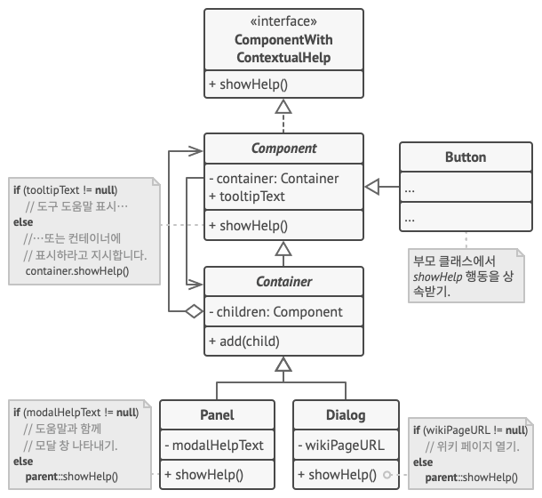
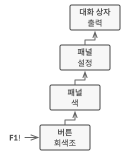

# 책임 연쇄 패턴

- [참고 자료(Refactoring.Guru)](https://refactoring.guru/ko/design-patterns/chain-of-responsibility)

책임 연쇄 패턴은 핸들러들의 체인​(사슬)​을 따라 요청을 전달할 수 있게 해주는 행동 디자인 패턴입니다. 각 핸들러는 요청을 받으면 요청을 처리할지 아니면 체인의 다음 핸들러로 전달할지를 결정합니다.



앱의 그래픽 사용자 인터페이스의 구조는 일반적으로 객체 트리로 구성됩니다. 예를 들어 앱의 기본 창을 렌더링하는 Dialog​(대화 상자) 클래스는 객체 트리의 뿌리​(root)​가 됩니다. Dialog에는 Panels​(패널들)​가 포함되어 있으며, 여기에는 다른 패널들이나 Buttons​(버튼들) 및 Text­Fields​(문자 필드들)​와 같은 단순한 하위 설계 요소들이 포함될 수 있습니다.

간단한 컴포넌트는 컴포넌트에 어떤 도움말 텍스트가 할당되어 있는 한 상황에 맞는 짧은 도구 도움말들을 표시할 수 있습니다. 그러나 더 복잡한 컴포넌트들은 (예를 들어 설명서에서 발췌한 내용을 표시하거나 브라우저에서 웹페이지를 여는 것과 같은 상황에 맞는 도움말을 표시하는 컴포넌트들) 상황별 도움말을 나타내기 위한 그들의 고유한 방법들을 정의할 수 있습니다.



사용자가 요소에 마우스 커서를 놓고 F1 키를 누르면 앱은 포인터 아래에 있는 컴포넌트를 감지하고 그에게 도움 요청을 보냅니다. 이 요청은 도움말 정보를 표시할 수 있는 요소에 도달할 때까지 모든 요소의 컨테이너를 통과하며 올라갑니다.

```java
// 핸들러 인터페이스는 요청을 실행하기 위한 메서드를 선언합니다.
interface ComponentWithContextualHelp is
    method showHelp()


// 간단한 컴포넌트들의 기초 클래스.
abstract class Component implements ComponentWithContextualHelp is
    field tooltipText: string

    // 컴포넌트의 컨테이너는 핸들러 체인의 다음 링크 역할을 합니다.
    protected field container: Container

    // 컴포넌트는 도움말 텍스트가 할당되었을 때 도구 설명을 표시합니다. 그렇지
    // 않으면 컨테이너가 있는 경우 호출을 해당 컨테이너로 전달합니다.
    method showHelp() is
        if (tooltipText != null)
            // 도구 설명 표시하기.
        else
            container.showHelp()


// 컨테이너는 간단한 컴포넌트들과 다른 컨테이너들을 자식으로 포함할 수 있습니다.
// 여기에서 체인 관계들이 설립됩니다. 이 클래스는 부모로부터 showHelp 행동을
// 상속합니다.
abstract class Container extends Component is
    protected field children: array of Component

    method add(child) is
        children.add(child)
        child.container = this


// 원시적인 컴포넌트들은 디폴트 도움말 구현으로 괜찮을 수 있습니다…
class Button extends Component is
    // …

// 그러나 복잡한 컴포넌트들은 기초 구현을 오버라이드할 수 있습니다. 도움말 텍스트를
// 새로운 방식으로 제공할 수 없는 경우 컴포넌트는 언제든지 기초 구현을 호출할 수
// 있습니다. (컴포넌트 클래스 참조).
class Panel extends Container is
    field modalHelpText: string

    method showHelp() is
        if (modalHelpText != null)
            // 도움말 텍스트와 함께 모달 창을 표시합니다.
        else
            super.showHelp()

// …위와 같음…
class Dialog extends Container is
    field wikiPageURL: string

    method showHelp() is
        if (wikiPageURL != null)
            // 위키 도움말 페이지를 엽니다.
        else
            super.showHelp()


// 클라이언트 코드
class Application is
    // 모든 앱은 체인을 다르게 설정합니다.
    method createUI() is
        dialog = new Dialog("Budget Reports")
        dialog.wikiPageURL = "http://..."
        panel = new Panel(0, 0, 400, 800)
        panel.modalHelpText = "This panel does..."
        ok = new Button(250, 760, 50, 20, "OK")
        ok.tooltipText = "This is an OK button that..."
        cancel = new Button(320, 760, 50, 20, "Cancel")
        // …
        panel.add(ok)
        panel.add(cancel)
        dialog.add(panel)

    // 여기에서 무슨 일이 일어날지 상상해 보세요.
    method onF1KeyPress() is
        component = this.getComponentAtMouseCoords()
        component.showHelp()
```

<br /><br />

---

<br /><br />

## 사용 유형

- 프로그램이 다양한 방식으로 다양한 종류의 요청들을 처리할 것으로 예상되지만 정확한 요청 유형들과 순서들을 미리 알 수 없는 경우
- 특정 순서로 여러 핸들러를 실행해야 할 때
- 핸들러들의 집합과 그들의 순서가 런타임에 변경되어야 할 때

<br /><br />

---

<br /><br />

## 구현방법

- 핸들러 인터페이스를 선언하고 요청을 처리하는 메서드의 시그니처를 설명
- 구상 핸들러들에서 중복된 상용구 코드를 제거하려면 핸들러 인터페이스에서 파생된 추상 기초 핸들러 클래스를 만드는 것도 고려
- 하나씩 구상 핸들러 자식 클래스들을 만들고 그들의 처리 메서드들을 구현
- 클라이언트는 자체적으로 체인을 조립하거나 다른 객체들에서부터 미리 구축된 체인 전달
- 클라이언트는 첫 번째 핸들러뿐만 아니라 체인의 모든 핸들러를 활성화 가능
- 체인의 동적 특성으로 인해 클라이언트는 다음 상황들을 처리할 준비

<br /><br />

---

<br /><br />

## 장단점

### 장점

- 요청의 처리 순서를 제어할 수 있습니다.
- 단일 책임 원칙. 당신은 작업을 호출하는 클래스들을 작업을 수행하는 클래스들과 분리할 수 있습니다.
- 개방/폐쇄 원칙. 기존 클라이언트 코드를 손상하지 않고 앱에 새 핸들러들을 도입할 수 있습니다.

<br />

### 단점

- 일부 요청들은 처리되지 않을 수 있습니다.
