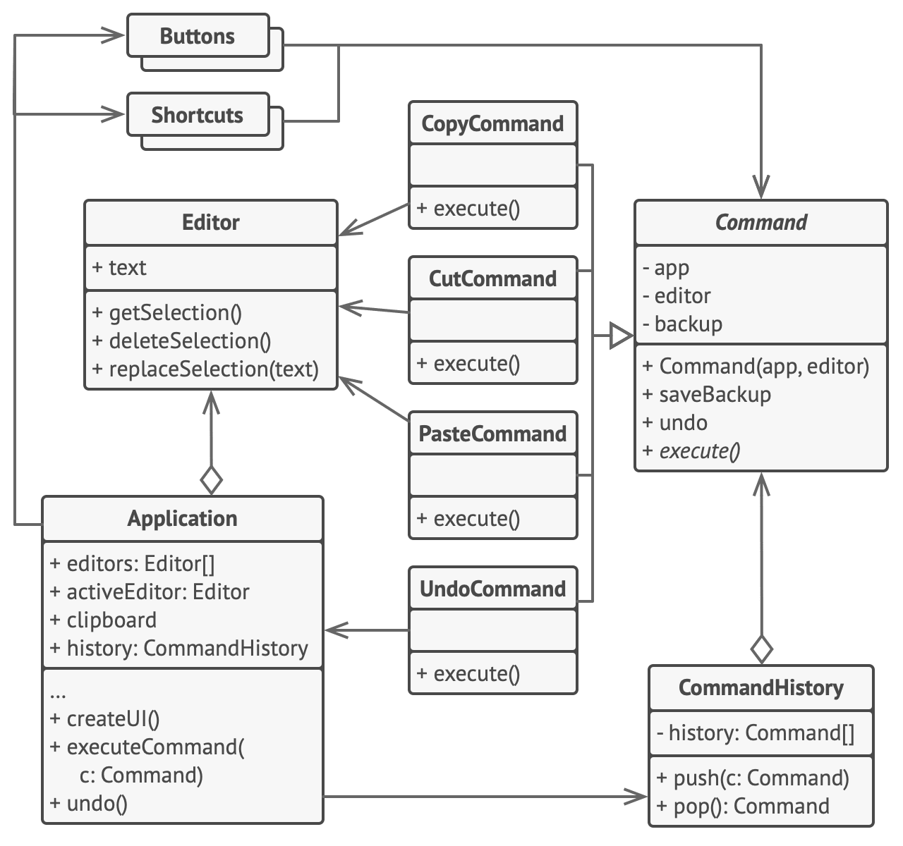

# 커맨드 패턴

-   [참고 자료(Refactoring.Guru)](https://refactoring.guru/ko/design-patterns/command)

커맨드는 요청을 요청에 대한 모든 정보가 포함된 독립실행형 객체로 변환하는 행동 디자인 패턴입니다. 이 변환은 다양한 요청들이 있는 메서드들을 인수화 할 수 있도록 하며, 요청의 실행을 지연 또는 대기열에 넣을 수 있도록 하고, 또 실행 취소할 수 있는 작업을 지원할 수 있도록 합니다.

커맨드 패턴은 그래픽 사용자 인터페이스 객체들이 이러한 요청을 직접 보내서는 안된다고 합니다. 대신 모든 요청 세부 정보들​(예: 호출되는 객체, 메서드 이름 및 인수 리스트)​을 요청을 작동시키는 단일 메서드를 가진 별도의 커맨드 클래스로 추출하라고 제안합니다.

커맨드 객체들은 다양한 그래픽 사용자 인터페이스 객체들과 비즈니스 논리 객체들 간의 링크 역할을 합니다. 이제부터 그래픽 사용자 인터페이스 객체는 어떤 비즈니스 논리 객체가 요청을 받을지와 이 요청이 어떻게 처리할지에 대하여 알 필요가 없습니다. 그래픽 사용자 인터페이스 객체는 커맨드를 작동시킬 뿐이며, 그렇게 작동된 커맨드는 모든 세부 사항을 처리합니다.



```java
// 기초 커맨드 클래스는 모든 구상 커맨드에 대한 공통 인터페이스를 정의합니다.
abstract class Command is
    protected field app: Application
    protected field editor: Editor
    protected field backup: text

    constructor Command(app: Application, editor: Editor) is
        this.app = app
        this.editor = editor

    // 편집기의 상태에 대한 백업을 만드세요.
    method saveBackup() is
        backup = editor.text

    // 편집기의 상태를 복원하세요.
    method undo() is
        editor.text = backup

    // 실행 메서드는 모든 구상 커맨드들이 자체 구현을 제공하도록 강제하기 위해
    // 추상으로 선언됩니다. 이 메서드는 커맨드가 편집기의 상태를 변경하는지에 따라
    // 진실 또는 거짓을 반환해야 합니다.
    abstract method execute()


// 구상 커맨드들은 여기에 배치됩니다.
class CopyCommand extends Command is
    // 복사 커맨드는 편집기의 상태를 변경하지 않으므로 기록에 저장되지 않습니다.
    method execute() is
        app.clipboard = editor.getSelection()
        return false

class CutCommand extends Command is
    // cut 커맨드는 편집기의 상태를 변경하므로 기록에 반드시 저장되어야 하며,
    // 메서드가 true를 반환하는 한 저장됩니다.
    method execute() is
        saveBackup()
        app.clipboard = editor.getSelection()
        editor.deleteSelection()
        return true

class PasteCommand extends Command is
    method execute() is
        saveBackup()
        editor.replaceSelection(app.clipboard)
        return true

// 실행취소 작업도 커맨드입니다.
class UndoCommand extends Command is
    method execute() is
        app.undo()
        return false


// 글로벌 커맨드 기록도 스택일 뿐입니다.
class CommandHistory is
    private field history: array of Command

    // 후입 …
    method push(c: Command) is
        // 커맨드를 기록 배열의 끝으로 푸시하세요.

    // … 선출
    method pop():Command is
        // 기록에서 가장 최근 명령을 가져오세요.


// 편집기 클래스에는 실제 텍스트 편집 기능이 있습니다. 이는 수신기의 역할을
// 합니다. 모든 커맨드들은 결국 편집기의 메서드들에 실행을 위임합니다.
class Editor is
    field text: string

    method getSelection() is
        // 선택된 텍스트를 반환하세요.

    method deleteSelection() is
        // 선택된 텍스트를 삭제하세요.

    method replaceSelection(text) is
        // 현재 위치에 클립보드의 내용을 삽입하세요.


// 앱 클래스는 객체 관계들을 설정하며 발신자 역할을 합니다. 이것은 무언가를
// 수행해야 할 때 커맨드 객체를 만들고 실행합니다.
class Application is
    field clipboard: string
    field editors: array of Editors
    field activeEditor: Editor
    field history: CommandHistory

    // 사용자 인터페이스 객체들에 커맨드들을 할당하는 코드는 다음과 같을 수
    // 있습니다.
    method createUI() is
        // …
        copy = function() { executeCommand(
            new CopyCommand(this, activeEditor)) }
        copyButton.setCommand(copy)
        shortcuts.onKeyPress("Ctrl+C", copy)

        cut = function() { executeCommand(
            new CutCommand(this, activeEditor)) }
        cutButton.setCommand(cut)
        shortcuts.onKeyPress("Ctrl+X", cut)

        paste = function() { executeCommand(
            new PasteCommand(this, activeEditor)) }
        pasteButton.setCommand(paste)
        shortcuts.onKeyPress("Ctrl+V", paste)

        undo = function() { executeCommand(
            new UndoCommand(this, activeEditor)) }
        undoButton.setCommand(undo)
        shortcuts.onKeyPress("Ctrl+Z", undo)

    // 커맨드를 실행하여 기록에 추가해야 하는지 확인하세요.
    method executeCommand(command) is
        if (command.execute)
            history.push(command)

    // 기록에서 가장 최근의 커맨드를 가져와서 그의 실행 취소 메서드를 실행하세요.
    // 참고로 우리는 이 커맨드의 클래스를 알지 못한다는 사실에 유념하세요.
    // 하지만 몰라도 상관없는데, 그 이유는 커맨드가 자신의 작업을 실행 취소하는
    // 법을 알기 때문입니다.
    method undo() is
        command = history.pop()
        if (command != null)
            command.undo()
```

<br /><br />

---

<br /><br />

## 사용 유형

-   작업들로 객체를 매개변수화하려는 경우
-   작업들의 실행을 예약하거나, 작업들을 대기열에 넣거나 작업들을 원격으로 실행하려는 경우
-   되돌릴 수 있는 작업을 구현하려고 할 때

<br /><br />

---

<br /><br />

## 구현방법

-   단일 실행 메서드로 커맨드 인터페이스를 선언
-   요청들을 커맨드 인터페이스를 구현하는 구상 커맨드 클래스들로 추출
-   발송자 역할을 할 클래스들을 식별
-   수신자에게 직접 요청을 보내는 대신 커맨드를 실행하도록 발송자들을 변경
-   클라이언트는 다음 순서로 객체들을 초기화(수신자 생성 > 커맨드들을 만들고 필요한 경우 수신자들과 연관 > 발송자들을 만들고 특정 커맨드들과 연관)

<br /><br />

---

<br /><br />

## 장단점

### 장점

-   단일 책임 원칙. 작업을 호출하는 클래스들을 이러한 작업을 수행하는 클래스들로부터 분리할 수 있습니다.
-   개방/폐쇄 원칙. 기존 클라이언트 코드를 손상하지 않고 앱에 새 커맨드들을 도입할 수 있습니다.
-   실행 취소/다시 실행을 구현할 수 있습니다.
-   작업들의 지연된 실행을 구현할 수 있습니다.
-   간단한 커맨드들의 집합을 복잡한 커맨드로 조합할 수 있습니다.

<br />

### 단점

-   발송자와 수신자 사이에 완전히 새로운 레이어를 도입하기 때문에 코드가 더 복잡해질 수 있습니다.
