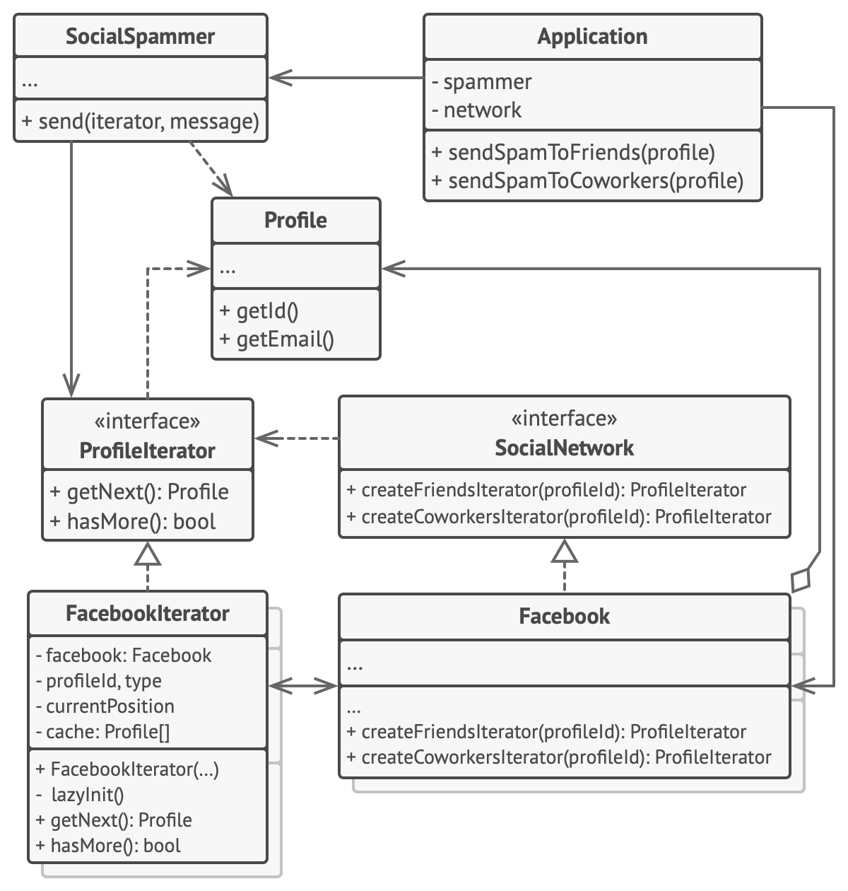

# 반복자 패턴

-   [참고 자료(Refactoring.Guru)](https://refactoring.guru/ko/design-patterns/iterator)

반복자는 컬렉션의 요소들의 기본 표현​(리스트, 스택, 트리 등)​을 노출하지 않고 그들을 하나씩 순회할 수 있도록 하는 행동 디자인 패턴입니다.



Friends​(친구들) 반복자는 주어진 프로필의 친구들을 탐색하는 데 사용될 수 있습니다. Colleagues​(동료들) 반복자는 프로필 주인과 같은 회사에서 일하지 않는 친구들을 제외한 후 같은 작업을 수행합니다. 두 반복자 모두 인증 및 REST 요청 전송과 같은 구현 세부 사항들을 자세히 살펴보지 않고도 클라이언트들이 프로필들을 가져올 수 있도록 하는 공통 인터페이스를 구현합니다.

클라이언트 코드는 인터페이스들을 통해서만 컬렉션들 및 반복자들과 작업하기 때문에 구상 클래스들과 결합하지 않습니다. 앱을 새로운 소셜 네트워크에 연결하기로 했다면 기존 코드를 변경하지 않고 새로운 컬렉션 및 반복자 클래스들을 제공하기만 하면 됩니다.

```java
// 컬렉션 인터페이스는 반복자들을 생성하기 위한 팩토리 메서드를 선언해야 합니다.
// 프로그램에서 사용할 수 있는 다양한 종류의 순회가 있는 경우 여러 메서드를 선언할
// 수 있습니다.
interface SocialNetwork is
    method createFriendsIterator(profileId):ProfileIterator
    method createCoworkersIterator(profileId):ProfileIterator


// 각 구상 컬렉션은 자신이 반환하는 구상 반복자 클래스들의 집합에 연결됩니다.
// 하지만 이러한 메서드들의 시그니처는 반복자 인터페이스를 반환하기 때문에
// 클라이언트는 연결되지 않습니다.
class Facebook implements SocialNetwork is
    // …컬렉션 코드의 대부분은 여기에 포함되어야 합니다…

    // 반복자 생성 코드.
    method createFriendsIterator(profileId) is
        return new FacebookIterator(this, profileId, "friends")
    method createCoworkersIterator(profileId) is
        return new FacebookIterator(this, profileId, "coworkers")


// 모든 반복자에 대한 공통 인터페이스.
interface ProfileIterator is
    method getNext():Profile
    method hasMore():bool


// 구상 반복자 클래스.
class FacebookIterator implements ProfileIterator is
    // 반복자는 순회하는 컬렉션에 대한 참조가 필요합니다.
    private field facebook: Facebook
    private field profileId, type: string

    // 반복자 객체는 다른 반복자들과 별도로 컬렉션을 순회합니다. 따라서 반복자
    // 상태를 저장해야 합니다.
    private field currentPosition
    private field cache: array of Profile

    constructor FacebookIterator(facebook, profileId, type) is
        this.facebook = facebook
        this.profileId = profileId
        this.type = type

    private method lazyInit() is
        if (cache == null)
            cache = facebook.socialGraphRequest(profileId, type)

    // 각 구상 반복자 클래스는 공통 반복자 인터페이스를 자체적으로 구현합니다.
    method getNext() is
        if (hasMore())
            result = cache[currentPosition]
            currentPosition++
            return result

    method hasMore() is
        lazyInit()
        return currentPosition < cache.length


// 유용한 요령이 하나 더 있습니다. 전체 컬렉션에 대한 접근 권한을 클라이언트
// 클래스에 부여하는 대신 반복자를 클라이언트 클래스에 전달하는 것입니다. 그러면
// 컬렉션이 클라이언트에 노출되지 않습니다.
//
// 장점도 하나 더 있습니다. 클라이언트에 다른 반복자를 전달하여 런타임 때
// 클라이언트가 컬렉션과 작동하는 방식을 변경할 수 있습니다. 이것은 클라이언트
// 코드가 구상 반복자 클래스들에 결합되어 있지 않기 때문에 가능합니다.
class SocialSpammer is
    method send(iterator: ProfileIterator, message: string) is
        while (iterator.hasMore())
            profile = iterator.getNext()
            System.sendEmail(profile.getEmail(), message)


// 앱 클래스는 컬렉션들과 반복자들을 설정한 다음 클라이언트 코드에 전달합니다.
class Application is
    field network: SocialNetwork
    field spammer: SocialSpammer

    method config() is
        if working with Facebook
            this.network = new Facebook()
        if working with LinkedIn
            this.network = new LinkedIn()
        this.spammer = new SocialSpammer()

    method sendSpamToFriends(profile) is
        iterator = network.createFriendsIterator(profile.getId())
        spammer.send(iterator, "Very important message")

    method sendSpamToCoworkers(profile) is
        iterator = network.createCoworkersIterator(profile.getId())
        spammer.send(iterator, "Very important message")
```

<br /><br />

---

<br /><br />

## 사용 유형

-   컬렉션이 내부에 복잡한 데이터 구조가 있지만 이 구조의 복잡성을 보안이나 편의상의 이유로 클라이언트들로부터 숨기고 싶을 때
-   앱 전체에서 순회 코드의 중복을 줄이고자 할 때
-   코드가 다른 데이터 구조들을 순회할 수 있기를 원할 때 또는 이러한 구조들의 유형을 미리 알 수 없을 때

<br /><br />

---

<br /><br />

## 구현방법

-   반복자 인터페이스를 선언
-   컬렉션 인터페이스를 선언하고 반복자를 가져오는 메서드를 설명
-   반복자들이 순회하게 할 수 있도록 하고 싶은 컬렉션들에 대한 구상 반복자 클래스들을 구현
-   컬렉션 클래스들에서 컬렉션 인터페이스를 구현
-   클라이언트 코드를 살펴보면서 반복자들을 사용하여 모든 컬렉션 순회 코드들을 교체

<br /><br />

---

<br /><br />

## 장단점

### 장점

-   단일 책임 원칙. 부피가 큰 순회 알고리즘들을 별도의 클래스들로 추출하여 클라이언트 코드와 컬렉션들을 정돈할 수 있습니다.
-   개방/폐쇄 원칙. 새로운 유형의 컬렉션들과 반복자들을 구현할 수 있으며 이들을 아무것도 훼손하지 않은 체 기존의 코드에 전달할 수 있습니다.
-   당신은 이제 같은 컬렉션을 병렬로 순회할 수 있습니다. 왜냐하면 각 반복자 객체에는 자신의 고유한 순회 상태가 포함되어 있기 때문입니다.
-   같은 이유로 당신은 순회를 지연하고 필요할 때 계속할 수 있습니다.

<br />

### 단점

-   당신의 앱이 단순한 컬렉션들과만 작동하는 경우 반복자 패턴을 적용하는 것은 과도할 수 있습니다.
-   반복자를 사용하는 것은 일부 특수 컬렉션들의 요소들을 직접 탐색하는 것보다 덜 효율적일 수 있습니다.
