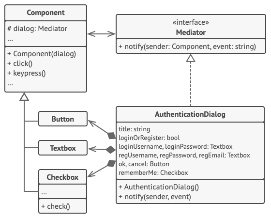

# 중재자 패턴

- [참고 자료(Refactoring.Guru)](https://refactoring.guru/ko/design-patterns/mediator)

중재자는 객체 간의 혼란스러운 의존 관계들을 줄일 수 있는 행동 디자인 패턴입니다. 이 패턴은 객체 간의 직접 통신을 제한하고 중재자 객체를 통해서만 협력하도록 합니다.



사용자에 의해 작동된 요소는 다른 요소들과 직접 통신하지 않습니다. 대신 이 요소는 중재자에게 이 이벤트​(사건)​에 대해 알리고 중재자에게 해당 알림과 함께 콘텍스트 정보를 전달합니다.

이 예시에서는 인증 대화 상자 전체가 중재자의 역할을 합니다. 이것은 구상 요소들이 어떻게 협력해야 하는지 알고 있으며 그들의 간접적인 의사소통을 촉진합니다. 이벤트에 대한 알림을 받으면 대화 상자는 이벤트를 처리해야 하는 요소를 결정하고 그 결정에 따라 호출을 리다이렉션합니다.

```java
// 중재자 인터페이스는 컴포넌트들에서 사용하는 메서드를 선언하여 다양한 이벤트를
// 중재자에게 알립니다. 중재자는 이러한 이벤트에 반응해 실행을 다른 컴포넌트들에게
// 전달할 수 있습니다.
interface Mediator is
    method notify(sender: Component, event: string)


// 구상 중재자 클래스. 개별 컴포넌트들의 얽히고설킨 연결들이 풀리고 중재자로
// 이동되었습니다.
class AuthenticationDialog implements Mediator is
    private field title: string
    private field loginOrRegisterChkBx: Checkbox
    private field loginUsername, loginPassword: Textbox
    private field registrationUsername, registrationPassword,
                  registrationEmail: Textbox
    private field okBtn, cancelBtn: Button

    constructor AuthenticationDialog() is
        // 연결을 설립하기 위해 현재 중재자를 컴포넌트 객체들의 생성자들에
        // 전달하여 모든 컴포넌트 객체들을 생성하세요.

    // 컴포넌트에 무슨 일어나면, 중재자에게 알립니다. 알림을 받으면 중재자는
    // 자체적으로 알림을 처리하거나 요청을 다른 컴포넌트에 전달할 수 있습니다.
    method notify(sender, event) is
        if (sender == loginOrRegisterChkBx and event == "check")
            if (loginOrRegisterChkBx.checked)
                title = "Log in"
                // 1. 로그인 양식 컴포넌트들을 표시하세요.
                // 2. 등록 양식 컴포넌트들을 표시하세요.
            else
                title = "Register"
                // 1. 등록 양식 컴포넌트들을 표시하세요.
                // 2. 로그인 양식 컴포넌트들을 숨기세요.

        if (sender == okBtn && event == "click")
            if (loginOrRegister.checked)
                // 로그인 자격 증명을 사용하여 사용자를 찾아보세요.
                if (!found)
                    // 로그인 필드 위에 오류 메시지를 표시하세요.
            else
                // 1. 등록 필드의 데이터를 사용하여 사용자 계정을 만드세요.
                // 2. 해당 사용자를 로그인시키세요.
                // …


// 컴포넌트들은 중재자 인터페이스를 사용하여 중재자와 통신합니다. 덕분에 컴포넌트들을
// 다른 중재자 객체들과 연결하여 다른 콘텍스트에서 같은 컴포넌트들을 사용할 수
// 있습니다.
class Component is
    field dialog: Mediator

    constructor Component(dialog) is
        this.dialog = dialog

    method click() is
        dialog.notify(this, "click")

    method keypress() is
        dialog.notify(this, "keypress")

// 구상 컴포넌트들은 서로 통신하지 않습니다. 그들은 하나의 통신 채널만 가지고
// 있으며, 이 채널을 통해 중재자에게 알림들을 보냅니다.
class Button extends Component is
    // …

class Textbox extends Component is
    // …

class Checkbox extends Component is
    method check() is
        dialog.notify(this, "check")
    // …
```

<br /><br />

---

<br /><br />

## 사용 유형

- 일부 클래스들이 다른 클래스들과 단단하게 결합하여 변경하기 어려울 때
- 타 컴포넌트들에 너무 의존하기 때문에 다른 프로그램에서 컴포넌트를 재사용할 수 없는 경우
- 몇 가지 기본 행동을 다양한 콘텍스트들에서 재사용하기 위해 수많은 컴포넌트 자식 클래스들을 만들고 있는 스스로를 발견했을 때

<br /><br />

---

<br /><br />

## 구현방법

- 더 독립적으로 만들었을 때 클래스의 유지 관리가 더 쉬워지거나 재사용이 더 간편해지는 등의 이점이 있는 단단히 결합된 클래스들을 식별
- 중재자 인터페이스를 선언하고 중재자와 다양한 컴포넌트 간의 원하는 통신 프로토콜을 설명
- 구상 중재자 클래스를 구현
- 중재자가 컴포넌트 객체들의 생성 및 파괴를 담당하도록 할 수 있으며, 그러면 중재자는 팩토리 또는 퍼사드와 유사
- 컴포넌트들은 중재자 객체에 대한 참조를 저장
- 다른 컴포넌트들의 메서드 대신 중재자의 알림 메서드를 호출하도록 컴포넌트의 코드를 변경

<br /><br />

---

<br /><br />

## 장단점

### 장점

- 단일 책임 원칙. 다양한 컴포넌트 간의 통신을 한곳으로 추출하여 코드를 이해하고 유지 관리하기 쉽게 만들 수 있습니다.
- 개방/폐쇄 원칙. 실제 컴포넌트들을 변경하지 않고도 새로운 중재자들을 도입할 수 있습니다.
- 프로그램의 다양한 컴포넌트 간의 결합도를 줄일 수 있습니다.
- 개별 컴포넌트들을 더 쉽게 재사용할 수 있습니다.

<br />

### 단점

- 중재자는 전지전능한 객체로 발전할지도 모릅니다.
