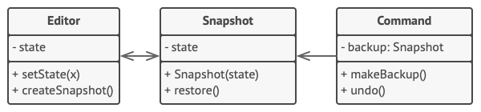

# 메멘토 패턴

- [참고 자료(Refactoring.Guru)](https://refactoring.guru/ko/design-patterns/memento)

메멘토는 객체의 구현 세부 사항을 공개하지 않으면서 해당 객체의 이전 상태를 저장하고 복원할 수 있게 해주는 행동 디자인 패턴입니다.



커맨드 객체들은 케어테이커 역할을 합니다. 이 객체들은 커맨드들과 관련된 작업들을 실행하기 전에 편집기의 메멘토를 가져옵니다. 사용자가 가장 최근 커맨드를 실행 취소하려고 하면 편집기는 해당 커맨드에 저장된 메멘토를 사용하여 자신을 이전 상태로 되돌릴 수 있습니다.

메멘토 클래스는 공개된 필드들, 게터​(getter)​들 또는 세터​(setter)​들을 선언하지 않습니다. 따라서 어떤 객체도 자신의 내용을 변경할 수 없습니다. 메멘토들은 자신을 만든 편집기 객체에 연결됩니다. 이것은 메멘토가 데이터를 연결된 편집기 객체의 세터들을 통해 전달하여 해당 편집기의 상태를 복원할 수 있도록 합니다. 메멘토들은 특정 편집자 객체들에 연결되어 있으므로 당신은 당신의 앱이 중앙 집중식 실행 취소 스택을 사용하여 여러 독립 편집기 창을 지원하도록 할 수 있습니다.

```java
// 오리지네이터는 시간이 지남에 따라 변경될 수 있는 어떤 중요한 데이터를
// 보유합니다. 또한 자신의 상태를 메멘토 내부에 저장하는 메서드와 해당 상태를
// 메멘토로부터 복원하는 또 다른 메서드를 정의합니다.
class Editor is
    private field text, curX, curY, selectionWidth

    method setText(text) is
        this.text = text

    method setCursor(x, y) is
        this.curX = x
        this.curY = y

    method setSelectionWidth(width) is
        this.selectionWidth = width

    // 현재 상태를 메멘토 내부에 저장합니다.
    method createSnapshot():Snapshot is
        // 메멘토는 불변 객체입니다. 이 때문에 오리지네이터는 자신의 상태를
        // 메멘토의 생성자 매개변수들에 전달합니다.
        return new Snapshot(this, text, curX, curY, selectionWidth)

// 메멘토 클래스는 편집기의 이전 상태를 저장합니다.
class Snapshot is
    private field editor: Editor
    private field text, curX, curY, selectionWidth

    constructor Snapshot(editor, text, curX, curY, selectionWidth) is
        this.editor = editor
        this.text = text
        this.curX = x
        this.curY = y
        this.selectionWidth = selectionWidth

    // 어느 시점에 메멘토 객체를 사용하여 편집기의 이전 상태를 복원할 수
    // 있습니다.
    method restore() is
        editor.setText(text)
        editor.setCursor(curX, curY)
        editor.setSelectionWidth(selectionWidth)

// 커맨드 객체는 케어테이커 역할을 할 수 있습니다. 그러면 커맨드는 오리지네이터의
// 상태를 변경하기 직전에 메멘토를 얻습니다. 실행 취소가 요청되면 커맨드는
// 메멘토에서 오리지네이터의 상태를 복원합니다.
class Command is
    private field backup: Snapshot

    method makeBackup() is
        backup = editor.createSnapshot()

    method undo() is
        if (backup != null)
            backup.restore()
    // …
```

<br /><br />

---

<br /><br />

## 사용 유형

- 객체의 이전 상태를 복원할 수 있도록 객체의 상태의 스냅샷들을 생성하려는 경우
- 객체의 필드들/게터들/세터들을 직접 접근하는 것이 해당 객체의 캡슐화를 위반할 때

<br /><br />

---

<br /><br />

## 구현방법

- 어떤 클래스가 오리지네이터의 역할을 할 것인지 결정
- 메멘토 클래스 생성
- 메멘토 클래스를 변경할 수 없도록 설정
- 사용하고 있는 프로그래밍 언어가 중첩 클래스를 지원하면 오리지네이터 내부에 메멘토를 중첩
- 오리지네이터 클래스에 메멘토들을 생성하는 메서드를 추가
- 오리지네이터의 클래스에 자신의 상태를 복원하는 메서드를 추가
- 케어테이커는 커맨드 객체든, 기록이든, 아니면 완전히 다른 무언가를 나타낼 때 새로운 메멘토들을 오리지네이터로부터 언제 요청해야 하는지, 이 메멘토들을 어떻게 저장하고, 언제 특정 메멘토로부터 오리지네이터를 복원해야 하는지를 알아야함
- 케어테이커들과 오리지네이터들 간의 연결은 메멘토 클래스로 이동 가능

<br /><br />

---

<br /><br />

## 장단점

### 장점

- 캡슐화를 위반하지 않고 객체의 상태의 스냅샷들을 생성할 수 있습니다.
- 당신은 케어테이커가 오리지네이터의 상태의 기록을 유지하도록 하여 오리지네이터의 코드를 단순화할 수 있습니다.

<br />

### 단점

- 클라이언트들이 메멘토들을 너무 자주 생성하면 앱이 많은 RAM을 소모할 수 있습니다.
- 케어테이커들은 더 이상 쓸모없는 메멘토들을 파괴할 수 있도록 오리지네이터의 수명주기를 추적해야 합니다.
- PHP, 파이썬 및 JavaScript와 같은 대부분의 동적 프로그래밍 언어에서는 메멘토 내의 상태가 그대로 유지된다고 보장할 수 없습니다.
