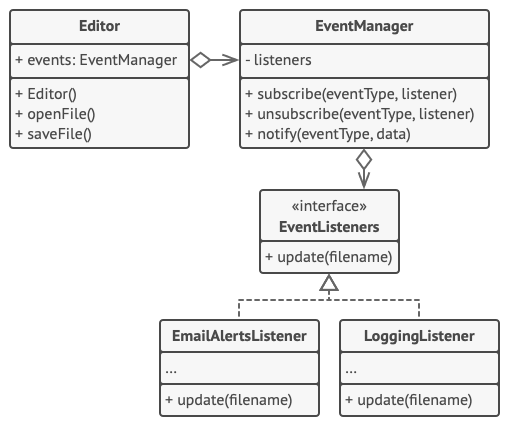

# 옵저버 패턴

- [참고 자료(Refactoring.Guru)](https://refactoring.guru/ko/design-patterns/observer)

옵서버 패턴은 당신이 여러 객체에 자신이 관찰 중인 객체에 발생하는 모든 이벤트에 대하여 알리는 구독 메커니즘을 정의할 수 있도록 하는 행동 디자인 패턴입니다.



구독자 리스트는 동적으로 컴파일됩니다. 당신이 앱이 원하는 행동에 따라 객체들은 런타임 때 알림들을 받는 것을 시작하거나 중단할 수 있습니다.

이 구현에서 편집기 클래스는 자체적으로 구독 리스트를 유지 관리하지 않습니다. 편집기 클래스는 이 작업을 해당 작업을 전담하는 특수 도우미 객체에 위임합니다. 이 객체를 중앙 집중식 이벤트 디스패처 역할을 하도록 업그레이드하여 모든 객체가 출판사 역할을 하도록 할 수 있습니다.

앱에 새 구독자들을 추가할 때 기존 출판사 클래스들이 같은 인터페이스를 통해 모든 구독자와 작업하는 한 기존 출판사 클래스들은 변경할 필요가 없습니다.

```java
// 기초 출판사 클래스에는 구독 관리 코드 및 알림 메서드들이 포함됩니다.
class EventManager is
    private field listeners: hash map of event types and listeners

    method subscribe(eventType, listener) is
        listeners.add(eventType, listener)

    method unsubscribe(eventType, listener) is
        listeners.remove(eventType, listener)

    method notify(eventType, data) is
        foreach (listener in listeners.of(eventType)) do
            listener.update(data)

// 구상 출판사는 일부 구독자에게 흥미로운 실제 비즈니스 논리를 포함합니다. 우리는
// 이 클래스를 기초 출판사로부터 파생시킬 수 있습니다. 그러나 이는 현실에서 항상
// 가능하지 않습니다. 왜냐하면 구상 클래스가 이미 자식 클래스일 수 있기
// 때문입니다. 이 경우 여기에서 했던 것처럼 합성 관계 속으로 구독 논리를 덧붙여
// 넣을 수 있습니다.
class Editor is
    public field events: EventManager
    private field file: File

    constructor Editor() is
        events = new EventManager()

    // 비즈니스 로직의 메서드들은 구독자들에게 변경 사항에 대해 알릴 수 있습니다.
    method openFile(path) is
        this.file = new File(path)
        events.notify("open", file.name)

    method saveFile() is
        file.write()
        events.notify("save", file.name)

    // …


// 여기 구독자 인터페이스가 있습니다. 사용 중인 프로그래밍 언어가 함수형 타입을
// 지원하는 경우 전체 구독자 계층구조를 함수들의 집합으로 바꿀 수 있습니다.
interface EventListener is
    method update(filename)

// 구상 구독자들은 자신이 연결된 출판사가 발행한 업데이트에 반응합니다.
class LoggingListener implements EventListener is
    private field log: File
    private field message: string

    constructor LoggingListener(log_filename, message) is
        this.log = new File(log_filename)
        this.message = message

    method update(filename) is
        log.write(replace('%s',filename,message))

class EmailAlertsListener implements EventListener is
    private field email: string
    private field message: string

    constructor EmailAlertsListener(email, message) is
        this.email = email
        this.message = message

    method update(filename) is
        system.email(email, replace('%s',filename,message))


// 앱은 런타임에 출판사들과 구독자들을 설정할 수 있습니다.
class Application is
    method config() is
        editor = new Editor()

        logger = new LoggingListener(
            "/path/to/log.txt",
            "Someone has opened the file: %s")
        editor.events.subscribe("open", logger)

        emailAlerts = new EmailAlertsListener(
            "admin@example.com",
            "Someone has changed the file: %s")
        editor.events.subscribe("save", emailAlerts)
```

<br /><br />

---

<br /><br />

## 사용 유형

- 한 객체의 상태가 변경되어 다른 객체들을 변경해야 할 필요성이 생겼을 때, 그리고 실제 객체 집합들을 미리 알 수 없거나 이러한 집합들이 동적으로 변경될 때
- 앱의 일부 객체들이 제한된 시간 동안 또는 특정 경우에만 다른 객체들을 관찰해야 할 때

<br /><br />

---

<br /><br />

## 구현방법

- 앱의 비즈니스 로직을 살펴보고 두 부분으로 나누기
- 구독자 인터페이스 선언
- 출판사 인터페이스를 선언하고 구독자 객체를 구독자 리스트에 추가 및 제거하는 한 쌍의 메서드에 대해 기술
- 구독 메서드들의 구현과 실제 구독 리스트를 어디에 배치할지 결정
- 구상 출판사 클래스들 생성
- 구상 구독자 클래스들에서 업데이트 알림 메서드들을 구현
- 클라이언트는 필요한 모든 구독자를 생성하고 적절한 출판사들과 등록

<br /><br />

---

<br /><br />

## 장단점

### 장점

- 개방/폐쇄 원칙. 출판사의 코드를 변경하지 않고도 새 구독자 클래스들을 도입할 수 있습니다. (출판사 인터페이스가 있는 경우 그 반대로 구독자의 클래스들을 변경하지 않고 새 출판사 클래스들을 도입하는 것 역시 가능합니다).
- 런타임에 객체 간의 관계들을 형성할 수 있습니다.

<br />

### 단점

- 구독자들은 무작위로 알림을 받습니다.
