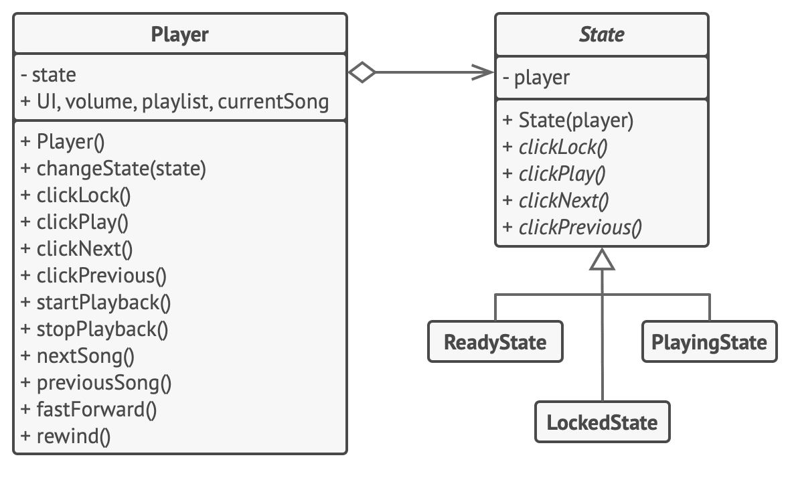

# 상태 패턴

-   [참고 자료(Refactoring.Guru)](https://refactoring.guru/ko/design-patterns/state)

상태 패턴은 객체의 내부 상태가 변경될 때 해당 객체가 그의 행동을 변경할 수 있도록 하는 행동 디자인 패턴입니다. 객체가 행동을 변경할 때 객체가 클래스를 변경한 것처럼 보일 수 있습니다.



플레이어의 주 객체는 항상 상태 객체에 연결되며, 이 상태 객체는 플레이어를 위해 대부분 작업을 수행합니다. 일부 작업들은 플레이어의 현재 상태 객체를 다른 객체로 대체하여 플레이어가 사용자 상호 작용에 반응하는 방식을 변경합니다.

```java
// AudioPlayer(오디오 플레이어) 클래스는 콘텍스트 역할을 합니다. 이 클래스는 또
// 오디오 플레이어의 현재 상태를 나타내는 상태 클래스 중 하나의 인스턴스에 대한
// 참조를 유지합니다.
class AudioPlayer is
    field state: State
    field UI, volume, playlist, currentSong

    constructor AudioPlayer() is
        this.state = new ReadyState(this)

        // 콘텍스트는 사용자 입력 처리를 상태 객체에 위임합니다. 당연히 결과는
        // 현재 활성화된 상태에 따라 달라집니다. 왜냐하면 각 상태는 입력을
        // 다르게 처리할 수 있기 때문입니다.
        UI = new UserInterface()
        UI.lockButton.onClick(this.clickLock)
        UI.playButton.onClick(this.clickPlay)
        UI.nextButton.onClick(this.clickNext)
        UI.prevButton.onClick(this.clickPrevious)

    // 다른 객체들은 오디오 플레이어의 활성 상태를 전환할 수 있어야 합니다.
    method changeState(state: State) is
        this.state = state

    // 사용자 인터페이스 메서드들은 실행을 활성 상태에 위임합니다.
    method clickLock() is
        state.clickLock()
    method clickPlay() is
        state.clickPlay()
    method clickNext() is
        state.clickNext()
    method clickPrevious() is
        state.clickPrevious()

    // 상태는 콘텍스트에 일부 서비스 메서드들을 호출할 수 있습니다.
    method startPlayback() is
        // …
    method stopPlayback() is
        // …
    method nextSong() is
        // …
    method previousSong() is
        // …
    method fastForward(time) is
        // …
    method rewind(time) is
        // …


// 기초 상태 클래스는 모든 구상 상태들이 구현해야 하는 메서드들을 선언하고 상태와
// 연결된 콘텍스트 객체에 대한 역참조도 제공합니다. 상태는 역참조를 사용하여
// 콘텍스트를 다른 상태로 천이할 수 있습니다.
abstract class State is
    protected field player: AudioPlayer

    // 콘텍스트는 상태 생성자를 통해 자신을 전달합니다. 이는 필요한 경우 상태가
    // 유용한 콘텍스트 데이터를 가져오는 데 도움이 될 수 있습니다.
    constructor State(player) is
        this.player = player

    abstract method clickLock()
    abstract method clickPlay()
    abstract method clickNext()
    abstract method clickPrevious()


// 구상 상태들은 콘텍스트의 상태와 연관된 다양한 행동들을 구현합니다.
class LockedState extends State is

    // 잠긴 플레이어의 잠금을 해제하면 플레이어가 두 가지 상태 중 하나를 택할 수
    // 있습니다.
    method clickLock() is
        if (player.playing)
            player.changeState(new PlayingState(player))
        else
            player.changeState(new ReadyState(player))

    method clickPlay() is
        // 잠금 상태: 아무것도 하지 않는다.

    method clickNext() is
        // 잠금 상태: 아무것도 하지 않는다.

    method clickPrevious() is
        // 잠금 상태: 아무것도 하지 않는다.


// 콘텍스트에서 상태 천이를 실행시킬 수도 있습니다.
class ReadyState extends State is
    method clickLock() is
        player.changeState(new LockedState(player))

    method clickPlay() is
        player.startPlayback()
        player.changeState(new PlayingState(player))

    method clickNext() is
        player.nextSong()

    method clickPrevious() is
        player.previousSong()


class PlayingState extends State is
    method clickLock() is
        player.changeState(new LockedState(player))

    method clickPlay() is
        player.stopPlayback()
        player.changeState(new ReadyState(player))

    method clickNext() is
        if (event.doubleclick)
            player.nextSong()
        else
            player.fastForward(5)

    method clickPrevious() is
        if (event.doubleclick)
            player.previous()
        else
            player.rewind(5)
```

<br /><br />

---

<br /><br />

## 사용 유형

-   현재 상태에 따라 다르게 행동하는 객체가 있을 때, 상태들의 수가 많을 때, 그리고 상태별 코드가 자주 변경될 때
-   클래스 필드들의 현재 값들에 따라 클래스가 행동하는 방식을 변경하는 거대한 조건문들로 오염된 클래스가 있을 때
-   유사한 상태들에 중복 코드와 조건문-기반 상태 머신의 천이가 많을 때

<br /><br />

---

<br /><br />

## 구현방법

-   어떤 클래스가 콘텍스트로 작동할지 결정
-   상태 인터페이스를 선언
-   모든 실제 상태에 대해 상태 인터페이스에서 파생된 클래스 생성
-   콘텍스트 클래스에서 상태 인터페이스 유형의 참조 필드와 필드의 값을 오버라이드할 수 있는 공개된 세터​(setter)​를 추가
-   콘텍스트의 메서드를 다시 살펴보고 빈 상태 조건문들을 상태 객체의 해당하는 메서드들에 대한 호출로 변경
-   콘텍스트의 상태를 전환하려면 상태 클래스 중 하나의 인스턴스를 만든 후 콘텍스트에 전달

<br /><br />

---

<br /><br />

## 장단점

### 장점

-   단일 책임 원칙. 특정 상태들과 관련된 코드를 별도의 클래스들로 구성하세요.
-   개방/폐쇄 원칙. 기존 상태 클래스들 또는 콘텍스트를 변경하지 않고 새로운 상태들을 도입하세요.
-   거대한 상태 머신 조건문들을 제거하여 콘텍스트의 코드를 단순화하세요.

<br />

### 단점

-   상태 머신에 몇 가지 상태만 있거나 머신이 거의 변경되지 않을 때 상태 패턴을 적용하는 것은 과도할 수 있습니다.ㄴ
