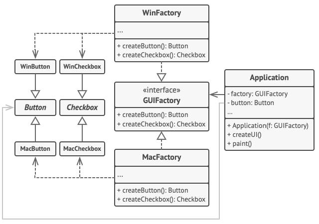

# 추상 팩토리 패턴

-   [참고 자료(Refactoring.Guru)](https://refactoring.guru/ko/design-patterns/abstract-factory)

추상 팩토리는 관련 객체들의 구상 클래스들을 지정하지 않고도 관련 객체들의 모음을 생성할 수 있도록 하는 생성패턴입니다.



UI 요소들은 크로스 플랫폼 애플리케이션 내에서는 유사하게 동작할 것으로 예상되나, 다른 운영 체제 내에서는 약간씩 다르게 보일 것으로 예상됩니다. 또한 UI 요소들이 해당하는 운영 체제의 스타일과 일치하는지 확인하는 것도 당신의 책임입니다. 왜냐하면 당신은 당신의 프로그램이 윈도우에서 실행될 때 매킨토시 컨트롤을 렌더링하는 것을 원하지 않을 것이기 때문입니다.

추상 팩토리 인터페이스는 일련의 생성 메서드들을 선언하며, 이 메서드들은 클라이언트 코드가 다양한 유형들의 UI 요소들을 생성하는 데 사용될 수 있습니다. 구상 팩토리는 특정 운영 체제에 해당하고 해당 특정 운영체제에 일치하는 UI 요소들을 생성합니다.

작동 방식은 다음과 같습니다. 앱이 시작될 때 현재 소속된 운영 체제의 유형을 확인합니다. 그 후 앱은 이 정보를 사용하여 운영 체제와 일치하는 클래스에서 팩토리 객체를 생성합니다. 나머지 코드는 이 팩토리 객체를 사용하여 UI 요소들을 만듭니다. 이렇게 하면 잘못된 요소들이 생성되는 것을 방지할 수 있습니다.

위 방법을 사용하면 클라이언트 코드가 객체의 추상 인터페이스를 통해 작업하는 한 팩토리들과 UI 요소들의 구상 클래스들에 의존하지 않게 됩니다. 또 위 방법은 클라이언트 코드가 당신이 나중에 추가할 수 있는 다른 팩토리들과 UI 요소들을 지원할 수 있도록 합니다.

이것의 결과로 새로운 변형의 UI 요소를 앱에 추가할 때마다 클라이언트 코드를 수정할 필요가 없어집니다. 이 요소들을 생성하는 새로운 팩토리 클래스를 만든 후 앱의 초기화 코드를 그 팩토리 클래스를 선택하도록 약간 수정하기만 하면 됩니다.

```java
// 추상 팩토리 인터페이스는 다른 추상 제품들을 반환하는 메서드들의 집합을
// 선언합니다. 이러한 제품들을 패밀리라고 하며 이들은 상위 수준의 주제 또는
// 개념으로 연결됩니다. 한 가족의 제품들은 일반적으로 서로 협력할 수 있습니다.
// 제품들의 패밀리​(제품군)​에는 여러 변형이 있을 수 있지만 한 변형의 제품들은 다른
// 변형의 제품들과 호환되지 않습니다.
interface GUIFactory is
    method createButton():Button
    method createCheckbox():Checkbox


// 구상 팩토리들은 단일 변형에 속하는 제품들의 패밀리​(제품군)​을 생성합니다. 이
// 팩토리는 결과 제품들의 호환을 보장합니다. 구상 팩토리 메서드의 시그니처들은 추상
// 제품을 반환하는 반면, 메서드 내부에서는 구상 제품이 인스턴스화됩니다.
class WinFactory implements GUIFactory is
    method createButton():Button is
        return new WinButton()
    method createCheckbox():Checkbox is
        return new WinCheckbox()

// 각 구상 팩토리에는 해당하는 제품 변형이 있습니다.
class MacFactory implements GUIFactory is
    method createButton():Button is
        return new MacButton()
    method createCheckbox():Checkbox is
        return new MacCheckbox()


// 제품 패밀리의 각 개별 제품에는 기초 인터페이스가 있어야 합니다. 이 제품의 모든
// 변형은 이 인터페이스를 구현해야 합니다.
interface Button is
    method paint()

// 구상 제품들은 해당하는 구상 팩토리에서 생성됩니다.
class WinButton implements Button is
    method paint() is
        // 버튼을 윈도우 스타일로 렌더링하세요.

class MacButton implements Button is
    method paint() is
        // 버튼을 맥 스타일로 렌더링하세요.

// 다음은 다른 제품의 기초 인터페이스입니다. 모든 제품은 상호 작용할 수 있지만 같은
// 구상 변형의 제품들 사이에서만 적절한 상호 작용이 가능합니다.
interface Checkbox is
    method paint()

class WinCheckbox implements Checkbox is
    method paint() is
        // 윈도우 스타일의 확인란을 렌더링하세요.

class MacCheckbox implements Checkbox is
    method paint() is
        // 맥 스타일의 확인란을 렌더링하세요.


// 클라이언트 코드는 GUIFactory, Button 및 Checkbox와 같은 추상 유형을
// 통해서만 팩토리들 및 제품들과 작동하며, 이는 클라이언트 코드를 손상하지 않고
// 클라이언트 코드에 모든 팩토리 또는 하위 클래스를 전달할 수 있게 해줍니다.
class Application is
    private field factory: GUIFactory
    private field button: Button
    constructor Application(factory: GUIFactory) is
        this.factory = factory
    method createUI() is
        this.button = factory.createButton()
    method paint() is
        button.paint()


// 앱은 현재 설정 또는 환경 설정에 따라 팩토리 유형을 선택한 후 팩토리를 런타임
// 때​(일반적으로는 초기화 단계에서) 생성합니다.
class ApplicationConfigurator is
    method main() is
        config = readApplicationConfigFile()

        if (config.OS == "Windows") then
            factory = new WinFactory()
        else if (config.OS == "Mac") then
            factory = new MacFactory()
        else
            throw new Exception("Error! Unknown operating system.")

        Application app = new Application(factory)
```

<br /><br />

---

<br /><br />

## 사용 유형

-   코드가 관련된 제품군의 다양한 패밀리들과 작동해야 하지만 해당 제품들의 구상 클래스들에 의존하고 싶지 않을 때
-   코드에 클래스가 있고, 이 클래스의 팩토리 메서드들의 집합의 기본 책임이 뚜렷하지 않을 때

<br /><br />

---

<br /><br />

## 구현방법

고유한 제품 유형들 대 변형 제품들을 나타내는 매트릭스를 매핑

모든 제품 변형들에 대한 추상 제품 인터페이스들을 선언. 그 후 모든 구상 제품 클래스들이 위 인터페이스들을 구현

추상 팩토리 인터페이스를 모든 추상 제품들에 대한 생성 메서드들의 집합과 함께 선언

각 제품 변형에 대해 각각 하나의 구상 팩토리 클래스 집합을 구현

앱 어딘가에 팩토리 초기화 코드를 생성. 초기화 코드는 앱 설정 또는 현재 환경에 따라 구상 팩토리 클래스 중 하나를 인스턴스화. 이 팩토리 객체를 제품을 생성하는 모든 클래스들에 전달

<br /><br />

---

<br /><br />

## 장단점

### 장점

-   팩토리에서 생성되는 제품들의 상호 호환을 보장할 수 있습니다.
-   구상 제품들과 클라이언트 코드 사이의 단단한 결합을 피할 수 있습니다.
-   단일 책임 원칙. 제품 생성 코드를 한 곳으로 추출하여 코드를 더 쉽게 유지보수할 수 있습니다.
-   개방/폐쇄 원칙. 기존 클라이언트 코드를 훼손하지 않고 제품의 새로운 변형들을 생성할 수 있습니다.

<br />

### 단점

-   패턴과 함께 새로운 인터페이스들과 클래스들이 많이 도입되기 때문에 코드가 필요 이상으로 복잡해질 수 있습니다.
