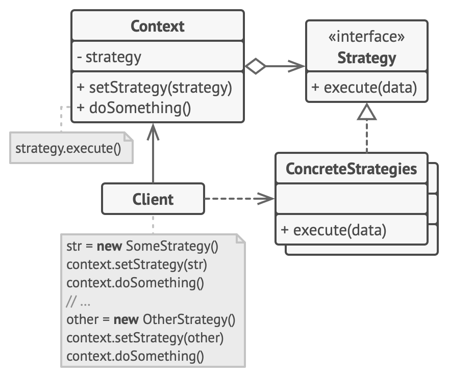

# 전략 패턴

-   [참고 자료(Refactoring.Guru)](https://refactoring.guru/ko/design-patterns/strategy)

전략 패턴은 알고리즘들의 패밀리를 정의하고, 각 패밀리를 별도의 클래스에 넣은 후 그들의 객체들을 상호교환할 수 있도록 하는 행동 디자인 패턴입니다.



```java
// 전략 인터페이스는 어떤 알고리즘의 모든 지원 버전에 공통적인 작업을 선언합니다.
// 콘텍스트는 이 인터페이스를 사용하여 구상 전략들에 의해 정의된 알고리즘을
// 호출합니다.
interface Strategy is
    method execute(a, b)

// 구상 전략들은 기초 전략 인터페이스를 따르면서 알고리즘을 구현합니다. 인터페이스는
// 그들이 콘텍스트에서 상호교환할 수 있게 만듭니다.
class ConcreteStrategyAdd implements Strategy is
    method execute(a, b) is
        return a + b

class ConcreteStrategySubtract implements Strategy is
    method execute(a, b) is
        return a - b

class ConcreteStrategyMultiply implements Strategy is
    method execute(a, b) is
        return a * b

// 콘텍스트는 클라이언트들이 관심을 갖는 인터페이스를 정의합니다.
class Context is
    // 콘텍스트는 전략 객체 중 하나에 대한 참조를 유지합니다. 콘텍스트는 전략의
    // 구상 클래스를 알지 못하며, 전략 인터페이스를 통해 모든 전략과 함께
    // 작동해야 합니다.
    private strategy: Strategy

    // 일반적으로 콘텍스트는 생성자를 통해 전략을 수락하고 런타임에 전략이 전환될
    // 수 있도록 세터도 제공합니다.
    method setStrategy(Strategy strategy) is
        this.strategy = strategy

    // 콘텍스트는 자체적으로 여러 버전의 알고리즘을 구현하는 대신 일부 작업을 전략
    // 객체에 위임합니다.
    method executeStrategy(int a, int b) is
        return strategy.execute(a, b)


// 클라이언트 코드는 구상 전략을 선택하고 콘텍스트에 전달합니다. 클라이언트는 올바른
// 선택을 하기 위해 전략 간의 차이점을 알고 있어야 합니다.
class ExampleApplication is
    method main() is
        Create context object.

        Read first number.
        Read last number.
        Read the desired action from user input.

        if (action == addition) then
            context.setStrategy(new ConcreteStrategyAdd())

        if (action == subtraction) then
            context.setStrategy(new ConcreteStrategySubtract())

        if (action == multiplication) then
            context.setStrategy(new ConcreteStrategyMultiply())

        result = context.executeStrategy(First number, Second number)

        Print result.
```

<br /><br />

---

<br /><br />

## 사용 유형

-   객체 내에서 한 알고리즘의 다양한 변형들을 사용하고 싶을 때, 그리고 런타임 중에 한 알고리즘에서 다른 알고리즘으로 전환하고 싶을 때
-   일부 행동을 실행하는 방식에서만 차이가 있는 유사한 클래스들이 많은 경우
-   클래스의 비즈니스 로직을 해당 로직의 콘텍스트에서 그리 중요하지 않을지도 모르는 알고리즘들의 구현 세부 사항들로부터 고립
-   같은 알고리즘의 다른 변형들 사이를 전환하는 거대한 조건문이 당신의 클래스에 있는 경우에 사용

<br /><br />

---

<br /><br />

## 구현방법

-   콘텍스트 클래스에서 자주 변경되는 알고리즘을 식별
-   알고리즘의 모든 변형에 공통인 전략 인터페이스를 선언
-   하나씩 모든 알고리즘을 자체 클래스들로 추출
-   콘텍스트 클래스에서 전략 객체에 대한 참조를 저장하기 위한 필드를 추가한 후, 해당 필드의 값을 대체하기 위한 세터를 제공
-   콘텍스트의 클라이언트들은 콘텍스트를 적절한 전략과 연관

<br /><br />

---

<br /><br />

## 장단점

### 장점

-   런타임에 한 객체 내부에서 사용되는 알고리즘들을 교환할 수 있습니다.
-   알고리즘을 사용하는 코드에서 알고리즘의 구현 세부 정보들을 고립할 수 있습니다.
-   상속을 합성으로 대체할 수 있습니다.
-   개방/폐쇄 원칙. 콘텍스트를 변경하지 않고도 새로운 전략들을 도입할 수 있습니다.

<br />

### 단점

-   알고리즘이 몇 개밖에 되지 않고 거의 변하지 않는다면, 패턴과 함께 사용되는 새로운 클래스들과 인터페이스들로 프로그램을 지나치게 복잡하게 만들 이유가 없습니다.
-   클라이언트들은 적절한 전략을 선택할 수 있도록 전략 간의 차이점들을 알고 있어야 합니다.
-   현대의 많은 프로그래밍 언어에는 익명 함수들의 집합 내에서 알고리즘의 다양한 버전들을 구현할 수 있는 함수형 지원이 있으며, 클래스들과 인터페이스들을 추가하여 코드의 부피를 늘리지 않으면서도 전략 객체를 사용했을 때와 똑같이 이러한 함수들을 사용할 수 있습니다.
