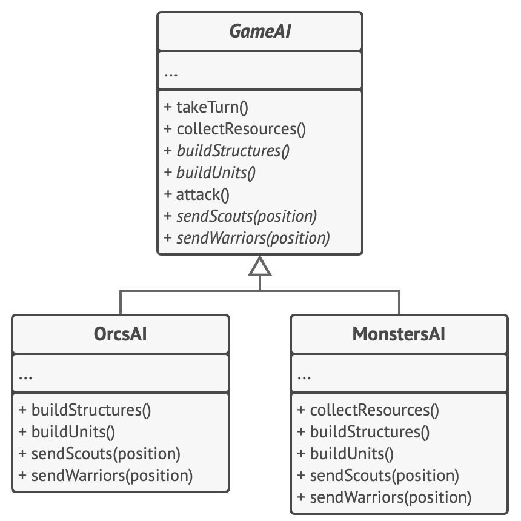

# 템플릿 메서드 패턴

-   [참고 자료(Refactoring.Guru)](https://refactoring.guru/ko/design-patterns/template-method)

템플릿 메서드는 부모 클래스에서 알고리즘의 골격을 정의하지만, 해당 알고리즘의 구조를 변경하지 않고 자식 클래스들이 알고리즘의 특정 단계들을 오버라이드​(재정의)​할 수 있도록 하는 행동 디자인 패턴입니다.



게임의 모든 종족은 거의 같은 유형의 유닛들과 건물들을 가지고 있습니다. 따라서 다양한 종족에 대해 같은 인공지능 구조를 재사용하면서 일부 세부 사항들은 오버라이드할 수 있습니다. 이 접근 방식을 사용하면 오크들의 인공지능을 오버라이드하여 그들을 더 공격적으로 만들고, 같은 방식으로 인간들을 방어 지향적으로 만들고 몬스터들은 아무것도 건설할 수 없도록 만들 수 있습니다. 게임에 새 종족을 추가하려면 새 인공지능 자식 클래스를 만들고 기초 인공지능 클래스에 선언된 디폴트 메서드들을 오버라이드해야 합니다.

```java
// 추상 클래스는 템플릿 메서드를 정의합니다. 이 메서드는 일반적으로 원시 작업을
// 추상화하기 위해 호출로 구성된 어떤 알고리즘의 골격을 포함합니다. 구상 자식
// 클래스들은 이러한 작업을 구현하지만 템플릿 메서드 자체는 그대로 둡니다.
class GameAI is
    // 템플릿 메서드는 알고리즘의 골격을 정의합니다.
    method turn() is
        collectResources()
        buildStructures()
        buildUnits()
        attack()

    // 일부 단계들은 기초 클래스에서 바로 구현될 수 있습니다.
    method collectResources() is
        foreach (s in this.builtStructures) do
            s.collect()

    // 그리고 그중 일부는 추상으로 정의될 수 있습니다.
    abstract method buildStructures()
    abstract method buildUnits()

    // 한 클래스에는 여러 템플릿 메서드가 있을 수 있습니다.
    method attack() is
        enemy = closestEnemy()
        if (enemy == null)
            sendScouts(map.center)
        else
            sendWarriors(enemy.position)

    abstract method sendScouts(position)
    abstract method sendWarriors(position)

// 구상 클래스들은 기초 클래스의 모든 추상 작업을 구현해야 합니다. 하지만 템플릿
// 메서드 자체를 오버라이드해서는 안 됩니다.
class OrcsAI extends GameAI is
    method buildStructures() is
        if (there are some resources) then
            // 농장들, 막사들, 그리고 요새들을 차례로 건설하세요.

    method buildUnits() is
        if (there are plenty of resources) then
            if (there are no scouts)
                // 잡역인을 생성한 후 정찰병 그룹에 추가하세요.
            else
                // 하급 병사를 생성한 후 전사 그룹에 추가하세요.

    // …

    method sendScouts(position) is
        if (scouts.length > 0) then
            // 정찰병들을 위치로 보내세요.

    method sendWarriors(position) is
        if (warriors.length > 5) then
            // 전사들을 위치로 보내세요.

// 자식 클래스들은 디폴트 구현을 가진 일부 작업을 오버라이드할 수 있습니다.
class MonstersAI extends GameAI is
    method collectResources() is
        // 몬스터들은 자원을 모으지 않습니다.

    method buildStructures() is
        // 몬스터들은 건물을 짓지 않습니다.

    method buildUnits() is
        // 몬스터들은 유닛들을 생성하지 않습니다.
```

<br /><br />

---

<br /><br />

## 사용 유형

-   클라이언트들이 알고리즘의 특정 단계들만 확장할 수 있도록 하고 싶을 때, 그러나 전체 알고리즘이나 알고리즘 구조는 확장하지 못하도록 하려고 할 때
-   약간의 차이가 있지만 거의 같은 알고리즘들을 포함하는 여러 클래스가 있는 경우

<br /><br />

---

<br /><br />

## 구현방법

-   대상 알고리즘을 분석하여 여러 단계로 나눌 수 있는지 확인
-   추상 기초 클래스를 만들고 알고리즘의 단계들을 표현하는 템플릿 메서드와 추상 메서드들의 집합을 선언
-   모든 단계가 추상적이어도 가능
-   알고리즘의 중요한 단계들 사이에 훅들을 추가하는 것을 고려
-   알고리즘의 각 변형에서 새로운 구상 자식 클래스를 생성

<br /><br />

---

<br /><br />

## 장단점

### 장점

-   클라이언트들이 대규모 알고리즘의 특정 부분만 오버라이드하도록 하여 그들이 알고리즘의 다른 부분에 발생하는 변경에 영향을 덜 받도록 할 수 있습니다.
-   중복 코드를 부모 클래스로 가져올 수 있습니다.

<br />

### 단점

-   일부 클라이언트들은 알고리즘의 제공된 골격에 의해 제한될 수 있습니다.
-   당신은 자식 클래스를 통해 디폴트 단계 구현을 억제하여 리스코프 치환 원칙을 위반할 수 있습니다.
-   템플릿 메서드들은 단계들이 더 많을수록 유지가 더 어려운 경향이 있습니다.
