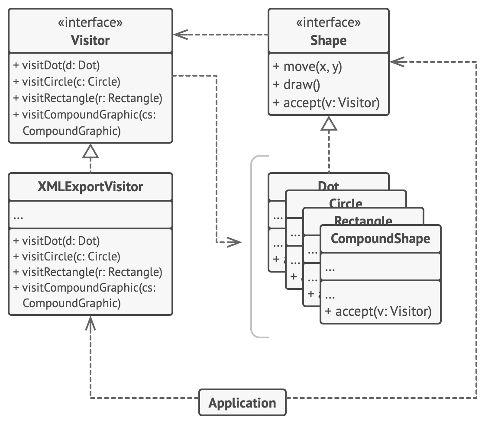

# 비지터 패턴

-   [참고 자료(Refactoring.Guru)](https://refactoring.guru/ko/design-patterns/visitor)

비지터(방문자) 패턴은 알고리즘들을 그들이 작동하는 객체들로부터 분리할 수 있도록 하는 행동 디자인 패턴입니다.



```java
// 요소 인터페이스는 기초 방문자 인터페이스를 인수로 받는 `accept` 메서드를
// 선언합니다.
interface Shape is
    method move(x, y)
    method draw()
    method accept(v: Visitor)

// 각 구상 요소 클래스는 요소의 클래스에 해당하는 비지터의 메서드를 호출하는
// 방식으로 `accept` 메서드를 구현해야 합니다.
class Dot implements Shape is
    // …

    // 참고로 우리는 현재 클래스 이름과 일치하는 `visitDot`를 호출하고
    // 있습니다. 그래야 비지터가 함께 작업하는 요소의 클래스를 알 수 있습니다.
    method accept(v: Visitor) is
        v.visitDot(this)

class Circle implements Shape is
    // …
    method accept(v: Visitor) is
        v.visitCircle(this)

class Rectangle implements Shape is
    // …
    method accept(v: Visitor) is
        v.visitRectangle(this)

class CompoundShape implements Shape is
    // …
    method accept(v: Visitor) is
        v.visitCompoundShape(this)


// 비지터 인터페이스는 요소 클래스들에 해당하는 방문 메서드들의 집합을 선언합니다.
// 방문 메서드의 시그니처를 통해 비지터는 처리 중인 요소의 정확한 클래스를 식별할
// 수 있습니다.
interface Visitor is
    method visitDot(d: Dot)
    method visitCircle(c: Circle)
    method visitRectangle(r: Rectangle)
    method visitCompoundShape(cs: CompoundShape)

// 구상 비지터는 모든 구상 요소 클래스와 작동할 수 있는 같은 알고리즘의 여러 버전을
// 구현합니다.
//
// 비지터 패턴은 복합체 트리와 같은 복잡한 객체 구조와 함께 사용할 때 가장 큰
// 이득을 볼 수 있습니다. 그러면 비지터의 메서드들을 구조의 다양한 객체 위에서
// 실행하는 동안 알고리즘의 어떤 중간 상태를 저장하는 것이 도움이 될 수 있습니다.
class XMLExportVisitor implements Visitor is
    method visitDot(d: Dot) is
        // 점의 아이디와 중심 좌표를 내보냅니다.

    method visitCircle(c: Circle) is
        // 원의 아이디, 중심 좌표 및 반지름을 내보냅니다.

    method visitRectangle(r: Rectangle) is
        // 사각형의 아이디, 왼쪽 상단 좌표, 너비 및 높이를 내보냅니다.

    method visitCompoundShape(cs: CompoundShape) is
        // 모양의 아이디와 그 자식들의 아이디 리스트를 내보냅니다.


// 클라이언트 코드는 요소의 구상 클래스들을 파악하지 않고도 모든 요소 집합 위에서
// 비지터의 작업들을 실행할 수 있습니다. `accept` 작업은 비지터 객체의 적절한
// 작업으로 호출을 전달합니다.
class Application is
    field allShapes: array of Shapes

    method export() is
        exportVisitor = new XMLExportVisitor()

        foreach (shape in allShapes) do
            shape.accept(exportVisitor)
```

<br /><br />

---

<br /><br />

## 사용 유형

-   복잡한 객체 구조​(예: 객체 트리)​의 모든 요소에 대해 작업을 수행해야 할 때
-   비지터 패턴을 사용하여 보조 행동들의 비즈니스 로직을 정리
-   행동이 클래스 계층구조의 일부 클래스들에서만 의미가 있고 다른 클래스들에서는 의미가 없을 때

<br /><br />

---

<br /><br />

## 구현방법

-   프로그램에 존재하는 각 구상 요소 클래스당 하나씩 '비지터​(방문)' 메서드를 만들고 이 메서드들의 집합으로 비지터 인터페이스를 선언
-   요소 인터페이스를 선언
-   모든 구상 요소 클래스들에서 수락 메서드들을 구현
-   요소 클래스들은 비지터 인터페이스를 통해서만 비지터와 작동
-   요소 계층구조 내에서 구현할 수 없는 각 행동의 경우, 새로운 구상 비지터 클래스를 만들고 모든 비지터 메서드들을 구현
-   클라이언트는 비지터 객체들을 만들고 '수락' 메서드들을 통해 그것들을 요소들에 전달

<br /><br />

---

<br /><br />

## 장단점

### 장점

-   개방/폐쇄 원칙. 당신은 다른 클래스를 변경하지 않으면서 해당 클래스의 객체와 작동할 수 있는 새로운 행동을 도입할 수 있습니다.
-   단일 책임 원칙. 같은 행동의 여러 버전을 같은 클래스로 이동할 수 있습니다.
-   비지터 객체는 다양한 객체들과 작업하면서 유용한 정보를 축적할 수 있습니다. 이것은 객체 트리와 같은 복잡한 객체 구조를 순회하여 이 구조의 각 객체에 비지터 패턴을 적용하려는 경우에 유용할 수 있습니다.

<br />

### 단점

-   당신은 클래스가 요소 계층구조에 추가되거나 제거될 때마다 모든 비지터를 업데이트해야 합니다.
-   비지터들은 함께 작업해야 하는 요소들의 비공개 필드들 및 메서드들에 접근하기 위해 필요한 권한이 부족할 수 있습니다.
