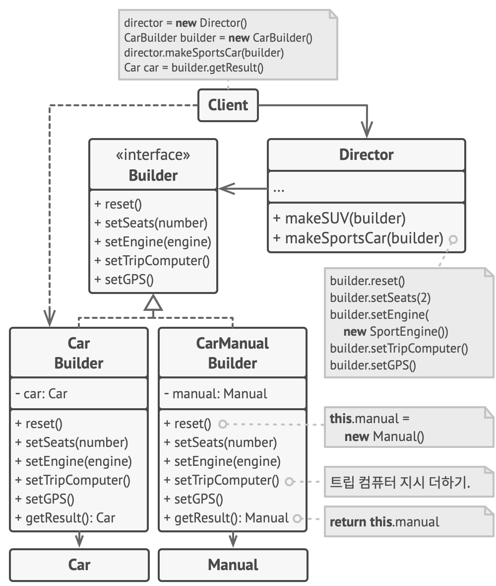

# 빌더 패턴

-   [참고 자료(Refactoring.Guru)](https://refactoring.guru/ko/design-patterns/builder)

빌더는 복잡한 객체들을 단계별로 생성할 수 있도록 하는 생성 디자인 패턴입니다. 이 패턴을 사용하면 같은 제작 코드를 사용하여 객체의 다양한 유형들과 표현을 제작할 수 있습니다.

이 패턴은 객체 생성을 일련의 단계들​(build­Walls​(벽 건설), build­Door​(문 건설) 등)​로 정리하며, 객체를 생성하고 싶으면 위 단계들을 builder(빌더) 객체에 실행하면 됩니다. 또 중요한 점은 모든 단계를 호출할 필요가 없다는 것으로, 객체의 특정 설정을 제작하는 데 필요한 단계들만 호출하면 됩니다.

더 나아가 제품을 생성하는 데 사용하는 빌더 단계들에 대한 일련의 호출을 디렉터 (관리자)라는 별도의 클래스로 추출할 수 있습니다. 디렉터 클래스는 제작 단계들을 실행하는 순서를 정의하는 반면 빌더는 이러한 단계들에 대한 구현을 제공합니다.



```java
// 빌더 패턴을 사용하는 것은 제품에 매우 복잡하고 광범위한 설정이 필요한 경우에만
// 의미가 있습니다. 다음 두 제품은 공통 인터페이스는 없지만 관련되어 있습니다.
class Car is
    // 자동차에는 GPS, 트립 컴퓨터 및 몇 개의 좌석이 있을 수 있습니다. 다른
    // 모델의 자동차​(스포츠카, SUV, 오픈카)​에는 다른 기능들이 설치되거나
    // 활성화되어 있을 수 있습니다.

class Manual is
    // 각 자동차에는 자동차의 설정에 해당하는, 모든 기능을 설명하는 사용 설명서가
    // 있어야 합니다.


// 빌더 인터페이스는 제품 객체들의 다른 부분들을 만드는 메서드들을 지정합니다.
interface Builder is
    method reset()
    method setSeats(...)
    method setEngine(...)
    method setTripComputer(...)
    method setGPS(...)

// 구상 빌더 클래스들은 빌더 인터페이스를 따르고 빌드 단계들의 특정 구현들을
// 제공합니다. 당신의 프로그램에는 각기 다르게 구현된 여러 가지 빌더 변형들이 있을
// 수 있습니다.
class CarBuilder implements Builder is
    private field car:Car

    // 새로운 빌더 인스턴스에는 인스턴스가 추가적인 조립과정에서 사용하는 빈 제품
    // 객체가 포함되어야 합니다.
    constructor CarBuilder() is
        this.reset()

    // reset 메서드는 구축 중인 객체를 지웁니다.
    method reset() is
        this.car = new Car()

    // 모든 생성 단계들은 같은 제품의 인스턴스와 작동합니다.
    method setSeats(...) is
        // 차량의 좌석 수를 설정하세요.

    method setEngine(...) is
        // 해당 엔진을 설치하세요.

    method setTripComputer(...) is
        // 트립 컴퓨터를 설치하세요.

    method setGPS(...) is
        // GPS를 설치하세요.

    // 구상 빌더들은 결과들을 가져오기 위한 자체 메서드들을 제공해야 합니다.
    // 왜냐하면 다양한 유형의 빌더들은 모두 같은 인터페이스를 따르지 않는 완전히
    // 다른 제품들을 생성할 수 있기 때문입니다. 따라서 이러한 메서드는 빌더
    // 인터페이스에서 선언할 수 없습니다. 적어도 이는 정적 타입 언어에서는
    // 불가능합니다.
    //
    // 최종 결과를 클라이언트에 반환한 후 일반적으로 빌더 인스턴스는 다른 제품
    // 생산을 시작할 준비가 되어 있을 것이라고 예상됩니다. 이것이
    // `getProduct` 메서드의 본문 끝에서 reset 메서드를 호출하는 것이
    // 일반적인 관행인 이유입니다. 하지만 반드시 이렇게 해야 하는 것은
    // 아니라서, 빌더가 클라이언트 코드로부터 명시적으로 reset 호출을 받을
    // 때까지 이전 결과를 삭제하지 않고 기다리게 만들 수 있습니다.
    method getProduct():Car is
        product = this.car
        this.reset()
        return product

// 다른 생성 패턴과 달리 빌더를 사용하면 공통 인터페이스를 따르지 않는 제품들을
// 생성할 수 있습니다.
class CarManualBuilder implements Builder is
    private field manual:Manual

    constructor CarManualBuilder() is
        this.reset()

    method reset() is
        this.manual = new Manual()

    method setSeats(...) is
        // 자동차 좌석의 기능들을 문서화하세요.

    method setEngine(...) is
        // 엔진 사용 지침을 추가하세요.

    method setTripComputer(...) is
        // 트립 컴퓨터 사용 지침을 추가하세요.

    method setGPS(...) is
        // GPS 사용 지침을 추가하세요.

    method getProduct():Manual is
        // 매뉴얼을 반환하고 빌더를 초기화하세요.


// 디렉터는 특정 순서로 생성 단계들을 실행하는 책임만 있습니다. 이것은 특정 순서나
// 설정에 따라 제품들을 생성할 때 유용합니다. 엄밀히 말하면, 클라이언트가 빌더들을
// 직접 제어할 수 있으므로 디렉터 클래스는 선택 사항입니다.
class Director is
    // 디렉터는 클라이언트 코드가 전달하는 모든 빌더 인스턴스와 함께 작동합니다.
    // 그러면 클라이언트 코드는 새로 조립된 제품의 최종 유형을 변경할 수
    // 있습니다. 디렉터는 같은 생성 단계들을 사용하여 여러 제품 변형들을 생성할
    // 수 있습니다.
    method constructSportsCar(builder: Builder) is
        builder.reset()
        builder.setSeats(2)
        builder.setEngine(new SportEngine())
        builder.setTripComputer(true)
        builder.setGPS(true)

    method constructSUV(builder: Builder) is
        // …


// 클라이언트 코드는 빌더 객체를 만든 후 이를 디렉터에게 전달한 다음 생성
// 프로세스를 시작합니다. 최종 결과는 빌더 객체에서 가져옵니다.
class Application is

    method makeCar() is
        director = new Director()

        CarBuilder builder = new CarBuilder()
        director.constructSportsCar(builder)
        Car car = builder.getProduct()

        CarManualBuilder builder = new CarManualBuilder()
        director.constructSportsCar(builder)

        // 디렉터는 구상 빌더들 및 제품들에 의존하지 않고 인식하지 못하기 때문에
        // 최종 제품은 종종 빌더 객체에서 가져옵니다.
        Manual manual = builder.getProduct()
```

<br /><br />

---

<br /><br />

## 사용 유형

-   '점층적 생성자'를 제거하기 위하여
-   코드가 일부 제품의 다른 표현들​(예: 석조 및 목조 주택들)​을 생성할 수 있도록 하고 싶을 때
-   복합체 트리들 또는 기타 복잡한 객체들을 생성

<br /><br />

---

<br /><br />

## 구현방법

-   사용할 수 있는 모든 제품 표현을 생성하기 위한 공통 생성 단계들을 명확하게 정의할 수 있는지 확인
-   기초 빌더 인터페이스에서 이 단계를 선언
-   각 제품 표현에 대한 구상 빌더 클래스를 만들고 해당 생성 단계들을 구현
-   디렉터 클래스를 만드는 것에 대해 생각해보기. 같은 빌더 객체를 사용하여 제품을 제작하는 다양한 방법을 캡슐화할 수 있다.
-   클라이언트 코드는 빌더 객체들과 디렉터 객체들을 모두 생성
-   모든 제품이 같은 인터페이스를 따르는 경우에만 디렉터로부터 직접 생성 결과를 얻을 수 있다.

<br /><br />

---

<br /><br />

## 장단점

### 장점

-   객체들을 단계별로 생성하거나 생성 단계들을 연기하거나 재귀적으로 단계들을 실행할 수 있습니다.
-   제품들의 다양한 표현을 만들 때 같은 생성 코드를 재사용할 수 있습니다.
-   단일 책임 원칙. 제품의 비즈니스 로직에서 복잡한 생성 코드를 고립시킬 수 있습니다.

<br />

### 단점

-   패턴이 여러 개의 새 클래스들을 생성해야 하므로 코드의 전반적인 복잡성이 증가합니다.
