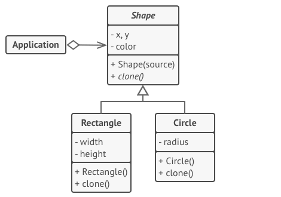

# 프로토타입 패턴

- [참고 자료(Refactoring.Guru)](https://refactoring.guru/ko/design-patterns/prototype)

프로토타입은 코드를 그들의 클래스들에 의존시키지 않고 기존 객체들을 복사할 수 있도록 하는 생성 디자인 패턴입니다.



모든 shape(모양) 클래스는 같은 인터페이스를 따르며, 이 인터페이스는 복제 메서드를 제공합니다. 자식 클래스는 자신의 필드 값들을 생성된 객체에 복사하기 전에 부모의 복제 메서드를 호출할 수 있습니다.

```java
// 기초 프로토타입.
abstract class Shape is
    field X: int
    field Y: int
    field color: string

    // 일반 생성자.
    constructor Shape() is
        // …

    // 프로토타입 생성자. 기존 객체의 값들로 새로운 객체가 초기화됩니다.
    constructor Shape(source: Shape) is
        this()
        this.X = source.X
        this.Y = source.Y
        this.color = source.color

    // 복제 작업은 Shape(모양) 자식 클래스 중 하나를 반환합니다.
    abstract method clone():Shape


// 구상 프로토타입. 복제 메서드는 현재 클래스의 생성자를 호출해 현재 객체를
// 생성자의 인수로 전달함으로써 한 번에 새로운 객체를 생성합니다. 생성자에서
// 실제로 모든 것을 복사하게 되면 결과의 일관성이 유지됩니다. 생성자가 새로운
// 객체가 완전히 완성되기 전까지 결과를 반환하지 않아서 어떤 객체도 일부분만 완성된
// 복제본을 참조할 수 없습니다.
class Rectangle extends Shape is
    field width: int
    field height: int

    constructor Rectangle(source: Rectangle) is
        // 부모 클래스에 정의된 비공개 필드들을 복사하려면 부모 생성자 호출이
        // 필요합니다.
        super(source)
        this.width = source.width
        this.height = source.height

    method clone():Shape is
        return new Rectangle(this)


class Circle extends Shape is
    field radius: int

    constructor Circle(source: Circle) is
        super(source)
        this.radius = source.radius

    method clone():Shape is
        return new Circle(this)


// 클라이언트 코드의 어딘가에…
class Application is
    field shapes: array of Shape

    constructor Application() is
        Circle circle = new Circle()
        circle.X = 10
        circle.Y = 10
        circle.radius = 20
        shapes.add(circle)

        Circle anotherCircle = circle.clone()
        shapes.add(anotherCircle)
        // `anotherCircle` 변수에는 `circle` 객체와 똑같은 사본이 포함되어
        // 있습니다.

        Rectangle rectangle = new Rectangle()
        rectangle.width = 10
        rectangle.height = 20
        shapes.add(rectangle)

    method businessLogic() is
        // 프로토타입은 매우 유용합니다! 왜냐하면 프로토타입은 당신이 복사하려는
        // 객체의 유형에 대해 아무것도 몰라도 복사본을 생성할 수 있도록 하기
        // 때문입니다.
        Array shapesCopy = new Array of Shapes.

        // 예를 들어, 우리는 shapes(모양들) 배열의 정확한 요소들을 알지
        // 못하며, 이 요소들이 모양이라는 것만 압니다. 그러나 다형성 덕분에
        // 모양의 `clone`(복제) 메서드를 호출하면 프로그램이 모양의 실제
        // 클래스를 확인하고 해당 클래스에 정의된 적절한 복제 메서드를
        // 실행합니다. 그래서 우리가 단순한 모양 객체들의 집합이 아닌 적절한
        // 복제본들을 얻는 것이죠.
        foreach (s in shapes) do
            shapesCopy.add(s.clone())

        // `shapesCopy`(모양들의 복사본) 배열에는 `shape`(모양) 배열의
        // 자식들과 정확히 일치하는 복사본들이 포함되어 있습니다.
```

<br /><br />

---

<br /><br />

## 사용 유형

- 복사해야 하는 객체들의 구상 클래스들에 코드가 의존하면 안 될 때
- 각자의 객체를 초기화하는 방식만 다른 자식 클래스들의 수를 줄이고 싶을 때

<br /><br />

---

<br /><br />

## 구현방법

- 프로토타입 인터페이스를 생성한 후 그 안에 clone 메서드를 선언
- 클래스의 객체를 인수로 받아들이는 대체 생성자를 반드시 정의
- 복제 메서드는 일반적으로 한 줄
- 추가 옵션으로 자주 사용하는 프로토타입들의 카탈로그를 저장할 중앙 프로토타입 레지스트리를 생성할 수 있다.
- 레지스트리를 새 팩토리 클래스로 구현하거나 레지스트리를 기초 프로토타입 클래스에 프로토타입을 가져오기 위한 정적 메서드와 함께 넣을 수 있다.
- 자식 클래스들의 생성자들에 대한 직접 호출들을 프로토타입 레지스트리의 팩토리 메서드에 대한 호출들로 대체

<br /><br />

---

<br /><br />

## 장단점

### 장점

- 당신은 객체들을 그 구상 클래스들에 결합하지 않고 복제할 수 있습니다.
- 반복되는 초기화 코드를 제거한 후 그 대신 미리 만들어진 프로토타입들을 복제하는 방법을 사용할 수 있습니다.
- 복잡한 객체들을 더 쉽게 생성할 수 있습니다.
- 복잡한 객체들에 대한 사전 설정들을 처리할 때 상속 대신 사용할 수 있는 방법입니다.

<br />

### 단점

- 순환 참조가 있는 복잡한 객체들을 복제하는 것은 매우 까다로울 수 있습니다.
