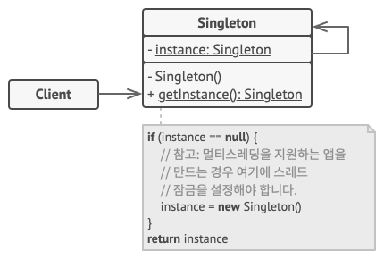

# 싱글턴 패턴

- [참고 자료(Refactoring.Guru)](https://refactoring.guru/ko/design-patterns/singleton)

싱글턴은 클래스에 인스턴스가 하나만 있도록 하면서 이 인스턴스에 대한 전역 접근​(액세스) 지점을 제공하는 생성 디자인 패턴입니다.



```java
// 데이터베이스 클래스는 클라이언트들이 프로그램 전체에서 데이터베이스 연결의 같은
// 인스턴스에 접근할 수 있도록 해주는 `getInstance`(인스턴스 가져오기) 메서드를
// 정의합니다.
class Database is
    // 싱글턴 인스턴스를 저장하기 위한 필드는 정적으로 선언되어야 합니다.
    private static field instance: Database

    // 싱글턴의 생성자는 `new` 연산자를 사용한 직접 생성 호출들을 방지하기 위해
    // 항상 비공개여야 합니다.
    private constructor Database() is
        // 데이터베이스 서버에 대한 실제 연결과 같은 일부 초기화 코드.

    // 싱글턴 인스턴스로의 접근을 제어하는 정적 메서드.
    public static method getInstance() is
        if (Database.instance == null) then
            acquireThreadLock() and then
                // 이 스레드가 잠금 해제를 기다리는 동안 인스턴스가 다른
                // 스레드에 의해 초기화되지 않았는지 확인하세요.
                if (Database.instance == null) then
                    Database.instance = new Database()
        return Database.instance

    // 마지막으로 모든 싱글턴은 해당 로직의 인스턴스에서 실행할 수 있는 비즈니스
    // 로직을 정의해야 합니다.
    public method query(sql) is
        // 예를 들어 앱의 모든 데이터베이스 쿼리들은 이 메서드를 거칩니다. 따라서
        // 여기에 스로틀링 또는 캐싱 논리를 배치할 수 있습니다.
        // …

class Application is
    method main() is
        Database foo = Database.getInstance()
        foo.query("SELECT ...")
        // …
        Database bar = Database.getInstance()
        bar.query("SELECT ...")
        // 변수 `bar`는 변수 `foo`와 같은 객체를 포함할 것입니다.
```

<br /><br />

---

<br /><br />

## 사용 유형

- 프로그램의 클래스에 모든 클라이언트가 사용할 수 있는 단일 인스턴스만 있어야 할 때
- 전역 변수들을 더 엄격하게 제어해야 할 때

<br /><br />

---

<br /><br />

## 구현방법

- 싱글턴 인스턴스의 저장을 위해 클래스에 비공개 정적 필드를 추가
- 싱글턴 인스턴스를 가져오기 위한 공개된 정적 생성 메서드를 선언
- 정적 메서드 내에서 '지연된 초기화'를 구현
- 클래스의 생성자를 비공개
- 클라이언트 코드를 살펴보며 싱글턴의 생성자에 대한 모든 직접 호출들을 싱글턴의 정적 생성 메서드에 대해 호출

<br /><br />

---

<br /><br />

## 장단점

### 장점

- 클래스가 하나의 인스턴트만 갖는다는 것을 확신할 수 있습니다.
- 이 인스턴스에 대한 전역 접근 지점을 얻습니다.
- 싱글턴 객체는 처음 요청될 때만 초기화됩니다.

<br />

### 단점

- 단일 책임 원칙을 위반합니다. 이 패턴은 한 번에 두 가지의 문제를 동시에 해결합니다.
- 또 싱글턴 패턴은 잘못된 디자인​(예를 들어 프로그램의 컴포넌트들이 서로에 대해 너무 많이 알고 있는 경우)​을 가릴 수 있습니다.
- 그리고 이 패턴은 다중 스레드 환경에서 여러 스레드가 싱글턴 객체를 여러 번 생성하지 않도록 특별한 처리가 필요합니다.
- 싱글턴의 클라이언트 코드를 유닛 테스트하기 어려울 수 있습니다. 그 이유는 많은 테스트 프레임워크들이 모의 객체들을 생성할 때 상속에 의존하기 때문입니다. 싱글턴 클래스의 생성자는 비공개이고 대부분 언어에서 정적 메서드를 오버라이딩하는 것이 불가능하므로 싱글턴의 한계를 극복할 수 있는 창의적인 방법을 생각해야 합니다. 아니면 그냥 테스트를 작성하지 말거나 싱글턴 패턴을 사용하지 않으면 됩니다.
