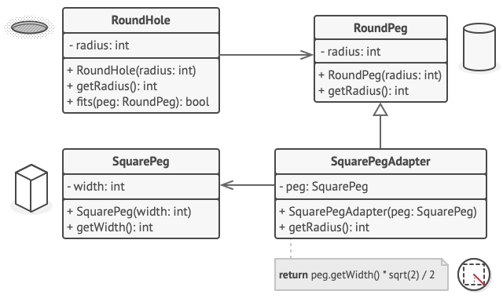

# 어댑터 패턴

- [참고 자료(Refactoring.Guru)](https://refactoring.guru/ko/design-patterns/adapter)

어댑터는 호환되지 않는 인터페이스를 가진 객체들이 협업할 수 있도록 하는 구조적 디자인 패턴입니다.



```java
// RoundHole(둥근 구멍) 및 RoundPeg(둥근 못)​라는 호환되는 인터페이스들이 있는
// 두 개의 클래스가 있다고 가정해봅시다.
class RoundHole is
    constructor RoundHole(radius) { ... }

    method getRadius() is
        // 구멍의 반지름을 반환하세요.

    method fits(peg: RoundPeg) is
        return this.getRadius() >= peg.getRadius()

class RoundPeg is
    constructor RoundPeg(radius) { ... }

    method getRadius() is
        // 못의 반지름을 반환하세요.


// 그러나 SquarePeg(직사각형 못)​라는 호환되지 않는 클래스가 있습니다.
class SquarePeg is
    constructor SquarePeg(width) { ... }

    method getWidth() is
        // 직사각형 못의 너비를 반환하세요.


// 어댑터 클래스를 사용하면 정사각형 못을 둥근 구멍에 맞출 수 있습니다. 어댑터
// 객체들은 RoundPeg(둥근 못) 클래스를 확장해 둥근 못들처럼 작동하게 해줍니다.
class SquarePegAdapter extends RoundPeg is
    // 실제로 어댑터에는 SquarePeg(정사각형 못) 클래스의 인스턴스가 포함되어
    // 있습니다.
    private field peg: SquarePeg

    constructor SquarePegAdapter(peg: SquarePeg) is
        this.peg = peg

    method getRadius() is
        // 어댑터는 이것이 어댑터가 실제로 감싸는 정사각형 못에 맞는 반지름을
        // 가진 원형 못인 것처럼 가장합니다.
        return peg.getWidth() * Math.sqrt(2) / 2


// 클라이언트 코드 어딘가에…
hole = new RoundHole(5)
rpeg = new RoundPeg(5)
hole.fits(rpeg) // 참

small_sqpeg = new SquarePeg(5)
large_sqpeg = new SquarePeg(10)
hole.fits(small_sqpeg) // 이것은 컴파일되지 않습니다​(호환되지 않는 유형)

small_sqpeg_adapter = new SquarePegAdapter(small_sqpeg)
large_sqpeg_adapter = new SquarePegAdapter(large_sqpeg)
hole.fits(small_sqpeg_adapter) // 참
hole.fits(large_sqpeg_adapter) // 거짓
```

<br /><br />

---

<br /><br />

## 사용 유형

- 기존 클래스를 사용하고 싶지만 그 인터페이스가 나머지 코드와 호환되지 않을 때
- 부모 클래스에 추가할 수 없는 어떤 공통 기능들이 없는 여러 기존 자식 클래스들을 재사용하려는 경우

<br /><br />

---

<br /><br />

## 구현방법

- 호환되지 않는 인터페이스가 있는 클래스가 최소 두 개 이상 있는지 확인
- 클라이언트 인터페이스를 선언하고 클라이언트들이 서비스와 통신하는 방법을 기술
- 어댑터 클래스를 생성한 후 클라이언트 인터페이스를 따르도록 생성
- 서비스 객체에 참조를 저장하기 위하여 어댑터 클래스에 필드를 추가
- 클라이언트 인터페이스의 모든 메서드를 어댑터 클래스에서 하나씩 구현
- 클라이언트들은 클라이언트 인터페이스를 통해 어댑터를 사용

<br /><br />

---

<br /><br />

## 장단점

### 장점

- 단일 책임 원칙. 프로그램의 기본 비즈니스 로직에서 인터페이스 또는 데이터 변환 코드를 분리할 수 있습니다.
- 개방/폐쇄 원칙. 클라이언트 코드가 클라이언트 인터페이스를 통해 어댑터와 작동하는 한, 기존의 클라이언트 코드를 손상시키지 않고 새로운 유형의 어댑터들을 프로그램에 도입할 수 있습니다.

### 단점

- 다수의 새로운 인터페이스와 클래스들을 도입해야 하므로 코드의 전반적인 복잡성이 증가합니다. 때로는 코드의 나머지 부분과 작동하도록 서비스 클래스를 변경하는 것이 더 간단합니다.
