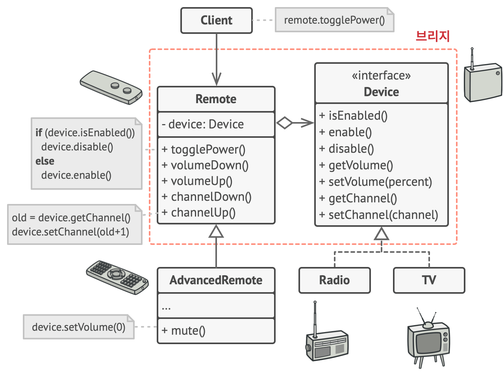

# 브리지 패턴

-   [참고 자료(Refactoring.Guru)](https://refactoring.guru/ko/design-patterns/bridge)

브리지는 큰 클래스 또는 밀접하게 관련된 클래스들의 집합을 두 개의 개별 계층구조​(추상화 및 구현)​로 나눈 후 각각 독립적으로 개발할 수 있도록 하는 구조 디자인 패턴입니다.

추상화 객체는 앱의 드러나는 모습을 제어하고 연결된 구현 객체에 실제 작업들을 위임합니다. 서로 다른 구현들은 공통 인터페이스를 따르는 한 상호 호환이 가능하며, 이에 따라 같은 그래픽 사용자 인터페이스는 리눅스와 윈도우에 동시에 작동할 수 있습니다.

따라서 당신은 API 관련 클래스들을 건드리지 않고 그래픽 사용자 인터페이스 클래스들을 변경할 수 있습니다. 그리고 다른 운영 체제에 대한 지원을 추가하려면 구현 계층구조 내에 자식 클래스를 생성하기만 하면 됩니다.



```java
// '추상화'는 두 클래스 계층구조의 '제어' 부분에 대한 인터페이스를 정의하며,
// 이것은 '구현' 계층구조의 객체에 대한 참조를 유지하고 모든 실제 작업을 이
// 객체에 위임합니다.
class RemoteControl is
    protected field device: Device
    constructor RemoteControl(device: Device) is
        this.device = device
    method togglePower() is
        if (device.isEnabled()) then
            device.disable()
        else
            device.enable()
    method volumeDown() is
        device.setVolume(device.getVolume() - 10)
    method volumeUp() is
        device.setVolume(device.getVolume() + 10)
    method channelDown() is
        device.setChannel(device.getChannel() - 1)
    method channelUp() is
        device.setChannel(device.getChannel() + 1)


// 이제 추상화 계층구조로부터 클래스들을 장치 클래스들과 독립적으로 확장할 수
// 있습니다.
class AdvancedRemoteControl extends RemoteControl is
    method mute() is
        device.setVolume(0)


// '구현' 인터페이스는 모든 구상 구현 클래스들에 공통적인 메서드를 선언하며, 이는
// 추상화의 인터페이스와 일치할 필요가 없습니다. 실제로 두 인터페이스는 완전히 다를
// 수 있습니다. 일반적으로 구현 인터페이스는 원시​(primitive) 작업들만 제공하는
// 반면 추상화는 이러한 원시 작업들을 기반으로 더 상위 수준의 작업들을 정의합니다.
interface Device is
    method isEnabled()
    method enable()
    method disable()
    method getVolume()
    method setVolume(percent)
    method getChannel()
    method setChannel(channel)


// 모든 장치는 같은 인터페이스를 따릅니다.
class Tv implements Device is
    // …

class Radio implements Device is
    // …


// 클라이언트 코드 어딘가에…
tv = new Tv()
remote = new RemoteControl(tv)
remote.togglePower()

radio = new Radio()
remote = new AdvancedRemoteControl(radio)
```

<br /><br />

---

<br /><br />

## 사용 유형

-   어떤 기능의 여러 변형을 가진 모놀리식 클래스를 나누고 정돈하려 할 때
-   여러 직교​(독립) 차원에서 클래스를 확장해야 할 때
-   런타임​(실행시간)​에 구현을 전환할 수 있어야 할 때

<br /><br />

---

<br /><br />

## 구현방법

-   클래스에서 직교 차원들을 식별
-   클라이언트가 필요로 하는 작업들을 확인한 후 기초 추상 클래스에서 정의
-   모든 플랫폼들에 제공되어야 하는 작업들을 결정
-   도메인의 모든 플랫폼에 대해 구상 구현 클래스들을 생성하되 이 클래스들 모두가 구현 인터페이스를 따르도록 구현
-   추상화 클래스 내에서 구현 유형에 대한 참조 필드를 추가
-   상위 수준 논리의 변형들이 여러 개 있는 경우 기초 추상화 클래스를 확장하여 각 변형에 대해 정제된 추상화들을 생성
-   클라이언트 코드는 구현 객체를 추상화의 생성자에 전달하여 이 객체를 그 생성자에 연관

<br /><br />

---

<br /><br />

## 장단점

### 장점

-   플랫폼 독립적인 클래스들과 앱들을 만들 수 있습니다.
-   클라이언트 코드는 상위 수준의 추상화를 통해 작동하며, 플랫폼 세부 정보에 노출되지 않습니다.
-   개방/폐쇄 원칙. 새로운 추상화들과 구현들을 상호 독립적으로 도입할 수 있습니다.
-   단일 책임 원칙. 추상화의 상위 수준 논리와 구현의 플랫폼 세부 정보에 집중할 수 있습니다.

<br />

### 단점

-   결합도가 높은 클래스에 패턴을 적용하여 코드를 더 복잡하게 만들 수 있습니다.
