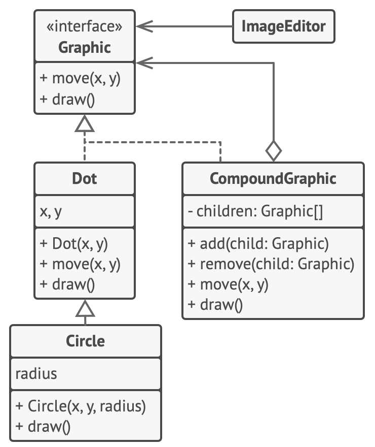

# 복합체 패턴

-   [참고 자료(Refactoring.Guru)](https://refactoring.guru/ko/design-patterns/composite)

복합체 패턴은 객체들을 트리 구조들로 구성한 후, 이러한 구조들과 개별 객체들처럼 작업할 수 있도록 하는 구조 패턴입니다.



```java
// 컴포넌트 인터페이스는 합성 관계의 단순 객체와 복잡한 객체 모두를 위한 공통
// 작업들을 선언합니다.
interface Graphic is
    method move(x, y)
    method draw()

// 잎 클래스는 합성 관계의 최종 객체들을 나타냅니다. 잎 객체는 하위 객체들을 가질
// 수 없습니다. 일반적으로 실제 작업을 수행하는 것은 잎 객체들이며, 복합체 객체들은
// 오로지 자신의 하위 컴포넌트에만 작업을 위임합니다.
class Dot implements Graphic is
    field x, y

    constructor Dot(x, y) { ... }

    method move(x, y) is
        this.x += x, this.y += y

    method draw() is
        // X와 Y에 점을 그립니다.

// 모든 컴포넌트 클래스들은 다른 컴포넌트들을 확장할 수 있습니다.
class Circle extends Dot is
    field radius

    constructor Circle(x, y, radius) { ... }

    method draw() is
        // X와 Y에 반지름이 R인 원을 그립니다.

// 복합체 클래스는 자식이 있을 수 있는 복잡한 컴포넌트들을 나타냅니다. 복합체
// 객체들은 일반적으로 실제 작업을 자식들에 위임한 다음 결과를 '합산'합니다.
class CompoundGraphic implements Graphic is
    field children: array of Graphic

    // 복합체 객체는 자식 리스트에 단순한 또는 복잡한 다른 컴포넌트들을 추가하거나
    // 제거할 수 있습니다.
    method add(child: Graphic) is
        // 하나의 자식을 자식들의 배열에 추가합니다.

    method remove(child: Graphic) is
        // 하나의 자식을 자식들의 배열에서 제거합니다.

    method move(x, y) is
        foreach (child in children) do
            child.move(x, y)

    // 복합체는 특정 방식으로 기본 논리를 실행합니다. 복합체는 모든 자식을
    // 재귀적으로 순회하여 결과들을 수집하고 요약합니다. 복합체의 자식들이 이러한
    // 호출들을 자신의 자식들 등으로 전달하기 때문에 결과적으로 전체 객체 트리를
    // 순회하게 됩니다.
    method draw() is
        // 1. 각 자식 컴포넌트에 대해:
        //     - 컴포넌트를 그리세요.
        //     - 경계 사각형을 업데이트하세요.
        // 2. 경계 좌표를 사용하여 점선 직사각형을 그리세요.


// 클라이언트 코드는 기초 인터페이스를 통해 모든 컴포넌트와 함께 작동합니다. 그래야
// 클라이언트 코드가 단순한 잎 컴포넌트들과 복잡한 복합체들을 지원할 수 있습니다.
class ImageEditor is
    field all: CompoundGraphic

    method load() is
        all = new CompoundGraphic()
        all.add(new Dot(1, 2))
        all.add(new Circle(5, 3, 10))
        // …

    // 선택한 컴포넌트들을 하나의 복잡한 복합체 컴포넌트로 합성합니다.
    method groupSelected(components: array of Graphic) is
        group = new CompoundGraphic()
        foreach (component in components) do
            group.add(component)
            all.remove(component)
        all.add(group)
        // 모든 컴포넌트가 그려질 것입니다.
        all.draw()
```

<br /><br />

---

<br /><br />

## 사용 유형

-   나무와 같은 객체 구조를 구현해야 할 때
-   클라이언트 코드가 단순 요소들과 복합 요소들을 모두 균일하게 처리하도록 하고 싶을 때

<br /><br />

---

<br /><br />

## 구현방법

-   앱의 핵심 모델이 트리 구조로 표현될 수 있는지 확인
-   컴포넌트 인터페이스를 선언
-   단순 요소들을 나타내는 잎 클래스를 생성
-   복잡한 요소들을 나타내는 컨테이너 클래스를 만든 후, 이 클래스에 하위 요소들에 대한 참조를 저장하기 위한 배열 필드를 제공
-   마지막으로 컨테이너에서 자식 요소들을 추가 및 제거하는 메서드들을 정의

<br /><br />

---

<br /><br />

## 장단점

### 장점

-   다형성과 재귀를 당신에 유리하게 사용해 복잡한 트리 구조들과 더 편리하게 작업할 수 있습니다.
-   개방/폐쇄 원칙. 객체 트리와 작동하는 기존 코드를 훼손하지 않고 앱에 새로운 요소 유형들을 도입할 수 있습니다.

<br />

### 단점

-   기능이 너무 다른 클래스들에는 공통 인터페이스를 제공하기 어려울 수 있으며, 어떤 경우에는 컴포넌트 인터페이스를 과도하게 일반화해야 하여 이해하기 어렵게 만들 수 있습니다.
