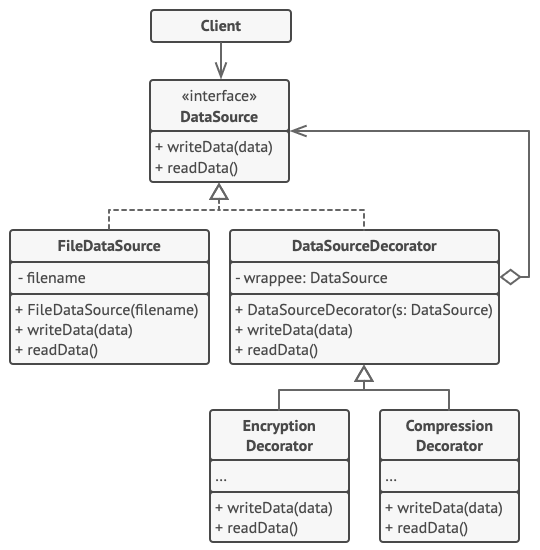

# 데코레이터 패턴

- [참고 자료(Refactoring.Guru)](https://refactoring.guru/ko/design-patterns/decorator)

데코레이터는 객체들을 새로운 행동들을 포함한 특수 래퍼 객체들 내에 넣어서 위 행동들을 해당 객체들에 연결시키는 구조적 디자인 패턴입니다.



- 데이터가 디스크에 기록되기 직전에 데코레이터들은 데이터를 암호화하고 압축합니다. 원래 클래스는 위 변경 사항에 대해 알지 못한 채 암호화되고 보호된 데이터를 파일에 씁니다.

- 데이터는 디스크에서 읽힌 직후 같은 데코레이터들을 거쳐 가며, 이 데코레이터들은 데이터의 압축을 풀고 디코딩합니다.

```java
// 컴포넌트 인터페이스는 데코레이터들이 변경할 수 있는 작업들을 정의합니다.
interface DataSource is
    method writeData(data)
    method readData():data

// 구상 컴포넌트들은 작업들에 대한 디폴트 구현들을 제공합니다. 프로그램에는 이러한
// 클래스들의 여러 변형이 있을 수 있습니다.
class FileDataSource implements DataSource is
    constructor FileDataSource(filename) { ... }

    method writeData(data) is
        // 파일에 데이터를 씁니다.

    method readData():data is
        // 파일에서 데이터를 읽으세요.

// 기초 데코레이터 클래스는 다른 컴포넌트들과 같은 인터페이스를 따릅니다. 이
// 클래스의 주목적은 모든 구상 데코레이터에 대한 래핑 인터페이스를 정의하는
// 것입니다. 래핑 코드의 디폴트 구현에는 래핑된 컴포넌트를 저장하기 위한 필드와
// 이를 초기화하는 수단들이 포함될 수 있습니다.
class DataSourceDecorator implements DataSource is
    protected field wrappee: DataSource

    constructor DataSourceDecorator(source: DataSource) is
        wrappee = source

    // 기초 데코레이터는 단순히 모든 작업을 래핑된 컴포넌트에 위임합니다. 구상
    // 데코레이터들에는 추가 행동들이 추가될 수 있습니다.
    method writeData(data) is
        wrappee.writeData(data)

    // 구상 데코레이터들은 래핑된 객체를 직접 호출하는 대신 부모의 작업 구현을
    // 호출할 수 있습니다. 이 접근 방식은 데코레이터 클래스들의 확장을
    // 단순화합니다.
    method readData():data is
        return wrappee.readData()

// 구상 데코레이터는 래핑된 객체에 메서드를 호출해야 하지만 결과에 자기 것을 뭔가를
// 추가할 수 있습니다. 데코레이터들은 래핑된 객체에 대한 호출 전 또는 후에 추가된
// 행동을 실행할 수 있습니다.
class EncryptionDecorator extends DataSourceDecorator is
    method writeData(data) is
        // 1. 전달된 데이터를 암호화합니다.
        // 2. 암호화된 데이터를 wrapee(래핑된)​의 writeData(데이터 쓰기)
        // 메서드에 전달합니다.

    method readData():data is
        // 1. wrapee(래핑된)​의 readData 메서드에서 데이터를 가져옵니다.
        // 2. 암호화되어 있다면 암호 해독을 시도하세요.
        // 3. 결과를 반환하세요.

// 여러 계층의 데코레이터들로 객체들을 래핑할 수 있습니다.
class CompressionDecorator extends DataSourceDecorator is
    method writeData(data) is
        // 1. 전달된 데이터를 압축하세요.
        // 2. 압축된 데이터를 wrapee(래핑된)​의 writeData 메서드에
        // 전달하세요.

    method readData():data is
        // 1. wrappee(래핑된)​의 readData(데이터 읽기) 메서드에서 데이터를
        // 가져오세요.
        // 2. 압축되어 있으면 압축을 풀어보세요.
        // 3. 결과를 반환하세요.


// 옵션 1. 데코레이터 조립의 간단한 예시.
class Application is
    method dumbUsageExample() is
        source = new FileDataSource("somefile.dat")
        source.writeData(salaryRecords)
        // 대상 파일은 일반 데이터로 작성되었습니다.

        source = new CompressionDecorator(source)
        source.writeData(salaryRecords)
        // 대상 파일은 압축된 데이터로 작성되었습니다.

        source = new EncryptionDecorator(source)
        // 이제 소스 변수에 다음이 포함됩니다. 암호화 > 압축 > 파일 데이터 소스
        source.writeData(salaryRecords)
        // 파일은 압축 및 암호화된 데이터로 작성되었습니다.


// 옵션 2. 외부 데이터 소스를 사용하는 클라이언트 코드. SalaryManager 객체들은
// 데이터 저장 세부 사항들을 알지도 못하고 신경 쓰지도 않습니다. 이들은 앱 설정
// 프로그램에서 받은 사전 구성된 데이터 소스로 작업합니다.
class SalaryManager is
    field source: DataSource

    constructor SalaryManager(source: DataSource) { ... }

    method load() is
        return source.readData()

    method save() is
        source.writeData(salaryRecords)
    // …다른 유용한 메서드들…


// 앱은 설정 또는 환경에 따라 런타임 때 다양한 데코레이터 스택들을 조합할 수
// 있습니다.
class ApplicationConfigurator is
    method configurationExample() is
        source = new FileDataSource("salary.dat")
        if (enabledEncryption)
            source = new EncryptionDecorator(source)
        if (enabledCompression)
            source = new CompressionDecorator(source)

        logger = new SalaryManager(source)
        salary = logger.load()
    // …
```

<br /><br />

---

<br /><br />

## 사용 유형

- 객체들을 사용하는 코드를 훼손하지 않으면서 런타임에 추가 행동들을 객체들에 할당할 수 있어야 할 때
- 상속을 사용하여 객체의 행동을 확장하는 것이 어색하거나 불가능할 때

<br /><br />

---

<br /><br />

## 구현방법

- 비즈니스 도메인이 여러 선택적 계층으로 감싸진 기본 컴포넌트로 표시될 수 있는지 확인
- 기본 컴포넌트와 선택적 계층들 양쪽에 공통적인 메서드들이 무엇인지 파악
- 구상 컴포넌트 클래스를 만든 후 그 안에 기초 행동들을 정의
- 기초 데코레이터 클래스를 생성
- 모든 클래스들이 컴포넌트 인터페이스를 구현하도록 생성
- 기초 데코레이터를 확장하여 구상 데코레이터들을 생성
- 데코레이터들을 만들고 이러한 데코레이터들을 클라이언트가 필요로 하는 방식으로 구성하는 일은 반드시 클라이언트 코드 담당

<br /><br />

---

<br /><br />

## 장단점

### 장점

- 새 자식 클래스를 만들지 않고도 객체의 행동을 확장할 수 있습니다.
- 런타임에 객체들에서부터 책임들을 추가하거나 제거할 수 있습니다.
- 객체를 여러 데코레이터로 래핑하여 여러 행동들을 합성할 수 있습니다.
- 단일 책임 원칙. 다양한 행동들의 여러 변형들을 구현하는 모놀리식 클래스를 여러 개의 작은 클래스들로 나눌 수 있습니다.

<br />

### 단점

**단점**

- 래퍼들의 스택에서 특정 래퍼를 제거하기가 어렵습니다.
- 데코레이터의 행동이 데코레이터 스택 내의 순서에 의존하지 않는 방식으로 데코레이터를 구현하기가 어렵습니다.
- 계층들의 초기 설정 코드가 보기 흉할 수 있습니다.
