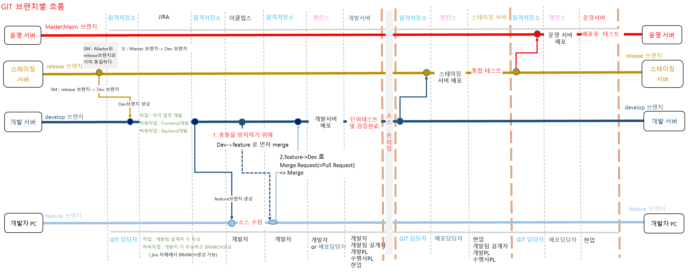

# git

[참고](https://okky.kr/articles/1424737)



Git 브랜치 종류

- (1) Master ( Main ) Branch
  1.  초기 생성되는 Branch이자 최종 서비스로 배포되는 Branch이다.
- (2) Release Branch
  1.  개발이 진행되는 Branch이자 이번 버전을 개발하기 위한 Branch이다.
- (3) Develop Branch
  1.  개발이 진행되는 Branch이자 다음 버전 개발을 위한 Branch이다.
- (4) Feature Branch
  1.  개발자가 특정 기능을 개발하기 위한 개발자별 Branch이다.
- (5) HotFix Branch
  1.  출시된 버전의 버그를 Fix하기 위한 Branch이다.

```
예 1)  프로젝트에서 confluence (wiki,설계문서 작성) -> jira (작업,이슈) -> bitbucket (원격저장소) 로 구성된 경우
      1)  confluence
     		- 설계문서 작성
      2)  jira
          => 업무개발 작업 작성
          => 업무개발 작업 하위에 FrontEnd 개발작업 작성후 "branch"버튼 클릭하여 FrontEnd 개발브랜치에서 feature브랜치에 작성
    	  => 업무개발 작업 하위에 BackEnd 개발작업 작성후 "branch"버튼 클릭하여 BackEnd 개발브랜치에서 feature브랜치에 작성
```

```
예 2) CI/CD (통합,배포) 여러 담당자
   현업
      - 현업 책임자
      - 현업 실무자

   프로젝트 수행팀 또는 SM팀
      - PM(프로젝트매니저)
        제품책임자
      - 스크럼마스터
      - GIT 책임자
      -  GIT 담당자(브랜치/릴리즈)
      - 젠킨스 배포 담당자
      - 코드리뷰어
      - 개발PL
      - 설계자
      - 개발자
```
