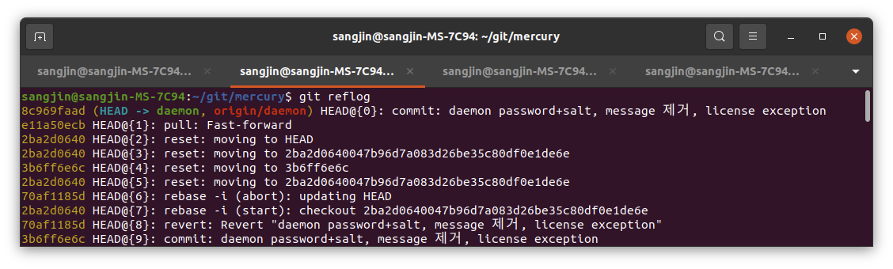

# git reflog

git reflog는 로컬 저장소에서 HEAD의 업데이트를 기록을 출력합니다. 업데이트의 내용은 저장소 디렉토리의 .git/logs/refs/heads/. 혹은 .git/logs/HEAD에 기록되며 git reflog는 이 내용을 출력합니다.

```bash
git reflog
```

위의 명령어는 아래의 명령어가 생략된 것입니다.

```bash
git reflog show HEAD
```

만약, 특정 브랜치의 reflog만 보고싶다면 아래와 같이 호출하면 됩니다.

```bash
git reflog [show] "branch name"
```



- commit id(hash)

  `8c969faad` 은 HEAD가 가리키고 있는 커밋 아이디(해쉬)를 나타냅니다.

- HEAD가 가리키고 있는 브랜치

  `(HEAD -> {branch name})`는 HEAD가 어떤 브랜치를 가리키고 있는지를 나타냅니다.

- 최신의 HEAD가 참조하는 포인터가 변경된 작업으로 부터 몇번째 전의 작업인지

  HEAD@{n}은 가장 최근의 HEAD의 참조가 변경된 작업으로 부터 몇번째 전의 작업인지를 알려줍니다.
  HEAD@{0}은 가장 최근에(방금)한 작업입니다.
  HEAD@{2}는 가장 최근에한 작업으로부터 2번째 전의 작업입니다.

- 어떤 git 명령어를 통해 작업을 했는지

  어떤 git 명령어를 통해 참조 포인터가 변경되었는지의 정보를 나타냅니다

- 커밋 메시지

  커밋 메시지를 출력해줍니다.

<br />

---
