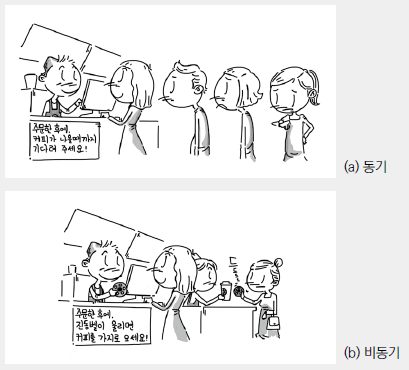

# Ajax

브라우저에서 웹페이지를 요청하거나 링크를 클릭하면 화면 전환이 발생한다. 이것은 브라우저와 서버와의 통신에 의한 것이다.

서버는 요청받은 페이지(HTML)를 반환하는데 이때 HTML에서 로드하는 CSS나 JavaScript 파일들도 같이 반환된다. 클라이언트의 요청에 따라 서버는 정적인 파일을 반환할 수도 있고 서버 사이드 프로그램이 만들어낸 파일이나 데이터를 반환할 수도 있다. 서버로부터 웹페이지가 반환되면 클라이언트(브라우저)는 이를 렌더링하여 화면에 표시한다.

Ajax(Asynchronous JavaScript and XML)는 자바스크립트를 이용해서 비동기적(Asynchronous)으로 서버와 브라우저가 데이터를 교환할 수 있는 통신 방식을 의미한다.

서버로부터 웹페이지가 반환되면 화면 전체를 갱신해야 하는데 페이지 일부만을 갱신하고도 동일한 효과를 볼 수 있도록 하는 것이 Ajax이다. 페이지 전체를 로드하여 렌더링할 필요가 없고 갱신이 필요한 일부만 로드하여 갱신하면 되므로 빠른 퍼포먼스와 부드러운 화면 표시 효과를 기대할 수 있다.

<br/><br/>

---

<br/><br/>

## 동기식 처리 모델 vs 비동기식 처리 모델



-   동기식 처리 모델(Synchronous processing model)은 직렬적으로 작업을 수행한다. 즉, 작업은 순차적으로 실행되며 어떤 작업이 수행 중이면 다음 작업은 대기하게 된다.

-   비동기식 처리 모델(Asynchronous processing model or Non-Blocking processing model)은 병렬적으로 작업을 수행한다. 즉, 작업이 종료되지 않은 상태라도 대기하지 않고 다음 작업을 실행한다는 의미이다.

<br/><br/>

---

<br/><br/>

## Ajax 요청 및 응답 처리

브라우저는 XMLHttpRequest 객체를 이용하여 Ajax 요청을 생성한다. 서버가 브라우저의 요청에 대해 응답을 반환하면 같은 XMLHttpRequest 객체가 그 결과를 처리한다.

```js
// XMLHttpRequest 객체의 생성
var req = new XMLHttpRequest();
// 비동기 방식으로 Request를 오픈한다
req.open("GET", "data/test.json", true);
// Request를 전송한다
req.send();
```

| Value | State            | Description                                           |
| ----- | ---------------- | ----------------------------------------------------- |
| 0     | UNSENT           | XMLHttpRequest.open() 메소드 호출 이전                |
| 1     | OPENED           | XMLHttpRequest.open() 메소드 호출 완료                |
| 2     | HEADERS_RECEIVED | XMLHttpRequest.send() 메소드 호출 완료                |
| 3     | LOADING          | 서버 응답 중(XMLHttpRequest.responseText 미완성 상태) |
| 4     | DONE             | 서버 응답 완료                                        |

<br/><br/>

---

<br/><br/>

## JSON

Ajax 요청에 대한 서버의 응답은 주로 HTML, XML, JSON이 사용된다. 이 중 가장 일반적인 데이터 형식은 JSON(JavaScript Object Notation)이다.

자바스크립트의 객체 리터럴과 매우 흡사하다. 하지만 JSON은 순수한 텍스트로 구성된 데이터이다.키는 반드시 큰따옴표(작은따옴표 사용불가)로 둘러싸야 한다. JSON.stringify() 메소드는 객체를 JSON 형식의 문자열로 변환한다.
