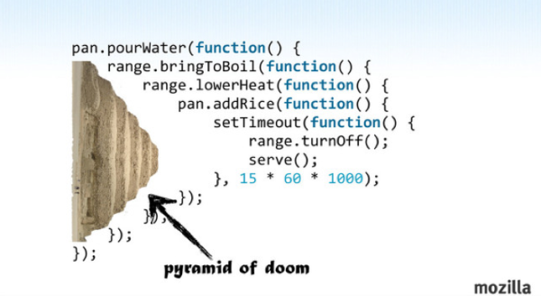

# Deferred Object

- [참고 자료(poiemaweb)](https://poiemaweb.com/jquery-deferred)

## Promise

콜백함수를 사용한 비동기식 처리 모델은 JavaScript에서 빈번히 사용된다. 비동기식 처리 모델이란 처리가 종료하면 호출될 함수(콜백함수)를 미리 parameter로 전달하고 처리가 종료하면 콜백함수를 호출하는 것이다.

비동기 처리 모델은 요청을 병렬로 처리하여 다른 요청이 blocking(작업 중단)되는 것을 막아주는 장점이 있지만 단점도 가지고 있는데 그것은 여러 개의 콜백함수가 nesting되어 복잡도가 높아지는 Callback Hell이다.



이러한 문제를 극복하기 위해 Promise가 제안되었다. (ES6의 Generator를 사용하여 Callback Hell 문제를 없애는 방법도 있다.) Promise는 ES6에 정식 채택되어 2017년 1월 현재 IE를 제외한 대부분의 브라우저가 지원하고 있다.

Promise는 비동기 처리가 성공(fulfilled)하였는지 또는 실패(rejected)하였는지 등의 상태 정보와 처리 종료 후 실행될 콜백함수(then, catch)담고 있는 객체이다.

## jQuery Deferred Object

jQuery Deferred는 각각의 비동기식 처리에 Promise 객체를 연계하여 그 상태를 전파하는 것으로 promise를 구현한 jQuery 객체이다. 브라우저 호환성과 편의성을 고려하여 만든 Promise 모듈이라고 생각하면 무리가 없을 듯하다.

jQuery Deferred에서 각각의 비동기식 처리를 Deferred 객체로 wrapping한다. Deferred 객체는 상태를 가지고 있는데 이는 비동기식 처리의 상태가 변경되는 시점에 특정 함수(resolve(), reject())를 호출하여 Deferred 객체에 상태를 부여하기 때문이다. deferred.state()로 상태를 확인할 수 있다.

```
Deferred object state (Deferred.state()의 반환값)
pending : 처리 중
resolved : 처리 성공
rejected : 처리 실패
```

처리 순서

1. $.Deferred()로 Deferred 객체 생성
2. 비동기 처리가 종료하면 Deferred 객체의 resolve() 또는 reject()로 Deferred 객체의 state를 변경
3. promise()로 Deferred 객체가 가지고 있는 Promise 객체를 반환한다. 반환된 객체는 Deferred 객체의 resolve()와 reject()를 더이상 사용할 수 없게 되어 비동기 처리 상태를 보장할 수 있게 된다.
