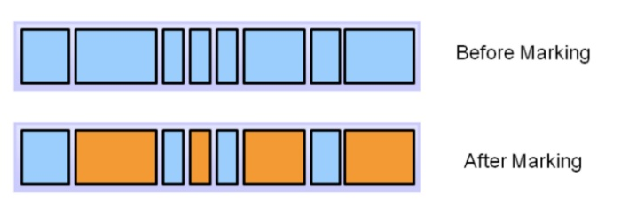
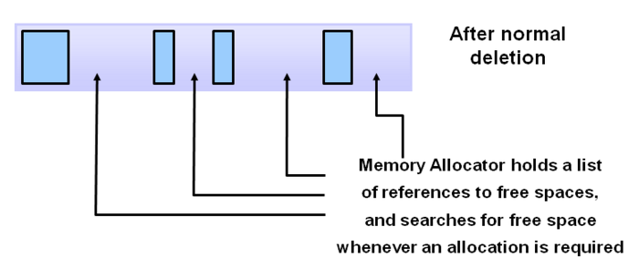
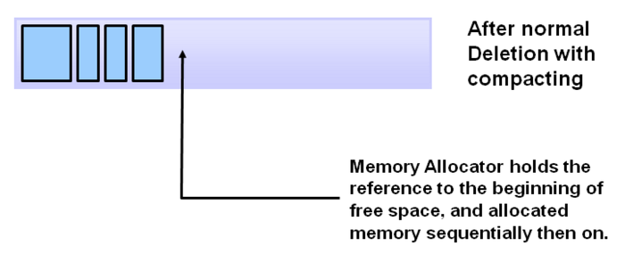

# Garbage Collection

> stop-the-world : GC를 실행하기 위해 JVM이 애플리케이션 실행을 멈추는 것입니다. 어떤 GC 알고리즘을 사용하더라도 'stop-the-world'는 발생하게 되는데, 대개의 경우 GC 튜닝은 이 'stop-the-world' 시간을 줄이는 것이라고 합니다.
> GC를 해도 더이상 사용 가능한 메모리 영역이 없는데 계속 메모리를 할당하려고 하면, OutOfMemoryError가 발생하여 WAS가 다운될 수도 있습니다. 행(Hang) 즉, 서버가 요청을 처리 못하고 있는 상태가 됩니다.

C/C++ 언어와 달리 자바는 개발자가 명시적으로 객체를 해제할 필요가 없습니다. 자바 언어의 큰 장점이기도 합니다. 사용하지 않는 객체는 메모리에서 삭제하는 작업을 GC라고 부르며 JVM에서 GC를 수행합니다.

기본적으로 JVM의 메모리는 총 5가지 영역(class, stack, heap, native method, PC)으로 나뉘는데, GC는 힙 메모리만 다룹니다.

일반적으로 다음과 같은 경우에 GC의 대상이 됩니다.

1. 객체가 NULL인 경우 (ex. String str = null)

2. 블럭 실행 종료 후, 블럭 안에서 생성된 객체

3. 부모 객체가 NULL인 경우, 포함하는 자식 객체

GC는 Weak Generational Hypothesis 에 기반합니다. 우선 GC의 메모리 해제 과정에 대해 살펴보겠습니다.

## GC의 메모리 해제 과정

1. Marking

> 프로세스는 마킹을 호출합니다. 이것은 GC가 메모리가 사용되는지 아닌지를 찾아냅니다. 참조되는 객체는 파란색으로, 참조되지 않는 객체는 주황색으로 보여집니다. 모든 오브젝트는 마킹 단계에서 결정을 위해 스캔되어집니다. 모든 오브젝트를 스캔하기 때문에 매우 많은 시간을 소모하게 됩니다.

 

2. Normal Deletion

> 참조되지 않는 객체를 제거하고, 메모리를 반환합니다. 메모리 Allocator는 반환되어 비어진 블럭의 참조 위치를 저장해 두었다고 새로운 오브젝트가 선언되면 할당되도록 합니다.

 

3. Compacting

> 퍼포먼스를 향상시키기 위해, 참조되지 않는 객체를 제거하고 또한 남은 참조되어지는 객체들을 묶습니다. 이들을 묶음으로서 공간이 생기므로 새로운 메모리 할당 시에 더 쉽고 빠르게 진행 할 수 있습니다.
