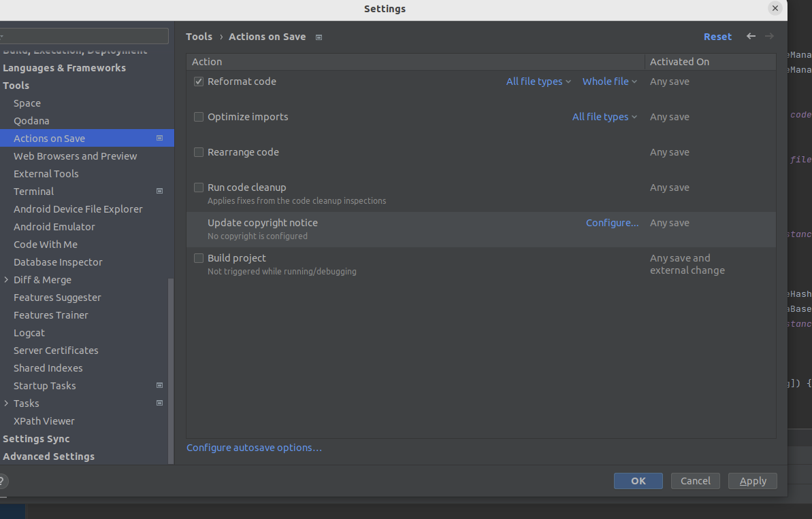
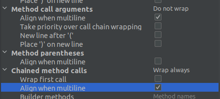
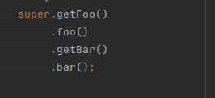
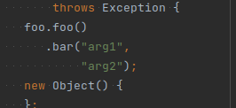
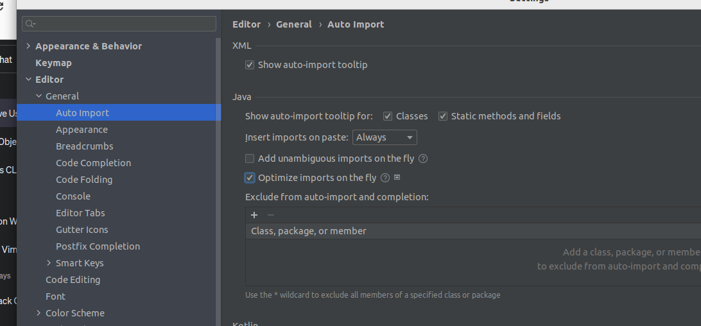

# IntelliJ 설정

## 저장 시 컨벤션 체크

 

---

 

setting -> editor -> code style -> java
chained method calls wrap always, align when multiline
method call arguments align when multiline

 

---

 

안쓰는 import 삭제

