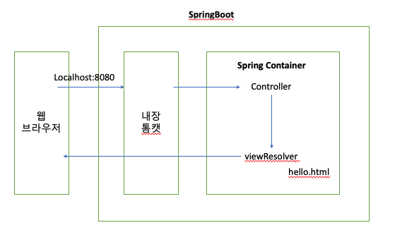
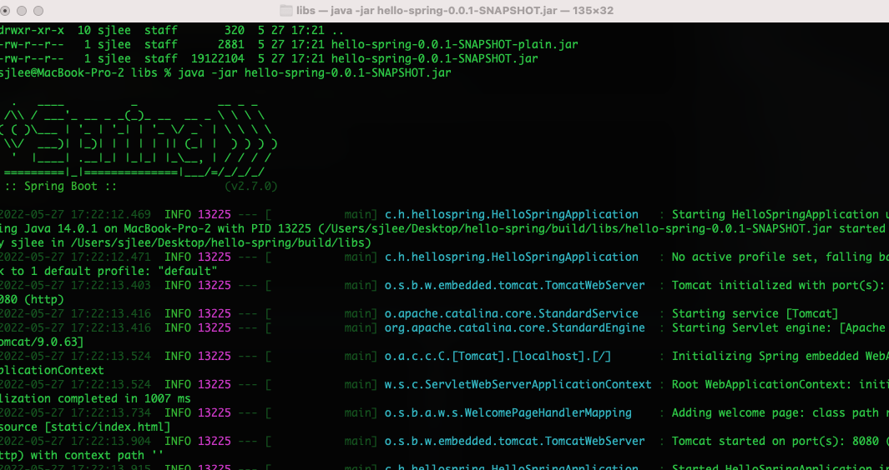

#springBoot

## springBoot의 동작구조



- 웹 브라우저에서 요청이 들어오면 spring은 요청에 맞는 controller을 찾아 맵핑한다.

- Controller은 요청을 받아 로직을 수행하고 결과를 리턴한다.

- Controller에서 리턴하면 ViewResolver가 결과에(hello.html) 해당하는 view를 찾아 리턴한다.

- springboot는 기본적으로 name.html을 반환 한다고 한다.

<br/><br/>

---

<br/><br/>

## controller 및 view 추가하기

- controller

```java
@Controller
public class HelloController {
    @GetMapping("hello")
    public String hello(Model model) {
        model.addAttribute("data", "hello!");
        return "hello";
    }
}
```

- html

```html
<!DOCTYPE html>
<html xmlns: xmlns:th="http://www.thymeleaf.org">
<head>
    <meta charset="UTF-8">
    <title>Hello</title>
    <meta http-equiv="Content-Type" content="text/html; charset=UTF-8"/>
</head>
<body>
<p th:text="'안녕하세요. ' + ${data}" >안녕하세요. 손님</p>
</body>
</html>
```

<br/><br/>

---

<br/><br/>

## build 하기

```bash
./gradlew build
cd build
cd libs
java -jar PROJECT_NAME-0.0.1-SNAPSHOT.jar
```

- clean 응용가능

```bash
./gradlew clean build
```

<br/><br/>

---

<br/><br/>

### 실행된 모습


