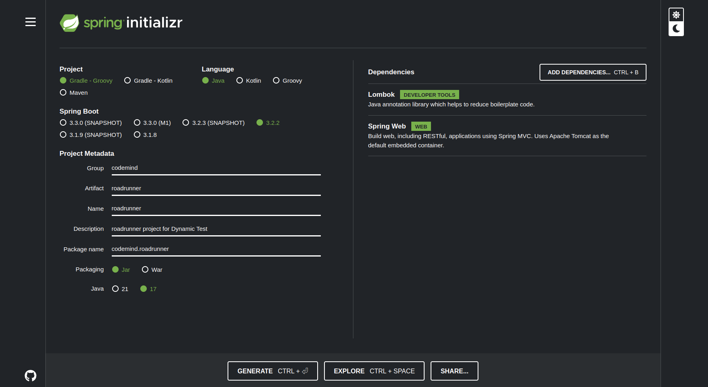

# start(Spring Initializer)

[Spring Initializer](https://start.spring.io/)


- 예시



1. Project에 대한 각각의 설정들을 해준다.
   - project: maven과 gradle중 선택
   - language: 사용하고자 하는 언어 선택
   - spring boot: 스프링부트의 버전 선택(SNAPSHOT은 정식릴리즈 되지 않은 버전)
   - Project Metadata
     - Group: 기업 도메인명
     - Artifact: 빌드되어 나올 결과물
     - Name: 프로젝트명 (일반적으로 Artifact와 동일하게 해준다.)
     - Description: 설명
     - Package name: 패키지 이름 (Group과 Artifact를 설정하면 자동으로 만들어준다.)
   - Packaging: Jar로 선택하면 tomcat이 자동으로 세팅되어 단독으로 실행가능
   - JAVA 자바 버전 선택
2. project의 dependencies를 추가해준다.(ex. spring boot devtools, lombok, spring web 등)
3. Generate click
4. 다운받은 프로젝트를 사용할 폴더로 옮겨주고, 압축을 해제한다.
5. IDE(intelliJ 등)를 실행하고 Open 버튼 클릭
6. 앞서 압축해체한 파일의 build.gradle 파일을 선택 한다.
7. 프로젝트로 열기 선택

## trouble shooting

1. gradle 빌드가 되지 않는 경우

   ```
   예시
   A problem occurred configuring root project 'roadrunner'.
   > Could not resolve all files for configuration ':classpath'.
     > Could not resolve org.springframework.boot:spring-boot-gradle-plugin:3.2.2.
       Required by:
           project : > org.springframework.boot:org.springframework.boot.gradle.plugin:3.2.2
         > No matching variant of org.springframework.boot:spring-boot-gradle-plugin:3.2.2 was found. The consumer was configured to find a library for use during runtime, compatible with Java 11, packaged as a jar, and its dependencies declared externally, as well as attribute 'org.gradle.plugin.api-version' with value '8.5' but:
             - Variant 'apiElements' capability org.springframework.boot:spring-boot-gradle-plugin:3.2.2 declares a library, packaged as a jar, and its dependencies declared externally:
   .......
   ```

   java version이 호환되지 않는 경우이다.
   스프링 부트 3.x 버전에선 Java 17 이상 버전을, 2.x 버전에선 자바 11을 쓰면 될 것 같다.
