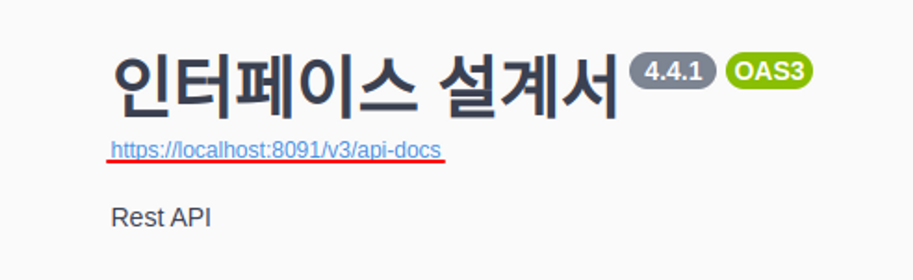
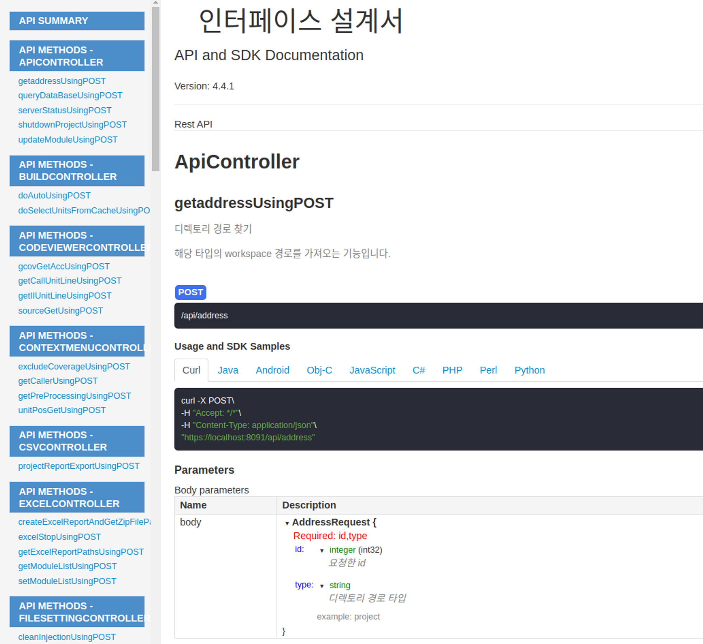
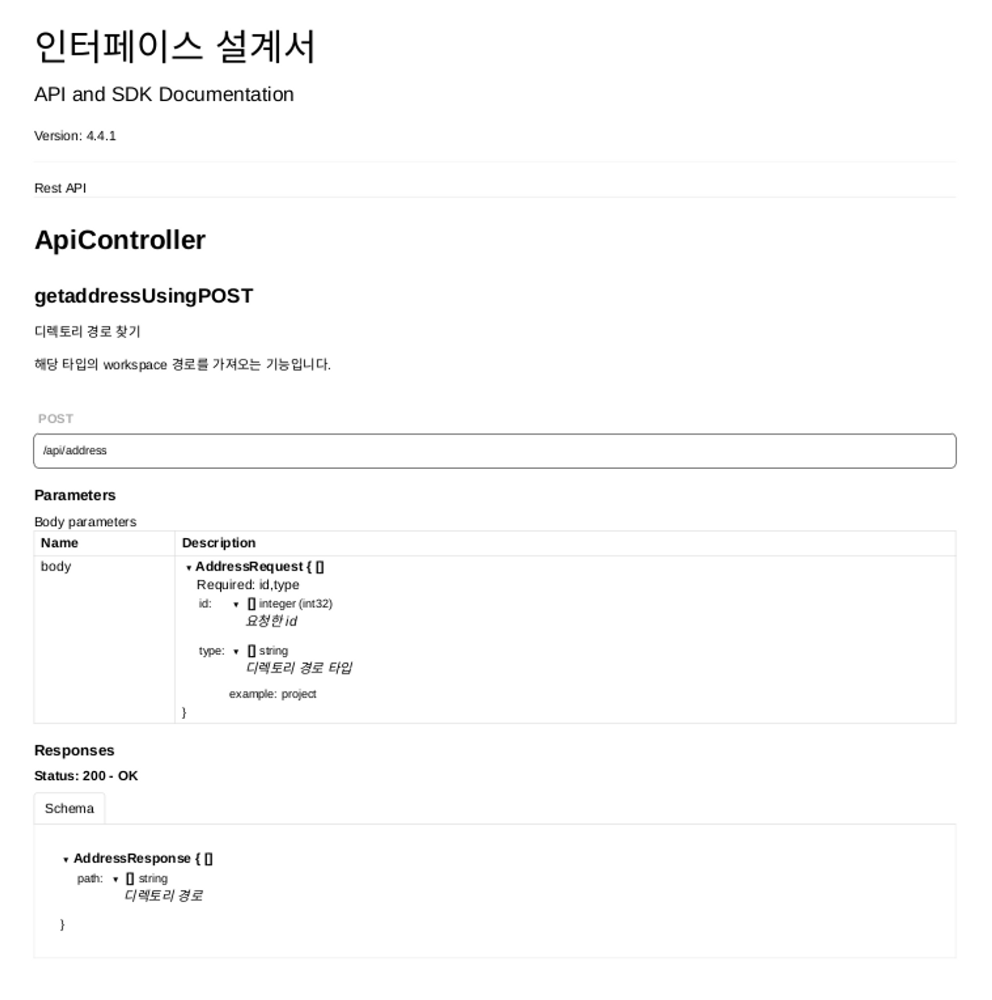

# 스웨거(swagger)

[공식사이트](https://swagger.io)

- Open Api Sqecification(OAS)를 위한 프레임워크.
- API 스펙을 명세, 관리할 수 있는 프로젝트/문서.

# spring boot에서 사용법

## 2.0 swagger 사용법

### 1. pom.xml 수정

```xml
<!-- springfox-swagger2 -->
<dependency>
	<groupId>io.springfox</groupId>
	<artifactId>springfox-swagger-ui</artifactId>
	<version>2.9.2</version>
</dependency>

<!-- springfox-swager-ui -->
<dependency>
	<groupId>io.springfox</groupId>
	<artifactId>springfox-swagger2</artifactId>
	<version>2.9.2</version>
</dependency>
```

- 현재 위 소스 상, Swagger 버전은 2.9.2 버전이다.

<br />

---

<br />

### 2. Controller 코드 작성 예시

```java
package com.example.swaggerStudy.controller;

import org.springframework.http.ResponseEntity;
import org.springframework.web.bind.annotation.GetMapping;
import org.springframework.web.bind.annotation.RequestMapping;
import org.springframework.web.bind.annotation.RequestParam;
import org.springframework.web.bind.annotation.RestController;

import io.swagger.annotations.Api;
import io.swagger.annotations.ApiOperation;
import io.swagger.annotations.ApiParam;

@RestController
@Api(value="ApiController v1")
@RequestMapping("/")
public class ApiController {

	@ApiOperation(value="덧셈", notes="덧셈 사칙연산")
	@GetMapping(value = "/add")
	public ResponseEntity<Integer> add(
			@ApiParam(value="첫째 값", required=true, example="1")
			@RequestParam(value = "num1", required = true) int num1,
			@ApiParam(value="두번째 값", required=true, example="2")
			@RequestParam(value = "num2", required = true) int num2) {

		int sum = num1 + num2;

		return ResponseEntity.ok(sum);
	}

	@ApiOperation(value="뺄셈", notes="뺄셈 사칙연산")
	@GetMapping(value = "/minue")
	public ResponseEntity<Integer> minue(
			@ApiParam(value="첫째 값", required=true, example="3")
			@RequestParam(value = "num1", required = true) int num1,
			@ApiParam(value="두번째 값", required=true, example="4")
			@RequestParam(value = "num2", required = true) int num2) {

		int minus = num1 + num2;

		return ResponseEntity.ok(minus);
	}

	@ApiOperation(value="곱셈", notes="곱셈 사칙연산")
	@GetMapping(value = "/multiply")
	public ResponseEntity<Double> multiply(
			@ApiParam(value="첫째 값", required=true, example="5")
			@RequestParam(value = "num1", required = true) int num1,
			@ApiParam(value="두번째 값", required=true, example="6")
			@RequestParam(value = "num2", required = true) int num2) {

		double res = num1 * num2;

		return ResponseEntity.ok(res);
	}

	@ApiOperation(value="나눗셈", notes="나눗셈 사칙연산")
	@GetMapping(value = "div")
	public ResponseEntity<Double> div(
			@ApiParam(value="첫째 값", required=true, example="3")
			@RequestParam(value = "num1", required = true) int num1,
			@ApiParam(value="두번째 값", required=true, example="2")
			@RequestParam(value = "num2", required = true) int num2) {

		double res = num1 / num2;

		return ResponseEntity.ok(res);
	}
}
```

<br />

1. @Api(value="~", tags="~"): 해당 클래스가 Swagger 리소스임을

   - value: 사용자 지정 이름 기재, tags사용 시, 무시되게 된다.
   - tags: 태그에 여러 이름을 콤마(,) 단위로 기재 시, 여러 태그 정의 가능

<br />

2. @ApiOperation(value="~", notes="~"): 해당 api에 대한 명세

   - value: 현재 api에 대한 정의
   - notes: 현재 api에 대한 Comment

<br />

3. @ApiParam(value="~", required="~", example="~"): 파라미터에 대한 명세
   - value: 현재 파라미터에 대한 설명
   - required: 필수 여부
   - example: 파라미터 예시

<br />

---

<br />

### 3. 결과 확인

swagger ui 주소예시: **localhost:8080/swagger-ui.html**

<br />

1. swagger 메인


<br />
<br />

2. swagger api 리스트


<br />
<br />

3. swagger request, response 세부 상세


<br/><br/>

---

<br/><br/>

## 3.0 swagger 사용법

### 1. build.gradle 에 의존성 추가

```c
compile 'io.springfox:springfox-boot-starter:3.0.0'
```

<br />

---

<br />

### 2. Swagger 설정 추가

```java
// config/SwaggerConfig.java
@Configuration
@EnableSwagger2
public class SwaggerConfig {  // Swagger

    private static final String API_NAME = "인터페이스 설계서"; //API 이름
    private static final String API_VERSION = "4.4.1"; // 버전
    private static final String API_DESCRIPTION = "Rest API";

    @Bean
    public Docket api() {
        return new Docket(DocumentationType.OAS_30) // Swagger 버전
                .select()
                .apis(RequestHandlerSelectors.basePackage("mercury.heaven.controller"))  // Swagger를 적용할 클래스의 package명
                .paths(PathSelectors.any())  // 해당 package 하위에 있는 모든 url에 적용
                .build()
                .apiInfo(apiInfo());
    }

    public ApiInfo apiInfo() {  // API의 이름, 현재 버전, API에 대한 정보
        return new ApiInfoBuilder()
                .title(API_NAME)
                .version(API_VERSION)
                .description(API_DESCRIPTION)
                .build();
    }
}
```

- 페이지 전체 제목
  - SwaggerConfig.java의 apiInfo() 함수에서 아래 정보 작성
    - title, description, version
- 각 API 정보
  - @APIOperation(value, notes) : 요청 URL 에 매핑된 API 에 대한 설명
    1. value : API 에 대한 요약 필드에 해당
    2. notes : API 에 대한 메모 필드에 해당
- 각 DTO 정보
  - @APIModelProperty(value, required) : 속성에 대한 설명
    1. value : 속성에 대한 간략한 설명
    2. required : 파라미터의 필수 여부
    3. example : 기본값 설정
    4. allowableValues : 이 매개변수에 허용되는 값을 제한 ( type에 알맞는 값만 적용 가능)

<br />

---

<br />

## 사용법

1. 프로젝트 실행
2. url 접속 (https://[IP Address]:[Port Number]/swagger-ui/index.html#/)

<br />

---

<br />

## 문서화

1. HTML

   1. 메인화면의 제목 밑의 링크 클릭
      
   2. swagger spec을 담은 전체 json 내용이 브라우저에 출력되는데, 해당 정보를 json 형식의 파일로 저장
   3. Swagger editor로 들어가 File→Import file에서 저장한 json 파일 선택
      - [swagger editor](https://editor.swagger.io/)
      - [swagger next editor](https://editor-next.swagger.io/)
      - Swagger editor가 spec을 ui로 렌더링
   4. Generate Client → html2 선택하여 파일 생성
      - 생성된 zip 파일의 index.html이 api 스펙 문서이며, 형식은 아래와 같음
        

2. PDF

   1. HTML 포맷으로 저장한 파일을 code로 열기
   2. 아래 코드 삭제
      ```html
      <h3>Usage and SDK Samples</h3>
      ```
   3. 파일을 브라우저로 연 후 해당 코드 입력

      ```js
      function remove(className) {
        [...document.getElementsByClassName(className)].forEach((x) => (x.style.display = "none"));
      }

      remove("nav nav-tabs nav-tabs-examples");
      remove("tab-content");
      ```

   4. 아래와 같이 코드 변경

      - 동일한 클래스 이름을 사용하는 부분들이 있어, 3-1 방법 사용 시 필요 데이터도 삭제되는 경우가 있음

      ```js
      	<ul class="nav nav-tabs nav-tabs-examples">
      	<div class="tab-content">

      	-----------------------------------------------------

      	<ul class="nav nav-tabs nav-tabs-examples" style="display: none">
      	<div class="tab-content" style="display: none">
      ```

   5. 브라우저에서 pdf로 Downloads
      
