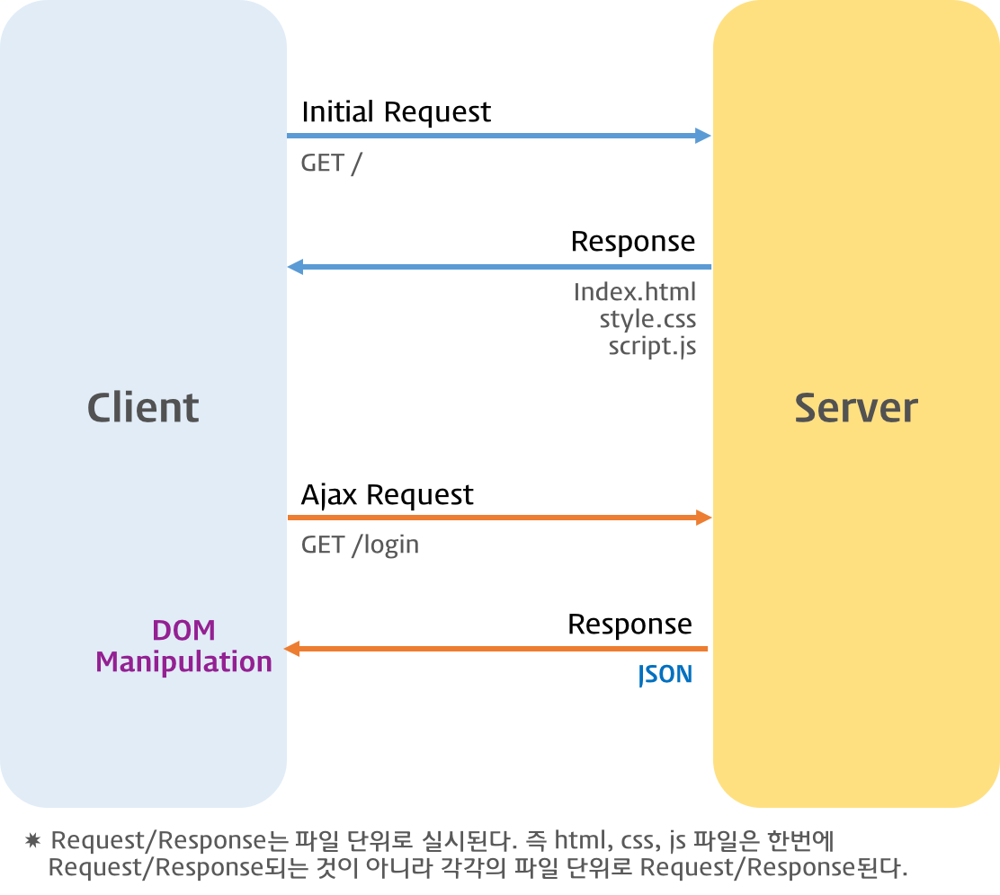

# Ajax

Ajax(Asynchronous JavaScript and XML)는 자바스크립트를 이용해서 비동기적(Asynchronous)으로 서버와 브라우저가 데이터를 교환할 수 있는 통신 방식을 의미한다.

서버로부터 웹페이지가 반환되면 화면 전체를 갱신해야 하는데 페이지 일부만을 갱신하고도 동일한 효과를 볼 수 있도록 하는 것이 Ajax이다. 페이지 전체를 로드하여 렌더링할 필요가 없고 갱신이 필요한 일부만 로드하여 갱신하면 되므로 빠른 퍼포먼스와 부드러운 화면 표시 효과를 기대할 수 있다.

  

---

  

## JSON (JavaScript Object Notation)

클라이언트와 서버 간에는 데이터 교환이 필요하다. JSON(JavaScript Object Notation)은 클라이언트와 서버 간 데이터 교환을 위한 규칙 즉 데이터 포맷을 말한다.

JSON은 일반 텍스트 포맷보다 효과적인 데이터 구조화가 가능하며 XML 포맷보다 가볍고 사용하기 간편하며 가독성도 좋다.

자바스크립트의 객체 리터럴과 매우 흡사하다. 하지만 JSON은 순수한 텍스트로 구성된 규칙이 있는 데이터 구조이다.

- JSON.stringify
- JSON.parse

  

---

  

## XMLHttpRequest

브라우저는 XMLHttpRequest 객체를 이용하여 Ajax 요청을 생성하고 전송한다. 서버가 브라우저의 요청에 대해 응답을 반환하면 같은 XMLHttpRequest 객체가 그 결과를 처리한다.

- Ajax request
  - XMLHttpRequest.open
  - XMLHttpRequest.send
  - XMLHttpRequest.setRequestHeader
- Ajax response

  

---

  

## Web Server

웹서버(Web Server)는 브라우저와 같은 클라이언트로부터 HTTP 요청을 받아들이고 HTML 문서와 같은 웹 페이지를 반환하는 컴퓨터 프로그램이다.

Ajax는 웹서버와의 통신이 필요하므로 예제를 실행하기 위해서는 웹서버가 필요하다.
