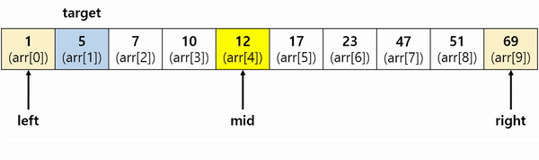

# 이진검색

    - 배열은 정렬되어 있었야 한다.
    - 배열의 중앙 값을 기준으로 검색한다.



이진 검색 알고리즘(binary search algorithm)은 오름차순으로 정렬된 리스트에서 특정한 값의 위치를 찾는 알고리즘이다. 처음 중간의 값을 임의의 값으로 선택하여, 그 값과 찾고자 하는 값의 크고 작음을 비교하는 방식을 채택하고 있다. 처음 선택한 중앙값이 만약 찾는 값보다 크면 그 값은 새로운 최댓값이 되며, 작으면 그 값은 새로운 최솟값이 된다. 검색 원리상 정렬된 리스트에만 사용할 수 있다는 단점이 있지만, 검색이 반복될 때마다 목표값을 찾을 확률은 두 배가 되므로 속도가 빠르다는 장점이 있다.

## 특징

-   시간복잡도 : O(logN)
-   전체 갯수 = 2의 K승
-   작업 횟수는 K번 일어난다.
-   K = log 전체 갯수

<br />
<br />

## 구현

```c
// c언어
// loop version : A[0 ~ N-1]
int binarySearch(int A[], int low, int high, int target){
    while(low <= high){
        int mid = (low + high) / 2;
        if(A[mid] == target) return mid;
        if(A[mid] > target) high = mid - 1;
        else low = mid + 1;
    }
    return -1;
}

// recursive version : A[0 ~ N-1]
int binarySearchRecur(int A[], int low, int high, int target){
    if(low > high) return -1;
    int mid = (low + high) / 2;
    if(A[mid] == target) return mid;
    if(A[mid] > target){
        return binarySearchRecur(A, low, mid-1, target);
    }
    return binarySearchRecur(A, mid+1, high, target);
}

// one-side(meta) binary search version : A[0 ~ N-1]
int metaBinarySearch(int A[], int low, int high, int target){
    int bin = 1, idx = 0;
    while(bin <= high) bin <<= 1;
    for(bin >>= 1;; bin >>= 1){
        int i = idx + bin;
        if( i <= high && A[i] <= target){
            if(A[i] == target) return i;
            idx = i;
        }
        if(bin == 0) break;
    }
    return -1;
}
```
