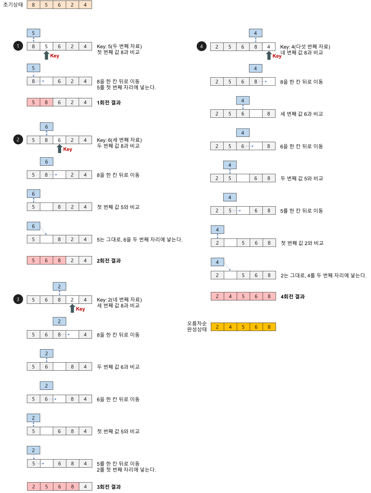

# 삽입정렬(Insertion sort)

## 삽입정렬이란?

-   두번째 항목부터 시작한다. (첫번째 항목은 이미 정렬된 것으로 볼 수 있다)
-   그 앞(왼쪽)의 항목들과 비교하여 값이 크(작으)면 뒤(오른쪽)으로 이동시키고 작으(크)면 멈춘다.
-   2회전은 세번째 항목을 그 앞의 항목들과 비교하여 정렬한다.
-   n - 1회 반복한다.

 
 

## 특징

-   최선의 경우(이미 정렬된 경우) : 1회전(외부루프)에 1회의 비교만 이루어진다. O(n)
-   최악의 경우(역순으로 정렬된 경우) : 1회전(외부루프)에 i번의 비교와 i+2번의 이동이 이루어진다. O(n^2)

 
 

## 예제

-   배열(8, 5, 6, 2, 4), 오름차순 정렬

