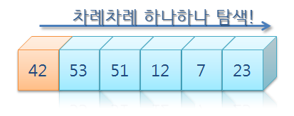

# 순차검색

    배열의 항목들을 처음부터 마지막까지 하나씩 검사하여 특정한 항목을 찾는다.


<br />

## 특징

-   탐색 방법 중에서 가장 간단하다.
-   시간복잡도 : O(n)

```c
// c언어
int sequentialSearch(int array[], int n, int m, int value) { // Starts from n to m
    int i;
    for (i = n; i <= m; i++)
        if (array[i] == value)
            return i;
    return -1;
}
```

<br />

---


