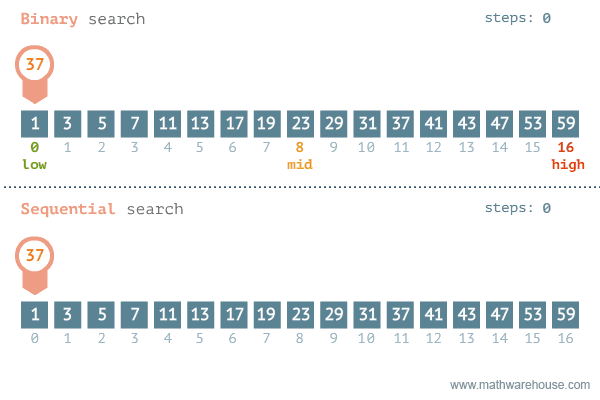

# 순차검색

    배열의 항목들을 처음부터 마지막까지 하나씩 검사하여 특정한 항목을 찾는다.



순차 검색 알고리즘(sequential search algorithm), 또는 선형 검색 알고리즘(linear search algorithm)은 리스트에서 특정한 값을 찾는 알고리즘의 하나다. 이것은 리스트에서 찾고자 하는 값을 맨 앞에서부터 끝까지 차례대로 찾아 나가는 것이다. 검색할 리스트의 길이가 길면 비효율적이지만, 검색 방법 중 가장 단순하여 구현이 쉽고 정렬되지 않은 리스트에서도 사용할 수 있다는 장점이 있다.

<br />

## 특징

- 탐색 방법 중에서 가장 간단하다.
- 시간복잡도 : O(n)

<br />
<br />

## 구현

```c
// c언어
int sequentialSearch(int array[], int n, int m, int value) { // Starts from n to m
    int i;
    for (i = n; i <= m; i++)
        if (array[i] == value)
            return i;
    return -1;
}
```

<br />

---


