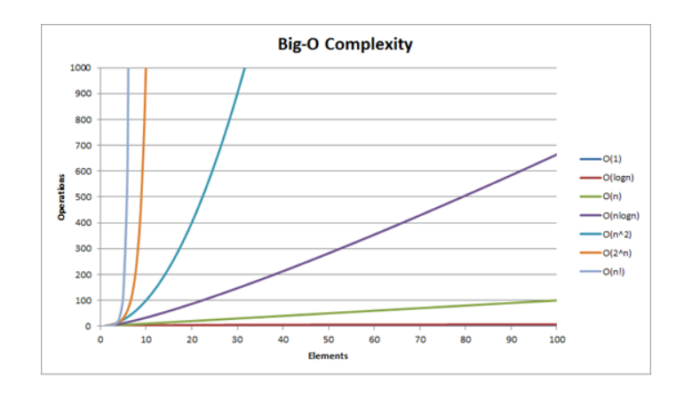

# 시간복잡도, Big-O 표기법(Notation)

[참고](https://heekim0719.tistory.com/266)

- 컴퓨터 프로그램의 입력 값과 연산 수행 시간의 상관 관계를 나타낸다.
- 알고리즘의 효율성을 나타낸다.
- 시간 복잡도가 빠른 순 : O(logn) > O(n) > O(nlogn) > O(n^2) > O(n^3) > O(2^n) > O(n!)
- 시간들의 설명
  - O(1) : 입력자료의 수에 관계없이 일정한 실행시간을 갖음
- O(logn) : 입력자료의 수에 따라 시간이 흐를수록 시간이 조금씩 증가
  - EX > 큰 문제를 일정한 크기를 갖는 작은 문제로 쪼갤 때 나타남
  - EX > 이진탐색 같은 효율이 좋은 검색 알고리즘
- O(n) : 입력 자료의 수에 따라 선형적인 실행 시간이 걸리는 경우 - 입력자료마다 일정 시간 할당
- O(nlogn) : 큰 문제를 일정 크기 갖는 문제로 쪼개고(logn+logn+ .. + logn) 다시 그것을 모으는 경우
  - EX > 효율 좋은 정렬 알고리즘
  - EX > quick sorting / heap sorting 등
- O(n^2) : 이중 루프내에서 입력 자료를 처리할 때
  - EX > 인접행렬이용한 bfs/dfs 알고리즘
- O(n^3) : 삼중 루프 내에서 입력자료 처리할 때

  

## **시간복잡도 표**

| 시간/n   | 1      | 2   | 3    | 4    | 8     | 16             | 32             | 64             | 1000             |
| -------- | ------ | --- | ---- | ---- | ----- | -------------- | -------------- | -------------- | ---------------- | --------------- |
| 상수시간 |  1     | 1   | 1    | 1    | 1     | 1              | 1              | 1              | 1                | 1               |
| 로그시간 |  log n | 0   | 1    | 1.58 | 2     | 3              | 4              | 5              | 6                | 9.97            |
| 선형시간 |  n     | 1   | 2    | 3    | 4     | 8              | 16             | 32             | 64               | 1000            |
| n log n  | 0      | 2   | 4.75 | 8    | 24    | 64             | 120            | 384            | 9966             |
| 2차시간  | n2     | 1   | 4    | 9    | 16    | 64             | 256            | 1024           | 4096             | 1000000         |
| 3차시간  | n3     | 1   | 8    | 27   | 64    | 512            | 4096           | 32768          | 262144           | 1000000000      |
| 지수시간 | 2n     | 2   | 4    | 8    | 16    | 256            | 65536          | 4294967296     | 약 1844경        | 약 1.07 x 10301 |
| n!       | 1      | 2   | 6    | 24   | 40320 | 20922789888000 | 약 2.63 x 1035 | 약 1.27 x 1089 | 약 4.02 x 102567 |

  

## 시간복잡도 그래프

