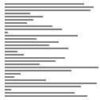
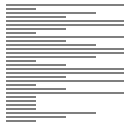

# 버블정렬(Bubble sort)

## Random

 
 

## Nearly Sorted

 
 

## Reversed

 
 

## Few Unique

 
 

## 버블정렬이란?

- 배열의 첫번째 항목과 두번째 항목를, 두번째 항목과 세번째 항목을, … 이런 식으로 (마지막-1)번째 항목과 마지막 항목를 비교하여 **교환**하면서 배열을 정렬한다.
- 위의 1회전을 수행하고 나면 가장 큰 항목이 맨 뒤로 이동하므로 2회전에서는 맨 끝에 있는 항목을 정렬에서 제외한다.
- 2회전을 수행하고 나면 3회전에서는 끝에서 두번째 항목까지 정렬에서 제외된다.
- 이렇게 정렬을 1회전 수행할 때마다 정렬에서 제외되는 데이터가 하나씩 늘어난다.
- n - 1회 반복한다.

 
 

## 특징

- 구현이 매우 간단하다.
- 비교하고 바로 바꿔 넣는 걸(교환) 반복한다.
- 1회전(외부루프)에 비교 작업이 n - 1회 일어나고, 교환 작업이 m회 일어난다.
- **교환 작업(SWAP)**이 **이동 작업(MOVE)**보다 더 복잡하기 때문에 버블정렬은 단순성에도 불구하고 거의 쓰이지 않는다.
- 시간복잡도 : T(n) = (n-1) + (n-2) + … + 2 + 1 = n(n-1)/2 = O(n^2)
