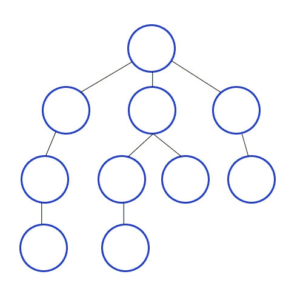

# DFS

깊이 우선 탐색

루트 노드 혹은 임의 노드에서 다음 브랜치로 넘어가기 전에, 해당 브랜치를 모두 탐색하는 방법

스택 or 재귀함수를 통해 구현한다.



시간 복잡도
인접 행렬 : O(V^2)
인접 리스트 : O(V+E)

> V는 접점, E는 간선을 뜻한다

```c++
#include <stdio.h>

int map[1001][1001], dfs[1001];

void init(int *, int size);

void DFS(int v, int N) {

	dfs[v] = 1;
	printf("%d ", v);

	for (int i = 1; i <= N; i++) {
		if (map[v][i] == 1 && dfs[i] == 0) {
			DFS(i, N);
		}
	}

}

int main(void) {

	init(map, sizeof(map) / 4);
	init(dfs, sizeof(dfs) / 4);

	int N, M, V;
	scanf("%d%d%d", &N, &M, &V);

	for (int i = 0; i < M; i++)
	{
		int start, end;
		scanf("%d%d", &start, &end);
		map[start][end] = 1;
		map[end][start] = 1;
	}

	DFS(V, N);

	return 0;
}

void init(int *arr, int size) {
	for (int i = 0; i < size; i++)
	{
		arr[i] = 0;
	}
}
```

# BFS

너비 중점 탐색

루트 노드 또는 임의 노드에서 인접한 노드부터 먼저 탐색하는 방법

큐를 통해 구현한다. (해당 노드의 주변부터 탐색해야하기 때문)

최소 비용(즉, 모든 곳을 탐색하는 것보다 최소 비용이 우선일 때)에 적합


시간 복잡도
인접 행렬 : O(V^2)
인접 리스트 : O(V+E)

##### Code

```c++
#include <stdio.h>

int map[1001][1001], bfs[1001];
int queue[1001];

void init(int *, int size);

void BFS(int v, int N) {
	int front = 0, rear = 0;
	int pop;

	printf("%d ", v);
	queue[rear++] = v;
	bfs[v] = 1;

	while (front < rear) {
		pop = queue[front++];

		for (int i = 1; i <= N; i++) {
			if (map[pop][i] == 1 && bfs[i] == 0) {
				printf("%d ", i);
				queue[rear++] = i;
				bfs[i] = 1;
			}
		}
	}

	return;
}

int main(void) {

	init(map, sizeof(map) / 4);
	init(bfs, sizeof(bfs) / 4);
	init(queue, sizeof(queue) / 4);

	int N, M, V;
	scanf("%d%d%d", &N, &M, &V);

	for (int i = 0; i < M; i++)
	{
		int start, end;
		scanf("%d%d", &start, &end);
		map[start][end] = 1;
		map[end][start] = 1;
	}

	BFS(V, N);

	return 0;
}

void init(int *arr, int size) {
	for (int i = 0; i < size; i++)
	{
		arr[i] = 0;
	}
}
```
